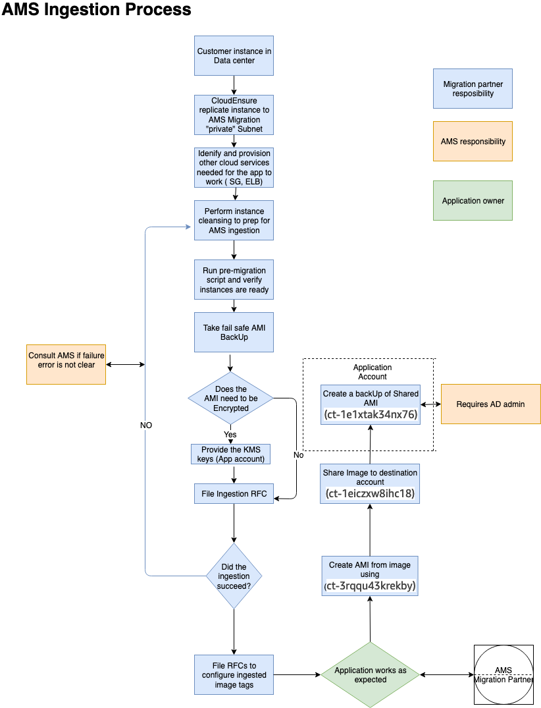

# Testing AMS Tools account connectivity and end-to-end setup

1. Start with configuring CloudEndure and installing the CloudEndure agent on a server that will replicate to AMS.
2. Create a project in CloudEndure.
3. Enter the AWS credentials shared when you performed the prerequisites, though secrets manager.
4. In **Replication settings**:
   1. Select both AMS "Sentinel" security groups (Private Only and EgressAll) for the
      **Choose the Security Groups to apply to the Replication Servers** option.
   2. Define cutover options for the machines (instances). For information, see
      [Step 5. Cut over](../../../prescriptive-guidance/latest/migration-factory-cloudendure/step5.md "../../../prescriptive-guidance/latest/migration-factory-cloudendure/step5.md")
   3. **Subnet**: Private subnet.

5. **Security Group**:
   1. Select both AMS "Sentinel" security groups (Private Only and EgressAll).
   2. Cutover instances have to communicate to the AMS-managed Active Directory (MAD) and to AWS public endpoints:
      1. **Elastic IP**: None
      2. **Public IP**: no
      3. **IAM role**: customer-mc-ec2-instance-profile

   3. Set tags as per your internal tagging convention.

6. Install the CloudEndure agent on the machine and look for the replication instance to come up in your AMS account in the EC2 console.
   The AMS ingestion process:

