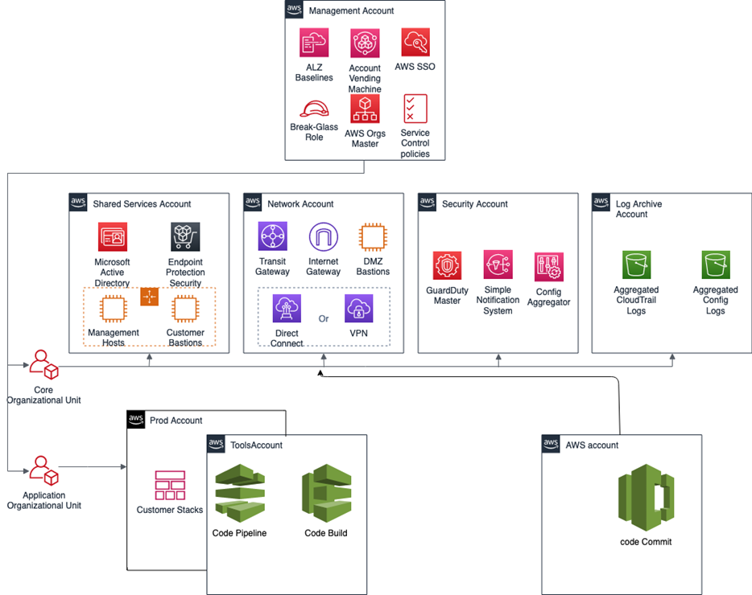

# AMS Tools account (migrating workloads)

Your Multi-Account Landing Zone tools account (with VPC) helps accelerate migration efforts, increases your security position,
reduces cost and complexity, and standardizes your usage pattern.

A tools account provides the following:

- A well-defined boundary for access to replication instances for system integrators outside of your production workloads.
- Enables you to create an isolated chamber to check a workload for malware, or unknown network routes, before placing it into an account with
  other workloads.
- As a defined account setup, it provides faster time to onboard and get set up for migrating workloads.
- Isolated network routes to secure traffic from on-premise -> CloudEndure -> Tools account -> AMS ingested image. Once an image has been ingested,
  you can share the image to the destination account via an AMS Management | Advanced stack components | AMI | Share (ct-1eiczxw8ihc18) RFC.
  High level architecture diagram:

Use the Deployment | Managed landing zone | Management account | Create tools account (with VPC) change type (ct-2j7q1hgf26x5c), to quickly deploy a tools account
and instantiate a Workload Ingestion process within a Multi-Account Landing Zone environment. See
[Management account, Tools account: Creating (with VPC)](../ctref/ex-malz-master-acct-create-tools-acct-col.md "../ctref/ex-malz-master-acct-create-tools-acct-col.md").

###### Note

We recommend having two availability zones (AZs), since this is a migration hub.

By default, AMS creates the following two security groups (SGs) in every account. Confirm that these two SGs are present. If they are not present, please open a new service request with the AMS team to request them.

- SentinelDefaultSecurityGroupPrivateOnlyEgressAll
- InitialGarden-SentinelDefaultSecurityGroupPrivateOnly
  Ensure that CloudEndure replication instances are created in the private subnet where there are routes back
  to on-premise. You can confirm that by ensuring that the route tables for the private subnet has a default
  route back to TGW. However, performing a CloudEndure machine cut over should go into the "isolated" private
  subnet where there is no route back to on-premise, only Internet outbound traffic is allowed. It is critical
  to ensure cutover occurs in the isolated subnet to avoid potential issues to the on-premise resources.

Prerequisites:

1. Either **Plus** or **Premium** support level.
2. The application account IDs for the KMS key where the AMIs are deployed.
3. The tools account, created as described previously.
