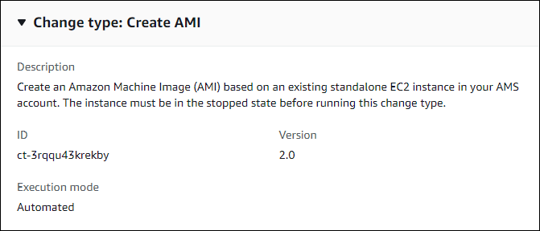

# AMI | Create

Create an Amazon Machine Image (AMI) based on an existing standalone EC2 instance in your AMS account. The instance must be in the stopped state before running this change type.

**Full classification:** Deployment | Advanced stack components | AMI | Create

## Change Type Details

|                             |                  |
| --------------------------- | ---------------- | ---------------------------------------------------------------------------------------------------------------------------------------------------------------------------------------------------------------------------------------------------------------------------------------------------------------------------------------------------------------------------------------------------------------------------------------------------------------------------------------------------------------------------------------------------------------------------------------------------------------------------------------------------------------------------------------------------------------------------------------------------------------------------------------------------------------------------------------------------------------------------------------------------------------------------------------------------------------------------------------------------------------------------------------------------------------------------------------------------------------------------------------------------------------------------------------------------------------------------------------------------------------------------------------------------------------------------------------------------------------------------------------------------------------------------------------------------------------------------------------------------------------------------------------------------------------------------------------------------------------------------------------------------------------------------------------------------------------------------------------------------------------------------------------------------------------------------------------------------------------------------------------------------------------------------------------------------------------------------------------------------------------------------------------------------------------------------------------------------------------------------------------------------------------------------------------------------------------------------------------------------------------------------------------------------------------------------------------------------------------------------------------------------------------------------------------------------------------------------------------------------------------------------------------------------------------------------------------------------------------------------------------------------------------------------------------------------------------------------------------------------------------------------------------------------------------------------------------------------------------------------------------------------------------------------------------------------------------------------------------------------------------------------------------------------------------------------------------------------------------------------------------------------------------------------------------------------------------------------------------------------------------------------------------------------------------------------------------------------------------------------------------------------------------------------------------------------------------------------------------------------------------------------------------------------------------------------------------------------------------------------------------------------------------------------------------------------------------------------------------------------------------------------------------------------------------------------------------------------------------------------------------------------------------------------------------------------------------------------------------------------------------------------------------------------------------------------------------------------------------------------------------------------------------------------------------------------------------------------------------------------------------------------------------------------------------------------------------------------------------------------------------------------------------------------------------------------------------------------------------------------------------------------------------------------------------------------------------------------------------------------------------------------------------------------------------------------------------------------------------------------------------------------------------------------------------------------------------------------------------------------------------------------------------------------------------------------------------------------------------------------------------------------------------------------------------------------------------------------------------------------------------------------------------------------------------------------------------------------------------------------------------------------------------------------------------------------------------------------------------------------------------------------------------------------------------------------------------------------------------------------------------------------------------------------------------------------------------------------------------------------------------------------------------------------------------------------------------------------------------------------------------------------------------------------------------------------------------------------------------------------------------------------------------------------------------------------------------------------------------------------------------------------------------------------------------------------------------------------------------------------------------------------------------------------------------------------------------------------------------------------------------------------------------------------------------------------------------------------------------------------------------------------------------------------------------------------------------------------------------------------------------------------------------------------------------------------------------------------------------------------------------------------------------------------------------------------------------------------------------------------------------------------------------------------------------------------------------------------------------------------------------------------------------------------------------------------------------------------------------------------------------------------------------------------------------------------------------------------------------------------------------------------------------------------------------------------------------------------------------------------------------------------------------------------------------------------------------------------------------------------------------------------------------------------------------------------------------------------------------------------------------------------------------------------------------------------------------------------------------------------------------------------------------------------------------------------------------------------------------------------------------------------------------------------------------------------------------------------------------------------------------------------------------------------------------------------------------------------------------------------------------------------------------------------------------------------------------------------------------------------------------------------------------------------------------------------------------------------------------------------------------------------------------------------------------------------------------------------------------------------------------------------------------------------------------------------------------------------------------------------------------------------------------------------------------------------------------------------------------------------------------------------------------------------------------------------------------------------------------------------------------------------------------------------------------------------------------------------------------------------------------------------------------------------------------------------------------------------------------------------------------------------------------------------------------------------------------------------------------------------------------------------------------------------------------------------- |
| Change type ID              | ct-3rqqu43krekby |
| Current version             | 2.0              |
| Expected execution duration | 360 minutes      |
| AWS approval                | Required         |
| Customer approval           | Not required     |
| Execution mode              | Automated        | ## Additional Information ### Create an AMI The following shows this change type in the AMS console.  ###### Important Before you begin, prepare the EC2 instance that you will use to create the AMI. Without proper preparation, the create AMI RFC is likely to be rejected or fail. For information about preparing your instance to successfully create an AMI, see the instructions included in this tutorial. How it works: 1. Navigate to the **Create RFC** page: In the left navigation pane of the AMS console click **RFCs** to open the RFCs list page, and then click **Create RFC**. 2. Choose a popular change type (CT) in the default **Browse change types** view, or select a CT in the **Choose by category** view.  • **Browse by change type**: You can click on a popular CT in the **Quick create** area to immediately open the **Run RFC** page. Note that you cannot choose an older CT version with quick create. To sort CTs, use the **All change types** area in either the **Card** or **Table** view. In either view, select a CT and then click **Create RFC** to open the **Run RFC** page. If applicable, a **Create with older version** option appears next to the **Create RFC** button.  • **Choose by category**: Select a category, subcategory, item, and operation and the CT details box opens with an option to **Create with older version** if applicable. Click **Create RFC** to open the **Run RFC** page. 3. On the **Run RFC** page, open the CT name area to see the CT details box. A **Subject** is required (this is filled in for you if you choose your CT in the **Browse change types** view). Open the **Additional configuration** area to add information about the RFC. In the **Execution configuration** area, use available drop-down lists or enter values for the required parameters. To configure optional execution parameters, open the **Additional configuration** area. 4. When finished, click **Run**. If there are no errors, the **RFC successfully created** page displays with the submitted RFC details, and the initial **Run output**. 5. Open the **Run parameters** area to see the configurations you submitted. Refresh the page to update the RFC execution status. Optionally, cancel the RFC or create a copy of it with the options at the top of the page. How it works: 1. Use either the Inline Create (you issue a `create-rfc` command with all RFC and execution parameters included), or Template Create (you create two JSON files, one for the RFC parameters and one for the execution parameters) and issue the `create-rfc` command with the two files as input. Both methods are described here. 2. Submit the RFC: `aws amscm submit-rfc --rfc-id `ID`` command with the returned RFC ID. Monitor the RFC: `aws amscm get-rfc --rfc-id `ID`` command. To check the change type version, use this command: `` aws amscm list-change-type-version-summaries --filter Attribute=ChangeTypeId,Value=`CT_ID` `` ###### Note You can use any `CreateRfc` parameters with any RFC whether or not they are part of the schema for the change type. For example, to get notifications when the RFC status changes, add this line, `--notification "{\"Email\": {\"EmailRecipients\" : [\"email@example.com\"]}}"` to the RFC parameters part of the request (not the execution parameters). For a list of all CreateRfc parameters, see the [AMS Change Management API Reference](../ApiReference-cm/API_CreateRfc.md "../ApiReference-cm/API_CreateRfc.md"). _INLINE CREATE_: Issue the create RFC command with execution parameters provided inline (escape quotation marks when providing execution parameters inline), and then submit the returned RFC ID. For example, you can replace the contents with something like this: ``aws --profile saml --region us-east-1 amscm create-rfc --change-type-id "ct-3rqqu43krekby" --change-type-version "2.0" --title "`AMI-Create-IC`" --execution-parameters "{\"AMIName\":\"`MyAmi`\",\"VpcId\":\"`VPC_ID`\",\"EC2InstanceId\":\"`INSTANCE_ID`\"}"`` _TEMPLATE CREATE_: 1. Output the execution parameters JSON schema for this change type to a file; this example names it CreateAmiParams.json: `aws amscm get-change-type-version --change-type-id "ct-3rqqu43krekby" --query "ChangeTypeVersion.ExecutionInputSchema" --output text > CreateAmiParams.json` 2. Modify and save the execution parameters CreateAmiParams.json file. For example, you can replace the contents with something like this: ``{ "AMIName":          "`My-AMI`", "InstanceId":    "`EC2_INSTANCE_ID`" }`` 3. Output the RFC template JSON file to a file in your current folder; this example names it CreateAmiRfc.json: `aws amscm create-rfc --generate-cli-skeleton > CreateAmiRfc.json` 4. Modify and save the CreateAmiRfc.json file. For example, you can replace the contents with something like this: ``{ "ChangeTypeId":         "ct-3rqqu43krekby", "ChangeTypeVersion":    "`2.0`", "Title":                "`AMI-Create-RFC`" }`` 5. Create the RFC, specifying the CreateAmiRfc file and the CreateAmiParams file: `aws amscm create-rfc --cli-input-json file://CreateAmiRfc.json  --execution-parameters file://CreateAmiParams.json` You receive the ID of the new RFC in the response and can use it to submit and monitor the RFC. Until you submit it, the RFC remains in the editing state and does not start. ###### Note After you have created a custom AMI, you can submit a service request to AMS to have your existing EC2 Auto Scaling group use the new AMI. For information about creating a service request, see [Service Request Examples](../userguide/serv-req-mgmt-examples.md "../userguide/serv-req-mgmt-examples.md"). ###### Important Before you begin, prepare the EC2 instance that you will use to create the AMI. Without proper preparation, the create AMI RFC is likely to be rejected or fail. To avoid authentication issues from instances created from the new AMI, run these system commands on the instance after applying custom changes, and prior to calling the Create AMI CT. ###### Important If the specified instance isn't stopped and separated from its current domain, the AMI creation RFC fails. Prepare the instance as described. For more information, see [Create a Standard Amazon Machine Image Using Sysprep](../../../AWSEC2/latest/WindowsGuide/Creating_EBSbacked_WinAMI.md#23ami-create-standard "../../../AWSEC2/latest/WindowsGuide/Creating_EBSbacked_WinAMI.md#23ami-create-standard"). You can subscribe to an AMS SNS AMI notification topic to receive an alert whenever new AMS AMIs of interest to you are deployed. For more information, see [AMS AMI Notification Service](../userguide/ams-ami-notify.md "../userguide/ams-ami-notify.md"). ##### Linux Preparation for AMI Create Download and run the following script to prepare your instance for AMI creation. You must run this script as the root user. `curl https://amazon-ams-us-east-1.s3.amazonaws.com/latest/linux/prepare_instance_for_ami_and_shutdown.sh -o ./prepare_instance_for_ami_and_shutdown.sh chmod 744 prepare_instance_for_ami_and_shutdown.sh ./prepare_instance_for_ami_and_shutdown.sh` Note: The preceding script performs a shut down on the instance and connected users are logged out from the session. ##### Windows Preparation for AMI Create Windows Powershell (run as Administrator): `Invoke-AMSSysprep` The instance is stopped and any connected user is logged out from the current Windows RDP session. For more info on creating AWS Windows AMIs, see [Create a custom Windows AMI](../../../AWSEC2/latest/WindowsGuide/Creating_EBSbacked_WinAMI.md#23ami-create-standard "../../../AWSEC2/latest/WindowsGuide/Creating_EBSbacked_WinAMI.md#23ami-create-standard"). ##### UserData for AMI Create If you need user data to be executed on the next boot from your AMI, ensure the following:  • Registry Key `HKEY_LOCAL_MACHINE\SOFTWARE\Amazon\ManagedServices\RunUserDataViaAMSBootModule` is present; if that key is not present, user data will not be run next time.  • To enable user data to be run on next boot: 1. Start a Windows PowerShell under administrator privilege (run as administrator) 2. Run the following command: `Install-AMSDependencies` For information about failed AMI Create RFCs, see [RFC failure troubleshooting](../userguide/rfc-failures.md "../userguide/rfc-failures.md"). ## Execution Input Parameters For detailed information about the execution input parameters, see [Schema for Change Type ct-3rqqu43krekby](schemas.md#ct-3rqqu43krekby-schema-section "schemas.md#ct-3rqqu43krekby-schema-section"). ## Example: Required Parameters `{ "InstanceId": "i-01234567890abcdef", "AmiName": "MyAMI" }` ## Example: All Parameters `{ "InstanceId": "i-12345678", "AmiName": "MyAMI", "AmiTags": [ { "Key": "foo", "Value": "bar" }, { "Key": "testkey", "Value": "testvalue" } ] }` |
