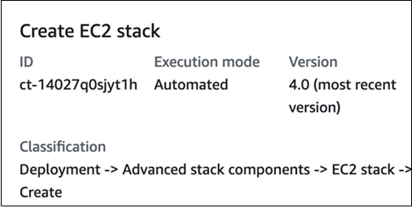

# EC2 Stack | Create

Use to create an Amazon Elastic Compute Cloud (EC2) instance.

**Full classification:** Deployment | Advanced stack components | EC2 stack | Create

## Change Type Details

|                             |                  |
| --------------------------- | ---------------- |
| Change type ID              | ct-14027q0sjyt1h |
| Current version             | 5.0              |
| Expected execution duration | 360 minutes      |
| AWS approval                | Required         |
| Customer approval           | Not required     |
| Execution mode              | Automated        |

## Additional Information

### Create stack

The following shows this change type in the AMS console.


How it works:

1. Navigate to the **Create RFC** page: In the left navigation pane of the AMS console click **RFCs** to open the RFCs list page, and then click **Create RFC**.
2. Choose a popular change type (CT) in the default **Browse change types** view, or select a CT in the
   **Choose by category** view.
   - **Browse by change type**: You can click on a popular CT in the **Quick create** area to immediately open the
     **Run RFC** page. Note that you cannot choose an older CT version with quick create.

   To sort CTs, use the **All change types** area in either the **Card** or **Table** view.
   In either view, select a CT and then click **Create RFC** to open the **Run RFC** page. If applicable,
   a **Create with older version** option appears next to the **Create RFC** button.
   - **Choose by category**: Select a category, subcategory, item, and operation and the CT details box opens with an option to
     **Create with older version** if applicable. Click **Create RFC** to open the **Run RFC** page.

3. On the **Run RFC** page, open the CT name area to see the CT details box.
   A **Subject** is required (this is filled in for you if you choose your CT in the **Browse change types** view). Open the
   **Additional configuration** area to add information about the RFC.

In the **Execution configuration** area, use available drop-down lists or enter values for the required parameters. To configure
optional execution parameters, open the **Additional configuration** area. 4. When finished, click **Run**. If there are no errors, the **RFC successfully created**
page displays with the submitted RFC details, and the initial **Run output**. 5. Open the **Run parameters** area to see the configurations you submitted. Refresh the page to update the RFC execution status.
Optionally, cancel the RFC or create a copy of it with the options at the top of the page.
How it works:

1. Use either the Inline Create (you issue a `create-rfc` command with all RFC and execution parameters included), or
   Template Create (you create two JSON files, one for the RFC parameters and one for the execution parameters) and issue the `create-rfc`
   command with the two files as input. Both methods are described here.
2. Submit the RFC: `aws amscm submit-rfc --rfc-id `ID`` command with the returned RFC ID.

Monitor the RFC: `aws amscm get-rfc --rfc-id `ID`` command.
To check the change type version, use this command:

```
aws amscm list-change-type-version-summaries --filter Attribute=ChangeTypeId,Value=`CT_ID`
```

###### Note

You can use any `CreateRfc` parameters with any RFC whether or not they are part of the schema for the
change type. For example, to get notifications when the RFC status changes, add this line, `--notification "{\"Email\": {\"EmailRecipients\" : [\"email@example.com\"]}}"` to the
RFC parameters part of the request (not the execution parameters). For a list of all CreateRfc parameters, see the
[AMS Change Management API Reference](../ApiReference-cm/API_CreateRfc.md "../ApiReference-cm/API_CreateRfc.md").

_INLINE CREATE_:

Issue the create RFC command with execution parameters provided inline (escape
quotation marks when providing execution parameters inline), and then submit the
returned RFC ID. For example, you can replace the contents with something like this:

```
aws amscm create-rfc --change-type-id "ct-14027q0sjyt1h" --change-type-version "4.0" --title "`EC2-Create-RFC`" --execution-parameters "{\"Description\": \"`Create a new EC2 Instance stack`\",\"VpcId\": \"`vpc-0a60eb65b4EXAMPLE`\",\"Name\": \"`My-EC2`\",\"TimeoutInMinutes\": `60`,\"Parameters\": {\"InstanceAmiId\": \"`ami-1234567890EXAMPLE`\",\"InstanceDetailedMonitoring\": `false`,\"InstanceEBSOptimized\": `false`,\"InstanceProfile\": \"`customer-mc-ec2-instance-profile`\",\"InstanceRootVolumeIops\": `3000`,\"InstanceRootVolumeType\": \"`gp3`\",\"InstanceType\": \"`t2.large`\",\"InstanceUserData\": \"\",\"InstanceSubnetId\": \"`subnet-0bb1c79de3EXAMPLE`\",\"EnforceIMDSV2\": \"`false`\"}}"
```

_TEMPLATE CREATE_:

1. Output the execution parameters for this change type to a JSON file; this
   example names it CreateEC2Params.json:

```
aws amscm get-change-type-version --change-type-id "ct-14027q0sjyt1h" --query "ChangeTypeVersion.ExecutionInputSchema" --output text > CreateEC2Params.json
```

2. Modify and save the CreateEC2Params file. For example, you can replace the contents with something like this:

```
{
  "Description": "Create a new EC2 Instance stack",
  "VpcId": "vpc-0a60eb65b4EXAMPLE",
  "Name": "My-EC2",
  "TimeoutInMinutes": 60,
  "Parameters": {
    "InstanceAmiId": "ami-1234567890EXAMPLE",
    "InstanceDetailedMonitoring": false,
    "InstanceEBSOptimized": false,
    "InstanceProfile": "customer-mc-ec2-instance-profile",
    "InstanceRootVolumeIops": 3000,
    "InstanceRootVolumeType": "gp3",
    "InstanceType": "t2.large",
    "InstanceUserData": "",
    "InstanceSubnetId": "subnet-0bb1c79de3EXAMPLE",
    "EnforceIMDSV2": "false"
  }
}
```

3. Output the RFC template to a file in your current folder; this example names
   it CreateEC2Rfc.json:

```
aws amscm create-rfc --generate-cli-skeleton > CreateEC2Rfc.json
```

4. Modify and save the CreateEC2Rfc.json file. For example, you can replace the contents with something like this:.

```
{
"ChangeTypeVersion":    "`4.0`",
"ChangeTypeId":         "ct-14027q0sjyt1h",
"Title":                "`EC2-Create-RFC`"
}
```

5. Create the RFC, specifying the CreateEC2Rfc file and the CreateEC2Params
   file:

```
aws amscm create-rfc --cli-input-json file://CreateEC2Rfc.json  --execution-parameters file://CreateEC2Params.json
```

You receive the ID of the new RFC in the response and can use it to submit and monitor the RFC. Until you submit it, the RFC remains in the editing state and does not start.

###### Security Groups

Starting with version 3.0 of this change type, AMS does not attach the default
AMS security groups if you specify your own security groups. If you do not specify your own
security groups in the request, AMS attaches the AMS default security groups. In previous
versions, AMS attached the default security groups whether or not you provided your own
security groups.

Currently, if you specify custom security groups, you must also specify the
IDs of the default AMS security groups for your account,
`mc-initial-garden-SG-name` and `mc-initial-garden-SG-name`.

###### Instance Types

AMS does not recommend the
**t2.micro/t3.micro** and
**t2.nano/t3.nano** types.
These are smaller instance types, and can degrade the
performance of your application and AMS tools.
EC2 instances need enough
capacity to support AMS tools such as EPS, SSM, and Cloudwatch in addition to
the application workload. For more information, see
[Choosing the Right EC2 Instance Type for Your Application](https://aws.amazon.com/blogs/aws/choosing-the-right-ec2-instance-type-for-your-application/ "https://aws.amazon.com/blogs/aws/choosing-the-right-ec2-instance-type-for-your-application/").

To create an EC2 stack with additional volumes, see
[EC2 Stack | Create (with Additional Volumes)](deployment-advanced-ec2-stack-create-with-additional-volumes.md "deployment-advanced-ec2-stack-create-with-additional-volumes.md").

You can add up to 50 tags, but to do so you must enable the **Additional configuration** view.

If needed, see [EC2 instance stack create fail](../userguide/rfc-troubleshoot.md#rfc-valid-execute-ec2-create "../userguide/rfc-troubleshoot.md#rfc-valid-execute-ec2-create").

## Execution Input Parameters

For detailed information about the execution input parameters, see
[Schema for Change Type ct-14027q0sjyt1h](schemas.md#ct-14027q0sjyt1h-schema-section "schemas.md#ct-14027q0sjyt1h-schema-section").

## Example: Required Parameters

```
{
  "Description": "This is a test description",
  "VpcId": "vpc-1234567890abcdef0",
  "Name": "Test Stack",
  "TimeoutInMinutes": 360,
  "Parameters": {
    "InstanceAmiId": "ami-1234567890abcdef0",
    "InstanceSubnetId": "subnet-1234567890abcdef0",
    "EnforceIMDSV2": "true"
  }
}

```

## Example: All Parameters

```
{
  "Description": "This is a test description",
  "VpcId": "vpc-12345678",
  "Name": "Test Stack",
  "Tags": [
    {
      "Key": "foo",
      "Value": "bar"
    },
    {
      "Key": "testkey",
      "Value": "testvalue"
    }
  ],
  "TimeoutInMinutes": 60,
  "Parameters": {
    "InstanceAmiId": "ami-a0b1c2d3",
    "InstanceDetailedMonitoring": false,
    "InstanceEBSOptimized": false,
    "InstanceProfile": "customer-mc-ec2-instance-profile",
    "InstanceRootVolumeIops": 3000,
    "InstanceRootVolumeName": "/dev/xvda",
    "InstanceRootVolumeSize": 60,
    "InstanceRootVolumeType": "gp3",
    "InstancePrivateStaticIp": "172.16.0.0",
    "InstanceSubnetId": "subnet-a0b1c2d3",
    "InstanceType": "t2.large",
    "InstanceUserData": "pwd\nls -ltrh\necho \"Hello, World\"",
    "EnforceIMDSV2": "true"
  }
}

```
