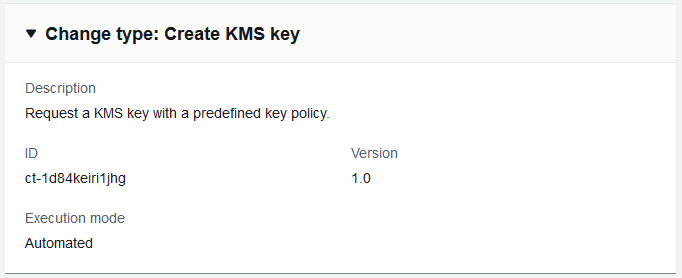

# KMS Key | Create

Create an AWS KMS Customer Master Key (CMK) using SSM automation document with policy validation.

**Full classification:** Deployment | Advanced stack components | KMS key | Create

## Change Type Details

|                             |                  |
| --------------------------- | ---------------- |
| Change type ID              | ct-1d84keiri1jhg |
| Current version             | 2.0              |
| Expected execution duration | 30 minutes       |
| AWS approval                | Required         |
| Customer approval           | Not required     |
| Execution mode              | Automated        |

## Additional Information

### Create KMS key

Screenshot of this change type in the AMS console:


How it works:

1. Navigate to the **Create RFC** page: In the left navigation pane of the AMS console click **RFCs** to open the RFCs list page, and then click **Create RFC**.
2. Choose a popular change type (CT) in the default **Browse change types** view, or select a CT in the
   **Choose by category** view.
   - **Browse by change type**: You can click on a popular CT in the **Quick create** area to immediately open the
     **Run RFC** page. Note that you cannot choose an older CT version with quick create.

   To sort CTs, use the **All change types** area in either the **Card** or **Table** view.
   In either view, select a CT and then click **Create RFC** to open the **Run RFC** page. If applicable,
   a **Create with older version** option appears next to the **Create RFC** button.
   - **Choose by category**: Select a category, subcategory, item, and operation and the CT details box opens with an option to
     **Create with older version** if applicable. Click **Create RFC** to open the **Run RFC** page.

3. On the **Run RFC** page, open the CT name area to see the CT details box.
   A **Subject** is required (this is filled in for you if you choose your CT in the **Browse change types** view). Open the
   **Additional configuration** area to add information about the RFC.

In the **Execution configuration** area, use available drop-down lists or enter values for the required parameters. To configure
optional execution parameters, open the **Additional configuration** area. 4. When finished, click **Run**. If there are no errors, the **RFC successfully created**
page displays with the submitted RFC details, and the initial **Run output**. 5. Open the **Run parameters** area to see the configurations you submitted. Refresh the page to update the RFC execution status.
Optionally, cancel the RFC or create a copy of it with the options at the top of the page.
How it works:

1. Use either the Inline Create (you issue a `create-rfc` command with all RFC and execution parameters included), or
   Template Create (you create two JSON files, one for the RFC parameters and one for the execution parameters) and issue the `create-rfc`
   command with the two files as input. Both methods are described here.
2. Submit the RFC: `aws amscm submit-rfc --rfc-id `ID`` command with the returned RFC ID.

Monitor the RFC: `aws amscm get-rfc --rfc-id `ID`` command.
To check the change type version, use this command:

```
aws amscm list-change-type-version-summaries --filter Attribute=ChangeTypeId,Value=`CT_ID`
```

###### Note

You can use any `CreateRfc` parameters with any RFC whether or not they are part of the schema for the
change type. For example, to get notifications when the RFC status changes, add this line, `--notification "{\"Email\": {\"EmailRecipients\" : [\"email@example.com\"]}}"` to the
RFC parameters part of the request (not the execution parameters). For a list of all CreateRfc parameters, see the
[AMS Change Management API Reference](../ApiReference-cm/API_CreateRfc.md "../ApiReference-cm/API_CreateRfc.md").

_INLINE CREATE_:

Issue the create RFC command with execution parameters provided inline (escape quotes when providing execution parameters inline), and then submit the returned RFC ID. For example, you can replace the contents with something like this:

Required parameters only:

```
aws amscm create-rfc --title `my-app-key` --change-type-id ct-1d84keiri1jhg --change-type-version `1.0` --execution-parameters '{"Description":"`KMS key for my-app`","VpcId":"`VPC_ID`","Name":"`my-app-key`","StackTemplateId":"stm-enf1j068fhg34vugt","TimeoutInMinutes":60,"Parameters":{"Description":"`KMS key for my-app`"}}'
```

_TEMPLATE CREATE_:

1. Output the execution parameters JSON schema for this change type to a file; this example names it CreateKmsKeyAutoParams.json.

```
aws amscm get-change-type-version --change-type-id "ct-1d84keiri1jhg" --query "ChangeTypeVersion.ExecutionInputSchema" --output text > CreateKmsKeyAutoParams.json
```

2. Modify and save the CreateKmsKeyAutoParams file. Examples follow.

**Grant a user or a role, permission to decrypt the created CMK**. Example execution parameters:

```
{
  "Description": "`KMS key for my-app`",
  "VpcId": "`VPC_ID`”,
  "Name": "`my-app-key-decrypt`",
  "StackTemplateId": "stm-enf1j068fhg34vugt",
  "TimeoutInMinutes": 60,
  "Parameters": {
    "IAMPrincipalsRequiringDecryptPermissions": [
      "`ARN:role/roleA`",
      "`ARN:user/userB`",
      "`ARN:role/instanceProfileA`"
    ],
    "Description": "`KMS key for my-app`"
  }
}
```

For the resulting policy, see [Grants Permissions to Decrypt with the CML for an IAM User or a Role](#kms-key-grant-cmk-decrypt-for-user-or-role "#kms-key-grant-cmk-decrypt-for-user-or-role").

**Grant a user or role, permission to encrypt using the created CMK**. Example execution parameters:

```
{
  "Description": "`KMS key for my-app`",
  "VpcId": "`VPC_ID`",
  "Name": "`my-app-key-encrypt`",
  "Tags": [
    {
      "Key": "Name",
      "Value": "`my-app-key`"
    }
  ],
  "StackTemplateId": "stm-enf1j068fhg34vugt",
  "TimeoutInMinutes": 60,
  "Parameters": {
    "IAMPrincipalsRequiringEncryptPermissions": [
      "`ARN:role/roleA`",
      "`ARN:user/userB`",
      "`ARN:role/instanceProfileA`"
    ],
    "Description": "KMS key for my-app"
  }
}
```

For the resulting policy, see [Grants Permissions to Encrypt with the CML for an IAM User or a Role](#kms-key-grant-cmk-encrypt-for-user-or-role "#kms-key-grant-cmk-encrypt-for-user-or-role").

**Grant a user, role, or account, permission to create grants using the created CMK**. Example execution parameters:

```
{
  "Description": "`KMS key for my-app`",
  "VpcId": "`VPC_ID`",
  "Name": "`my-app-key-create-grants`",
  "StackTemplateId": "stm-enf1j068fhg34vugt",
  "TimeoutInMinutes": 60,
  "Parameters": {
    "IAMPrincipalsRequiringGrantsPermissions": [
      "`arn:aws:iam::999999999999:role/roleA`",
      "`888888888888`"
    ],
    "Description": "`KMS key for my-app`"
  }
}
```

For the resulting policy, see [Grants Permissions to Create Grants with the CMK for an IAM User, Role, or Account](#kms-key-create-cmk-grants-for-user-role-or-account "#kms-key-create-cmk-grants-for-user-role-or-account").

**Allow only AWS services that are integrated with AWS KMS to perform the GRANT operation**. Example execution parameters:

```
{
  "Description": "`KMS key for my-app`",
  "VpcId": "`VPC_ID`",
  "Name": "`my-app-key-limit-to-services`",
  "StackTemplateId": "stm-enf1j068fhg34vugt",
  "TimeoutInMinutes": 60,
  "Parameters": {
    "IAMPrincipalsRequiringGrantsPermissions": [
      "`arn:aws:iam::999999999999:role/roleA`"
    ],
    "LimitGrantsToAWSResources": "true",
    "Description": "`KMS key for my-app`"
  }
}
```

For the resulting policy, see [Allow only AWS services that are Integrated with AWS KMS to Perform the GRANT Operation](#kms-key-limit-grants-to-aws-services "#kms-key-limit-grants-to-aws-services").

**Enforce use of encryption context keys in cryptographic operations**. Example execution parameters:

```
{
  "Description": "`KMS key for my-app`",
  "VpcId": "`VPC_ID`",
  "Name": "`my-app-key-encryption-keys`",
  "StackTemplateId": "stm-enf1j068fhg34vugt",
  "TimeoutInMinutes": 60,
  "Parameters": {
    "EnforceEncryptionContextKeys": "true",
    "Description": "`KMS key for my-app`"
  }
}
```

For the resulting policy, see [Enforce use of Encryption Context Keys in Cryptographic Operations](#kms-key-enforce-encryption-context-keys "#kms-key-enforce-encryption-context-keys").

**Enforce a specific list of encryption context keys in cryptographic operations**. Example execution parameters:

```
{
  "Description": "`KMS key for my-app`",
  "VpcId": "`VPC_ID`",
  "Name": "`my-app-key-encryption-list`",
  "StackTemplateId": "stm-enf1j068fhg34vugt",
  "TimeoutInMinutes": 60,
  "Parameters": {
    "AllowedEncryptionContextKeys": [
      "`Name`",
      "`Application`"
    ],
    "Description": "`KMS key for my-app`"
  }
}
```

For the resulting policy, see [Enforce a Specific List of Encryption Context Keys in Cryptographic Operations](#kms-key-enforce-encryption-context-keys-list "#kms-key-enforce-encryption-context-keys-list").

**Allow AWS services to access the created CMK**. Example execution parameters:

```
{
  "Description" : "KMS key for my-app",
  "VpcId" : "VPC_ID",
  "Name" : "my-app-key-allow-aws-service-access",
  "StackTemplateId" : "stm-enf1j068fhg34vugt",
  "TimeoutInMinutes" : 60,
  "Parameters" : {
      "AllowServiceRolesAccessKMSKeys": [
          "ec2.us-east-1.amazonaws.com",
          "ecr.us-east-1.amazonaws.com"
    ],
    "Description": "KMS key for my-app"
  }
}
```

For the resulting policy, see [Allow AWS services to access created CMK](#kms-key-allow-services "#kms-key-allow-services"). 3. Output the RFC template JSON file to a file; this example names it CreateKmsKeyAutoRfc.json:

```
aws amscm create-rfc --generate-cli-skeleton > CreateKmsKeyAutoRfc.json
```

4. Modify and save the CreateKmsKeyAutoRfc.json file. For example, you can replace the contents with something like this:

```
{
    "ChangeTypeId": "ct-1d84keiri1jhg",
    "ChangeTypeVersion": "1.0",
    "Title": "`Create KMS Key`"
}
```

5. Create the RFC, specifying the CreateKmsKeyAuto Rfc file and the CreateKmsKeyAutoParams file:

```
aws amscm create-rfc --cli-input-json file://CreateKmsKeyAutoRfc.json  --execution-parameters file://CreateKmsKeyAutoParams.json
```

You receive the ID of the new RFC in the response and can use it to submit and monitor the RFC. Until you submit it, the RFC remains in the editing state and does not start.

- This CT creates a CloudFormation stack which creates a KMS key with
  `DeletionPolicy: Retain`. By design, the created KMS key will
  persist even after you delete the stack. If you are sure you want to delete
  the KMS key, create an RFC with Change Type [ct-2zxya20wmf5bf](schemas.md#ct-2zxya20wmf5bf-schema-section "schemas.md#ct-2zxya20wmf5bf-schema-section"), Management |
  Advanced stack components | KMS key | Delete (managed automation).
- This change type is ExecutionMode=Automated, so
  this change type does not require manual review by AMS operations and should execute more rapidly than KMS Key: Create (managed automation);
  however, if you have an unusual situation, the manual version might work better for you. See
  [KMS Key | Create (managed automation)](deployment-advanced-kms-key-create-review-required.md "deployment-advanced-kms-key-create-review-required.md").
- This CT has a new parameter, AllowServiceRolesAccessKMSKeys, that provides the specified AWS services access
  to the KMS key. The change was made because the Autoscaling group service role was unable to start the EC2
  instances with encrypted EBS volumes due to lack of permissions to the KMS key.
- To learn more about AWS KMS keys, see [AWS Key Management Service (KMS)](https://aws.amazon.com/kms/ "https://aws.amazon.com/kms/"),
  [AWS Key Management Service FAQs](https://aws.amazon.com/kms/faqs/ "https://aws.amazon.com/kms/faqs/"), and
  [AWS Key Management Service Concepts](../../../kms/latest/developerguide/concepts.md "../../../kms/latest/developerguide/concepts.md").

#### KMS Key Create resulting policies

Depending on how you created your KMS key, you created policies. These example policies match various KMS key create scenarios provided in
[Create KMS key](#ex-kms-key-create-col "#ex-kms-key-create-col").

##### Grants Permissions to Decrypt with the CML for an IAM User or a Role

Resulting example policy grants IAM users, roles or instance profiles, permission to decrypt using the CMK:

```
{
          "Sid": "Allow decrypt using the key",
          "Effect": "Allow",
          "Principal": {
              "AWS": [
                "arn:aws:iam::999999999999:role/roleA",
                "arn:aws:iam::999999999999:user/userB",
                "arn:aws:iam::999999999999:role/instanceProfileA"
              ]
          },
          "Action": [
              "kms:DescribeKey",
              "kms:Decrypt"
          ],
          "Resource": "*"
}
```

For the execution parameters to create this policy with the KMS key Create change type, see
[Create KMS key](#ex-kms-key-create-col "#ex-kms-key-create-col")

##### Grants Permissions to Encrypt with the CML for an IAM User or a Role

Resulting example policy grants IAM users, roles or instance profiles, permission to encrypt using the CMK:

```
{
          "Sid": "Allow encrypt using the key",
          "Effect": "Allow",
          "Principal": {
              "AWS": [
                "arn:aws:iam::999999999999:role/roleA",
                "arn:aws:iam::999999999999:user/userB",
                "arn:aws:iam::999999999999:role/instanceProfileA"
              ]
          },
          "Action": [
              "kms:DescribeKey",
              "kms:Encrypt",
              "kms:ReEncrypt*",
              "kms:GenerateDataKey",
              "kms:GenerateDataKeyWithoutPlaintext"
          ],
          "Resource": "*"
}
```

For the execution parameters to create this policy with the KMS key Create change type, see
[Create KMS key](#ex-kms-key-create-col "#ex-kms-key-create-col")

##### Grants Permissions to Create Grants with the CMK for an IAM User, Role, or Account

Resulting example policy:

```
{
          "Sid": "Allow grants",
          "Effect": "Allow",
          "Principal": {
              "AWS": [
                  "arn:aws:iam::999999999999:role/roleA",
                  "arn:aws:iam::888888888888:root"
              ]
          },
          "Action": [
              "kms:CreateGrant",
              "kms:ListGrants",
              "kms:RevokeGrant"
          ],
          "Resource": "*"
}
```

For the execution parameters to create this policy with the KMS key Create change type, see
[Create KMS key](#ex-kms-key-create-col "#ex-kms-key-create-col")

##### Allow only AWS services that are Integrated with AWS KMS to Perform the GRANT Operation

Resulting example policy:

```
{
          "Sid": "Allow grants",
          "Effect": "Allow",
          "Principal": {
              "AWS": "arn:aws:iam::999999999999:role/roleA"
          },
          "Action": [
              "kms:CreateGrant",
              "kms:ListGrants",
              "kms:RevokeGrant"
          ],
          "Resource": "*"
      },
      {
          "Sid": "Deny if grant is not for AWS resource",
          "Effect": "Deny",
          "Principal": {
              "AWS": "*"
          },
          "Action": [
              "kms:CreateGrant",
              "kms:ListGrants",
              "kms:RevokeGrant"
          ],
          "Resource": "*",
          "Condition": {
              "Bool": {
                  "kms:GrantIsForAWSResource": "false"
              }
          }
      } }
}
```

For the execution parameters to create this policy with the KMS key Create change type, see
[Create KMS key](#ex-kms-key-create-col "#ex-kms-key-create-col")

##### Enforce use of Encryption Context Keys in Cryptographic Operations

Resulting example policy:

```
{
          "Effect": "Deny",
          "Principal": {
              "AWS": "*"
          },
          "Action": [
              "kms:CreateGrant",
              "kms:Decrypt",
              "kms:Encrypt",
              "kms:GenerateDataKey*",
              "kms:ReEncrypt"
          ],
          "Resource": "*",
          "Condition": {
              "Null": {
                  "kms:EncryptionContextKeys": "true"
              }
          }
}
```

For the execution parameters to create this policy with the KMS key Create change type, see
[Create KMS key](#ex-kms-key-create-col "#ex-kms-key-create-col")

##### Enforce a Specific List of Encryption Context Keys in Cryptographic Operations

Resulting example policy:

```
{
          "Effect": "Deny",
          "Principal": {
              "AWS": "*"
          },
          "Action": [
              "kms:CreateGrant",
              "kms:Decrypt",
              "kms:Encrypt",
              "kms:GenerateDataKey*",
              "kms:ReEncrypt"
          ],
          "Resource": "*",
          "Condition": {
              "StringEquals": {
                  "kms:EncryptionContextKeys": [
                    "Name",
                    "Application"
                  ]
              }
          }
      }
```

For the execution parameters to create this policy with the KMS key Create change type, see
[Create KMS key](#ex-kms-key-create-col "#ex-kms-key-create-col")

##### Allow AWS services to access created CMK

Resulting example policy:

```
{
    "Effect": "Allow",
    "Principal": {
        "AWS": "*"
    },
    "Action": [
        "kms:ListGrants",
        "kms:CreateGrant",
        "kms:DescribeKey",
        "kms:Encrypt",
        "kms:Decrypt",
        "kms:ReEncrypt*",
        "kms:GenerateDataKey*"
    ],
    "Resource": "*",
    "Condition": {
        "StringEquals": {
            "kms:ViaService":  [
              "ec2.us-west-2.amazonaws.com",
              "ecr.us-east-1.amazonaws.com"
            ],
            "kms:CallerAccount": "111122223333"
        }
    }
}
```

For the execution parameters to create this policy with the KMS key Create change type, see
[Create KMS key](#ex-kms-key-create-col "#ex-kms-key-create-col")

## Execution Input Parameters

For detailed information about the execution input parameters, see
[Schema for Change Type ct-1d84keiri1jhg](schemas.md#ct-1d84keiri1jhg-schema-section "schemas.md#ct-1d84keiri1jhg-schema-section").

## Example: Required Parameters

```
{
  "DocumentName": "AWSManagedServices-CreateKMSKey",
  "Region": "us-east-1",
  "Parameters": {
    "Description": "Test key"
  }
}

```

## Example: All Parameters

```
{
  "DocumentName": "AWSManagedServices-CreateKMSKey",
  "Region": "us-west-2",
  "Parameters": {
    "Alias": "testkey",
    "EnableKeyRotation": true,
    "Description": "Test key for validation",
    "PendingWindow": 30,
    "IAMPrincipalsRequiringDecryptPermissions": [
      "arn:aws:iam::123456789012:user/myuser",
      "arn:aws:iam::123456789012:role/myrole"
    ],
    "IAMPrincipalsRequiringEncryptPermissions": [
      "arn:aws:iam::123456789012:user/myuser",
      "arn:aws:iam::123456789012:role/myrole"
    ],
    "IAMPrincipalsRequiringGrantsPermissions": [
      "arn:aws:iam::123456789012:user/myuser",
      "arn:aws:iam::123456789012:role/myrole",
      "987654321098"
    ],
    "LimitGrantsToAWSResources": true,
    "EnforceEncryptionContextKeys": true,
    "AllowedEncryptionContextKeys": [
      "App",
      "Environment"
    ],
    "AllowServiceRolesAccessKMSKeys": [
      "ec2.us-west-2.amazonaws.com",
      "s3.us-west-2.amazonaws.com"
    ]
  }
}

```
