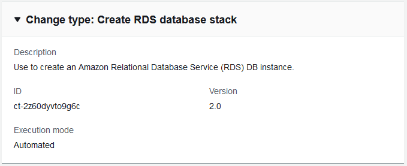

# RDS Database Stack | Create

Create an Amazon Relational Database Service (RDS) DB instance. To provision an Aurora single instance or multi-AZ instances, use CT ct-2jvzjwunghrhy.

**Full classification:** Deployment | Advanced stack components | RDS database stack | Create

## Change Type Details

|                             |                  |
| --------------------------- | ---------------- | -------------------------------------------------------------------------------------------------------------------------------------------------------------------------------------------------------------------------------------------------------------------------------------------------------------------------------------------------------------------------------------------------------------------------------------------------------------------------------------------------------------------------------------------------------------------------------------------------------------------------------------------------------------------------------------------------------------------------------------------------------------------------------------------------------------------------------------------------------------------------------------------------------------------------------------------------------------------------------------------------------------------------------------------------------------------------------------------------------------------------------------------------------------------------------------------------------------------------------------------------------------------------------------------------------------------------------------------------------------------------------------------------------------------------------------------------------------------------------------------------------------------------------------------------------------------------------------------------------------------------------------------------------------------------------------------------------------------------------------------------------------------------------------------------------------------------------------------------------------------------------------------------------------------------------------------------------------------------------------------------------------------------------------------------------------------------------------------------------------------------------------------------------------------------------------------------------------------------------------------------------------------------------------------------------------------------------------------------------------------------------------------------------------------------------------------------------------------------------------------------------------------------------------------------------------------------------------------------------------------------------------------------------------------------------------------------------------------------------------------------------------------------------------------------------------------------------------------------------------------------------------------------------------------------------------------------------------------------------------------------------------------------------------------------------------------------------------------------------------------------------------------------------------------------------------------------------------------------------------------------------------------------------------------------------------------------------------------------------------------------------------------------------------------------------------------------------------------------------------------------------------------------------------------------------------------------------------------------------------------------------------------------------------------------------------------------------------------------------------------------------------------------------------------------------------------------------------------------------------------------------------------------------------------------------------------------------------------------------------------------------------------------------------------------------------------------------------------------------------------------------------------------------------------------------------------------------------------------------------------------------------------------------------------------------------------------------------------------------------------------------------------------------------------------------------------------------------------------------------------------------------------------------------------------------------------------------------------------------------------------------------------------------------------------------------------------------------------------------------------------------------------------------------------------------------------------------------------------------------------------------------------------------------------------------------------------------------------------------------------------------------------------------------------------------------------------------------------------------------------------------------------------------------------------------------------------------------------------------------------------------------------------------------------------------------------------------------------------------------------------------------------------------------------------------------------------------------------------------------------------------------------------------------------------------------------------------------------------------------------------------------------------------------------------------------------------------------------------------------------------------------------------------------------------------------------------------------------------------------------------------------------------------------------------------------------------------------------------------------------------------------------------------------------------------------------------------------------------------------------------------------------------------------------------------------------------------------------------------------------------------------------------------------------------------------------------------------------------------------------------------------------------------------------------------------------------------------------------------------------------------------------------------------------------------------------------------------------------------------------------------------------------------------------------------------------------------------------------------------------------------------------------------------------------------------------------------------------------------------------------------------------------------------------------------------------------------------------------------------------------------------------------------------------------------------------------------------------------------------------------------------------------------------------------------------------------------------------------------------------------------------------------------------------------------------------------------------------------------------------------------------------------------------------------------------------------------------------------------------------------------------------------------------------------------------------------------------------------------------------------------------------------------------------------------------------------------------------------------------------------------------------------------------------------------------------------------------------------------------------------------------------------------------------------------------------------------------------------------------------------------------------------------------------------------------------------------------------------------------------------------------------------------------------------------------------------------------------------------------------------------------------------------------------------------------------------------------------------------------------------------------------------------------------------------------------------------------------------------------------------------------------------------------------------------------------------------------------------------------------------------------------------------------------------------------------------------------------------------------------------------------------------------------------------------------------------------------------------------------------------------------------------------------------------------------------------------------------------------------------------------------------------------------------------------------------------------------------------------------------------------------------------------------------------------------------------------------------------------------------------------------------------------------------------------------------------------------------------------------------------------------------------------------------------------------------------------------------------------------------------------------------------------------------------------------------------------------------------------------------------------------------------------------------------------------------------------------------------------------------------------------------------------------------------------------------------------------------------------------------------------------------------------------------------------------------------------------------------------------------------------------------------------------------------- |
| Change type ID              | ct-2z60dyvto9g6c |
| Current version             | 3.0              |
| Expected execution duration | 360 minutes      |
| AWS approval                | Required         |
| Customer approval           | Not required     |
| Execution mode              | Automated        | ## Additional Information ### Create DB stack Screenshot of this change type in the AMS console:  How it works: 1. Navigate to the **Create RFC** page: In the left navigation pane of the AMS console click **RFCs** to open the RFCs list page, and then click **Create RFC**. 2. Choose a popular change type (CT) in the default **Browse change types** view, or select a CT in the **Choose by category** view.  • **Browse by change type**: You can click on a popular CT in the **Quick create** area to immediately open the **Run RFC** page. Note that you cannot choose an older CT version with quick create. To sort CTs, use the **All change types** area in either the **Card** or **Table** view. In either view, select a CT and then click **Create RFC** to open the **Run RFC** page. If applicable, a **Create with older version** option appears next to the **Create RFC** button.  • **Choose by category**: Select a category, subcategory, item, and operation and the CT details box opens with an option to **Create with older version** if applicable. Click **Create RFC** to open the **Run RFC** page. 3. On the **Run RFC** page, open the CT name area to see the CT details box. A **Subject** is required (this is filled in for you if you choose your CT in the **Browse change types** view). Open the **Additional configuration** area to add information about the RFC. In the **Execution configuration** area, use available drop-down lists or enter values for the required parameters. To configure optional execution parameters, open the **Additional configuration** area. 4. When finished, click **Run**. If there are no errors, the **RFC successfully created** page displays with the submitted RFC details, and the initial **Run output**. 5. Open the **Run parameters** area to see the configurations you submitted. Refresh the page to update the RFC execution status. Optionally, cancel the RFC or create a copy of it with the options at the top of the page. How it works: 1. Use either the Inline Create (you issue a `create-rfc` command with all RFC and execution parameters included), or Template Create (you create two JSON files, one for the RFC parameters and one for the execution parameters) and issue the `create-rfc` command with the two files as input. Both methods are described here. 2. Submit the RFC: `aws amscm submit-rfc --rfc-id `ID`` command with the returned RFC ID. Monitor the RFC: `aws amscm get-rfc --rfc-id `ID`` command. To check the change type version, use this command: `` aws amscm list-change-type-version-summaries --filter Attribute=ChangeTypeId,Value=`CT_ID` `` _INLINE CREATE_: Issue the create RFC command with execution parameters provided inline (escape quotation marks when providing execution parameters inline), and then submit the returned RFC ID. For example, you can replace the contents with something like this: ``create-rfc --change-type-id "ct-2z60dyvto9g6c" --change-type-version "3.0" --title "`RDS-Create-QC-RFC`" --execution-parameters "{\"Description\":\"`My RDS DB`\", \"VpcId\":\"`VPC_ID`\", \"StackTemplateId\":\"stm-sl81ze00000000000\", \"Name\":\"`RDS-Create-QC`\", \"TimeoutInMinutes\":60, \"Parameters\":{\"RDSAllocatedStorage\":`100`, \"RDSDBEngine\":\"`MySQL`\", \"RDSDBName\":\"`MyDB`\", \"RDSEngineVersion\":\"`8.0.20`\", \"RDSLicenseModel\":\"`bring-your-own-license`\", \"RDSMasterUsername\":\"`myUser`\", \"RDSMasterUserPassword\":\"`myPassWord`\", \"RDSSubnetIds\":[\"`SUBNET_ID`\",\"`SUBNET_ID`\"]}}"`` _TEMPLATE CREATE_: 1. Output the execution parameters for this change type to a JSON file named CreateRdsParams.json. `aws amscm get-change-type-version --change-type-id "ct-2z60dyvto9g6c" --query "ChangeTypeVersion.ExecutionInputSchema" --output text > CreateRdsParams.json` 2. Modify and save the execution parameters JSON file. For example, you can replace the contents with something like this: Oracle example: ``{ "Description":          "`Create-RDS-DB`", "VpcId":                "`VPC_ID`", "StackTemplateId":      "stm-sl81ze00000000000", "Name":                 "`My-RDS-DB`", "TimeoutInMinutes":     `60`, "Parameters":   { "RDSAllocatedStorage":      `50`, "RDSDBEngine":              "`oracle-se1`", "RDSDBName":                "`MyRds`", "RDSEngineVersion":         "`11.2.0.4.v13`", "RDSInstanceType":          "`db.m1.small`", "RDSLicenseModel":          "`license-included`", "RDSMasterUsername":        "`dbadmin`", "RDSMasterUserPassword":    "`p4ssw0rd`", "RDSSubnetIds":             ["`PRIVATE_AZ1_SUBNET`", "`PRIVATE_AZ2_SUBNET`"] } }`` MySQL example: ``{ "Description":          "`Create-RDS-DB`", "VpcId":                "`VPC_ID`", "StackTemplateId":      "stm-sl81ze00000000000", "Name":                 "`My-RDS-DB`", "TimeoutInMinutes":     `60`, "Parameters":   { "RDSAllocatedStorage":      `50`, "RDSDBEngine":              "`MySQL`", "RDSDBName":                "`MyRds`", "RDSEngineVersion":         "`8.0.20`", "RDSInstanceType":          "`db.m1.small`", "RDSLicenseModel":          "`general-public-license`", "RDSMasterUsername":        "`dbadmin`", "RDSMasterUserPassword":    "`p4ssw0rd`", "RDSSubnetIds":             ["`PRIVATE_AZ1_SUBNET`", "`PRIVATE_AZ2_SUBNET`"] } }`` 3. Output the JSON template to a file in your current folder; this example names it CreateRdsRfc.json: `aws amscm create-rfc --generate-cli-skeleton > CreateRdsRfc.json` 4. Modify and save the CreateRdsRfc.json file. For example, you can replace the contents with something like this: ``{ "ChangeTypeVersion":    "`3.0`", "ChangeTypeId":         "ct-2z60dyvto9g6c", "Title":                "`RDS-Create-RFC`" }`` 5. Create the RFC, specifying the execution parameters file and the CreateRdsRfc file: `aws amscm create-rfc --cli-input-json file://CreateRdsRfc.json --execution-parameters file://CreateRdsParams.json` You receive the ID of the new RFC in the response and can use it to submit and monitor the RFC. Until you submit it, the RFC remains in the editing state and does not start. 6. To view the RDS, look in the execution output: Use the "stack_id" to view the RDS in the Cloud Formation Console. To create a Delete Stack or Update RDS RFC, use the first part of the DatabaseEndpoint (the DB instance ID) to create a Reboot RDS RFC, use the entire DatabaseEndpoint to programmatically access the RDS DB. 7. You are now able to manage the database via a database management tool such as SQL server management studio. You do not have to request access from AMS. ###### Note The **RDSDBEngine** parameter has a new value available: **mariadb**. ###### Note You can add up to 50 tags, but to do so you must enable the **Additional configuration** view. To learn more about Amazon RDS, including size recommendations, see [Amazon Relational Database Service Documentation](https://aws.amazon.com/documentation/rds/ "https://aws.amazon.com/documentation/rds/"). To create an Aurora RDS stack, see [Create DB stack (for Aurora)](deployment-advanced-rds-database-stack-create-for-aurora.md#ex-rds-create-aurora-stack-col "deployment-advanced-rds-database-stack-create-for-aurora.md#ex-rds-create-aurora-stack-col"). To create an RDS stack from a snapshot, see [Create DB from snapshot](deployment-advanced-rds-database-stack-create-from-snapshot.md#ex-rds-create-stack-frm-snpsht-col "deployment-advanced-rds-database-stack-create-from-snapshot.md#ex-rds-create-stack-frm-snpsht-col"). ## Execution Input Parameters For detailed information about the execution input parameters, see [Schema for Change Type ct-2z60dyvto9g6c](schemas.md#ct-2z60dyvto9g6c-schema-section "schemas.md#ct-2z60dyvto9g6c-schema-section"). ## Example: Required Parameters `{ "Description": "This is a test description", "VpcId": "vpc-1234567890abcdef0", "StackTemplateId": "stm-sl81ze20000000000", "Name": "Test Stack", "TimeoutInMinutes": 60, "Parameters": { "RDSAllocatedStorage": 50, "RDSDBEngine": "mysql", "RDSDBName": "my_db", "RDSEngineVersion": "5.6.27", "RDSInstanceType": "db.m3.medium", "RDSMasterUsername": "myadminuser", "RDSMasterUserPassword": "MySecurePassword", "RDSSubnetIds": ["subnet-1234567890abcdef0", "subnet-1234567890abcdef1"] } }` ## Example: All Parameters `{ "Description": "This is a test description", "VpcId": "vpc-12345678", "StackTemplateId": "stm-sl81ze20000000000", "Name": "Test Stack", "Tags": [ { "Key": "foo", "Value": "bar" }, { "Key": "testkey", "Value": "testvalue" } ], "TimeoutInMinutes": 60, "Parameters": { "RDSAllocatedStorage": 100, "RDSBackupRetentionPeriod": 7, "RDSAutoMinorVersionUpgrade": true, "RDSCharacterSetName": "", "RDSDBEngine": "sqlserver-ex", "RDSDBName": "my_db", "RDSDBParameterGroupName": "default.sqlserver-ex-13.0", "RDSDeletionProtection": true, "RDSEngineVersion": "13.00.4522.0.v1", "RDSInstanceType": "db.t2.micro", "RDSIOPS": 0, "RDSLicenseModel": "license-included", "RDSMasterUsername": "myadminuser", "RDSMasterUserPassword": "MySecurePassword", "RDSMultiAZ": false, "RDSOptionGroupName": "default:sqlserver-ex-13-00", "RDSPerformanceInsights" : "true", "RDSPerformanceInsightsKMSKey":"arn:aws:kms:us-east-1:123456789012:key/2590cd3a-f979-49db-adec-d213775385af", "RDSPerformanceInsightsRetentionPeriod":"7", "RDSPort": 1433, "RDSPreferredBackupWindow": "22:00-23:00", "RDSPreferredMaintenanceWindow": "wed:03:32-wed:04:02", "RDSStorageEncrypted": true, "RDSStorageEncryptionKey": "arn:aws:kms:us-east-1:123456789012:key/2590cd3a-f979-49db-adec-d213775385af", "RDSStorageType": "gp2", "RDSSubnetIds": ["subnet-12345678", "subnet-23456789"], "RDSTimezone": "Eastern Standard Time" } }` |
