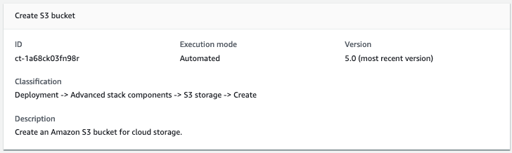

# S3 Storage | Create

Create an Amazon S3 bucket for cloud storage.

**Full classification:** Deployment | Advanced stack components | S3 storage | Create

## Change Type Details

|                             |                  |
| --------------------------- | ---------------- |
| Change type ID              | ct-1a68ck03fn98r |
| Current version             | 5.0              |
| Expected execution duration | 60 minutes       |
| AWS approval                | Required         |
| Customer approval           | Not required     |
| Execution mode              | Automated        |

## Additional Information

### Create S3 storage

Screenshot of this change type in the AMS console:


How it works:

1. Navigate to the **Create RFC** page: In the left navigation pane of the AMS console click **RFCs** to open the RFCs list page, and then click **Create RFC**.
2. Choose a popular change type (CT) in the default **Browse change types** view, or select a CT in the
   **Choose by category** view.
   - **Browse by change type**: You can click on a popular CT in the **Quick create** area to immediately open the
     **Run RFC** page. Note that you cannot choose an older CT version with quick create.

   To sort CTs, use the **All change types** area in either the **Card** or **Table** view.
   In either view, select a CT and then click **Create RFC** to open the **Run RFC** page. If applicable,
   a **Create with older version** option appears next to the **Create RFC** button.
   - **Choose by category**: Select a category, subcategory, item, and operation and the CT details box opens with an option to
     **Create with older version** if applicable. Click **Create RFC** to open the **Run RFC** page.

3. On the **Run RFC** page, open the CT name area to see the CT details box.
   A **Subject** is required (this is filled in for you if you choose your CT in the **Browse change types** view). Open the
   **Additional configuration** area to add information about the RFC.

In the **Execution configuration** area, use available drop-down lists or enter values for the required parameters. To configure
optional execution parameters, open the **Additional configuration** area. 4. When finished, click **Run**. If there are no errors, the **RFC successfully created**
page displays with the submitted RFC details, and the initial **Run output**. 5. Open the **Run parameters** area to see the configurations you submitted. Refresh the page to update the RFC execution status.
Optionally, cancel the RFC or create a copy of it with the options at the top of the page.
How it works:

1. Use either the Inline Create (you issue a `create-rfc` command with all RFC and execution parameters included), or
   Template Create (you create two JSON files, one for the RFC parameters and one for the execution parameters) and issue the `create-rfc`
   command with the two files as input. Both methods are described here.
2. Submit the RFC: `aws amscm submit-rfc --rfc-id `ID`` command with the returned RFC ID.

Monitor the RFC: `aws amscm get-rfc --rfc-id `ID`` command.
To check the change type version, use this command:

```
aws amscm list-change-type-version-summaries --filter Attribute=ChangeTypeId,Value=`CT_ID`
```

_INLINE CREATE_:

Issue the create RFC command with execution parameters provided inline (escape quotation marks when providing execution parameters inline), and then submit the returned RFC ID. For example, you can replace the contents with something like this:

**Example with only required parameters, version 5.0:**

```
aws amscm create-rfc --title "my-s3-bucket" --change-type-id "ct-1a68ck03fn98r" --change-type-version "5.0" --execution-parameters "{\"DocumentName\":\"`AWSManagedServices-CreateBucket`\",\"Region\":\"`us-east-1`\",\"Parameters\":{\"BucketName\":\"`amzn-s3-demo-bucket`\"}}"
```

**Example with all parameters, version 5.0:**

```
aws amscm create-rfc --title "My S3 Bucket" --change-type-id "ct-1a68ck03fn98r" --change-type-version "5.0" --execution-parameters "{\"DocumentName\":\"AWSManagedServices-CreateBucket\",\"Region\":\"`us-east-1`\",\"Parameters\":{\"BucketName\":\"`amzn-s3-demo-bucket`\",\"ServerSideEncryption\":\"KmsManagedKeys\",\"KMSKeyId\":\"`arn:aws:kms:ap-southeast-2:123456789012:key/9d5948f1-2082-4c07-a183-eb829b8d81c4`\",\"Versioning\":\"`Enabled`\",\"IAMPrincipalsRequiringReadObjectAccess\":[\"`arn:aws:iam::123456789012:user/myuser`\",\"`arn:aws:iam::123456789012:role/myrole`\"],\"IAMPrincipalsRequiringWriteObjectAccess\":[\"`arn:aws:iam::123456789012:user/myuser`\",\"`arn:aws:iam::123456789012:role/myrole`\"],\"ServicesRequiringReadObjectAccess\":[\"`rds.amazonaws.com`\",\"`ec2.amazonaws.com`\",\"`logs.ap-southeast-2.amazonaws.com`\"],\"`ServicesRequiringWriteObjectAccess`\":[\"`rds.amazonaws.com`\",\"`ec2.amazonaws.com`\",\"`logs.ap-southeast-2.amazonaws.com`\"],\"EnforceSecureTransport\"`:true,`\"AccessAllowedIpRanges\":[\"`1.0.0.0/24\`",\"`2.0.0.0/24\`"]}}"
```

_TEMPLATE CREATE_:

1. Output the execution parameters JSON schema for this change type to a file; this example names it CreateBucketParams.json.

```
aws amscm get-change-type-version --change-type-id "ct-1a68ck03fn98r" --query "ChangeTypeVersion.ExecutionInputSchema" --output text > CreateBucketParams.json
```

2. Modify and save the CreateBucketParams file. Note that you do not need to use your account ID in the `BucketName`, but it can make finding
   the bucket easier (remember that bucket names must be unique in the account across all regions and cannot have uppercase letters). If using this to create a tier-and-tie WordPress site, you may want to
   indicate that purpose when setting the `BucketName`.

**Example with read access:**

```
{
  "DocumentName": "AWSManagedServices-CreateBucket",
  "Region": "`us-east-1`",
  "Parameters": {
    "BucketName": "`amzn-s3-demo-bucket`",
    "IAMPrincipalsWithReadObjectAccess": [
      "`arn:aws:iam::123456789123:role/roleA`",
      "`arn:aws:iam::987654321987:role/roleB`"
    ]
  }
}
```

**Example with write access:**

```
{
    "DocumentName": "AWSManagedServices-CreateBucket",
    "Region": "`us-east-1`",
    "Parameters": {
      "BucketName": "`amzn-s3-demo-bucket",
 "IAMPrincipalsRequiringWriteObjectAccess`": [
        "`arn:aws:iam::123456789123:role/roleA`",
        "`arn:aws:iam::987654321987:role/roleB`"
      ]
    }
}
```

For the resulting policy, see [Grants READ access for an IAM User or a Role](#s3-create-read-for-user-or-role "#s3-create-read-for-user-or-role").

**Example with read access to service:**

```
{
    "DocumentName": "AWSManagedServices-CreateBucket",
    "Region": "`us-east-1`",
    "Parameters": {
      "BucketName": "`amzn-s3-demo-bucket`",
      "ServicesRequiringWriteObjectAccess": [
        "`rds.amazonaws.com`",
        "`logs.ap-southeast-2.amazonaws.com`",
        "`ec2.amazonaws.com`"
      ]
    }
}
```

For the resulting policy, see [Grants WRITE access for an IAM User or a Role](#s3-create-write-for-user-or-role "#s3-create-write-for-user-or-role").

**Example with write access to service:**

```
{
    "DocumentName": "AWSManagedServices-CreateBucket",
    "Region": "`us-east-1`",
    "Parameters": {
      "BucketName": "`amzn-s3-demo-bucket`",
      "ServicesRequiringWriteObjectAccess": [
        "`rds.amazonaws.com`",
        "`logs.ap-southeast-2.amazonaws.com`",
        "`ec2.amazonaws.com`"
      ]
    }
}
```

**Example with enforce secure transport:**

```
{
    "DocumentName": "AWSManagedServices-CreateBucket",
    "Region": "`us-east-1`",
    "Parameters": {
      "BucketName": "`amzn-s3-demo-bucket`",
      "EnforceSecureTransport": "`true`"
    }
}
```

For the resulting policy, see [Uses EnforceSecureTransport](#s3-create-enforce-secure-transport "#s3-create-enforce-secure-transport").

**Example with limits access to the bucket from a set of IP ranges:**

```
 {
    "DocumentName": "AWSManagedServices-CreateBucket",
    "Region": "`us-east-1`",
    "Parameters": {
      "BucketName": "`amzn-s3-demo-bucket`",
      "AccessAllowedIpRanges": [
        "`1.2.3.0/24`",
        "`2.3.4.0/24`"
      ]
    }
  }
```

For the resulting policy, see [Limits Access to IP Range](#s3-create-limits-access-to-ips "#s3-create-limits-access-to-ips"). 3. Output the RFC template JSON file to a file named CreateBucketRfc.json:

```
aws amscm create-rfc --generate-cli-skeleton > CreateBucketRfc.json
```

4. Modify and save the CreateBucketRfc.json file. For example, you can replace the contents with something like this:

```
{
"ChangeTypeVersion":    "`5.0`",
"ChangeTypeId":         "ct-1a68ck03fn98r",
"Title":                "`S3-Bucket-Create-RFC`",
"RequestedStartTime":   "`2016-12-05T14:20:00Z`",
"RequestedEndTime":     "`2016-12-05T16:20:00Z`"
}
```

5. Create the RFC, specifying the CreateBucketRfc file and the CreateBucketParams file:

```
aws amscm create-rfc --cli-input-json file://CreateBucketRfc.json  --execution-parameters file://CreateBucketParams.json
```

You receive the ID of the new RFC in the response and can use it to submit and monitor the RFC. Until you submit it, the RFC remains in the editing state and does not start. 6. To view the S3 bucket or load objects to it, look in the execution output: Use the `stack_id` to view the bucket in the Cloud Formation Console,
use the S3 bucket name to view the bucket in the S3 Console.

###### Note

When uploading objects from a non-owner account, it is mandatory to specify the `bucket-owner-full-control` ACL, that grants the bucket owner account full control over all the objects in the bucket. Example:

```
aws s3api put-object --acl `bucket-owner-full-control` --bucket `amzn-s3-demo-bucket` --key `data.txt` --body `/tmp/data.txt`
```

###### Note

This walkthrough describes, and provides example commands for, creating an Amazon S3 storage bucket using version 5.0 of the change type (ct-1a68ck03fn98r).
This version does not allow you to create a public S3 bucket, only private is allowed. To create a public S3 storage bucket, use a previous version of the
change type, and specify **PublicRead** for the **AccessControl** parameter.

Also, this walkthrough does not grant the permissions necessary for deleting versioned
objects.

To learn more about Amazon S3, see [Amazon Simple Storage Service Documentation](https://aws.amazon.com/documentation/s3/ "https://aws.amazon.com/documentation/s3/").

#### S3 Storage Bucket Create Example Resulting Policies

Depending on how you created your Amazon S3 storage bucket, you created policies. These example policies match various Amazon S3 create scenarios provided in
[Creating an S3 Bucket with the CLI](#s3-create-cli "#s3-create-cli").

##### Grants READ access for an IAM User or a Role

Resulting example policy grants READ access to the objects in the bucket for an IAM user or a role:

```
{
          "Sid": "AllowBucketReadActionsForArns",
          "Effect": "Allow",
          "Principal": {
              "AWS": [
                  "arn:aws:iam::123456789123:role/roleA”,
                  "arn:aws:iam::987654321987:role/roleB”
              ]
          },
          "Action": [
              "s3:GetBucketAcl",
              "s3:GetBucketLocation",
              "s3:ListBucket"
          ],
          "Resource": "arn:aws:s3:::`ACCOUNT-ID`.`BUCKET_NAME`"
      },
      {
          "Sid": "AllowObjectReadActionsForArns",
          "Effect": "Allow",
          "Principal": {
              "AWS": [
                  "arn:aws:iam::123456789123:role/roleA”,
                  "arn:aws:iam::987654321987:role/roleB”
              ]
          },
          "Action": [
              "s3:GetObject",
              "s3:ListMultipartUploadParts"
          ],
          "Resource": "arn:aws:s3:::`ACCOUNT-ID`.`amzn-s3-demo-bucket`/*"
}
```

For the execution parameters to create this policy with the S3 storage bucket Create change type, see [Creating an S3 Bucket with the CLI](#s3-create-cli "#s3-create-cli")

##### Grants WRITE access for an IAM User or a Role

The following resulting example policy grants WRITE access to the objects in the bucket for a IAM user or a role.
This policy does not grant the permissions necessary for deleting versioned objects.

```
{
          "Sid": "AllowObjectWriteActionsForArns",
          "Effect": "Allow",
          "Principal": {
              "AWS": [
                  "arn:aws:iam::123456789123:role/roleA”,
                  "arn:aws:iam::987654321987:role/roleB”
              ]
          },
          "Action": [
              "s3:PutObject",
              "s3:DeleteObject",
              "s3:AbortMultipartUpload"
          ],
          "Resource": "arn:aws:s3:::`ACCOUNT-ID`.`amzn-s3-demo-bucket`/*"
}
```

For the execution parameters to create this policy with the S3 storage bucket Create change type, see [Creating an S3 Bucket with the CLI](#s3-create-cli "#s3-create-cli")

##### Grants READ access for an AWS Service

Resulting example policy grants READ access to the objects in the bucket for an AWS service:

```
{
          "Sid": "AllowBucketReadActionsForServcices",
          "Effect": "Allow",
          "Principal": {
              "Service": [
                  "rds.amazonaws.com",
                  "logs.ap-southeast-2.amazonaws.com",
                  "ec2.amazonaws.com"
              ]
          },
          "Action": [
              "s3:GetBucketAcl",
              "s3:GetBucketLocation",
              "s3:ListBucket"
          ],
          "Resource": "arn:aws:s3:::`ACCOUNT-ID`.`amzn-s3-demo-bucket`/*"
      },
      {
          "Sid": "AllowObjectReadActionsForServcices",
          "Effect": "Allow",
          "Principal": {
              "Service": [
                  "rds.amazonaws.com",
                  "logs.ap-southeast-2.amazonaws.com",
                  "ec2.amazonaws.com"
              ]
          },
          "Action": [
              "s3:GetObject",
              "s3:ListMultipartUploadParts"
          ],
          "Resource": "arn:aws:s3:::`ACCOUNT-ID`.`amzn-s3-demo-bucket`/*"
}
```

For the execution parameters to create this policy with the S3 storage bucket Create change type, see [Creating an S3 Bucket with the CLI](#s3-create-cli "#s3-create-cli")

##### Grants WRITE access for an AWS Service

The following resulting example policy grants WRITE access to the objects in the bucket for an AWS service.
This policy does not grant the permissions necessary for deleting versioned objects.

```
{
      "Sid": "AllowObjectWriteActionsForServcices",
      "Effect": "Allow",
      "Principal": {
        "Service": [
            "rds.amazonaws.com",
            "logs.ap-southeast-2.amazonaws.com",
            "ec2.amazonaws.com"
        ]
    },
    "Action": [
          "s3:PutObject",
          "s3:DeleteObject",
          "s3:AbortMultipartUpload"
      ],
      "Resource": "arn:aws:s3:::`ACCOUNT-ID`.`amzn-s3-demo-bucket`/*"
}
```

For the execution parameters to create this policy with the S3 storage bucket Create change type, see [Creating an S3 Bucket with the CLI](#s3-create-cli "#s3-create-cli")

##### Uses EnforceSecureTransport

Resulting example policy enforcing secure transport:

```
{
          "Sid": "EnforceSecureTransport",
          "Effect": "Deny",
          "Principal": "*",
          "Action": "*",
          "Resource": "arn:aws:s3:::`ACCOUNT-ID`.`amzn-s3-demo-bucket`/*",
          "Condition": {
              "Bool": {
                  "aws:SecureTransport": "false"
              }
          }
}
```

For the execution parameters to create this policy with the S3 storage bucket Create change type, see [Creating an S3 Bucket with the CLI](#s3-create-cli "#s3-create-cli")

##### Limits Access to IP Range

Resulting example policy limiting access to the bucket from a set of IP ranges:

```
{
          "Sid": "RestrictBasedOnIPRanges",
          "Effect": "Deny",
          "Principal": "*",
          "Action": "s3:*",
          "Resource": "arn:aws:s3:::`ACCOUNT-ID`.`amzn-s3-demo-bucket`/*",
          "Condition": {
              "NotIpAddress": {
                  "aws:SourceIp": [
                      “1.2.3.0/24",
                      “2.3.4.0/24"
                  ]
              }
          }
      }
```

For the execution parameters to create this policy with the S3 storage bucket Create change type, see [Creating an S3 Bucket with the CLI](#s3-create-cli "#s3-create-cli")

## Execution Input Parameters

For detailed information about the execution input parameters, see
[Schema for Change Type ct-1a68ck03fn98r](schemas.md#ct-1a68ck03fn98r-schema-section "schemas.md#ct-1a68ck03fn98r-schema-section").

## Example: Required Parameters

```
{
  "DocumentName" : "AWSManagedServices-CreateBucket",
  "Region": "us-east-1",
  "Parameters": {
    "BucketName": "mybucket"
  }
}

```

## Example: All Parameters

```
{
  "DocumentName" : "AWSManagedServices-CreateBucket",
  "Region": "us-east-1",
  "Parameters": {
    "BucketName": "mybucket",
    "ServerSideEncryption": "KmsManagedKeys",
    "KMSKeyId": "arn:aws:kms:ap-southeast-2:123456789012:key/9d5948f1-2082-4c07-a183-eb829b8d81c4",
    "Versioning": "Enabled",
    "IAMPrincipalsRequiringReadObjectAccess": [
      "arn:aws:iam::123456789012:user/myuser",
      "arn:aws:iam::123456789012:role/myrole"
    ],
    "IAMPrincipalsRequiringWriteObjectAccess": [
      "arn:aws:iam::123456789012:user/myuser",
      "arn:aws:iam::123456789012:role/myrole"
    ],
    "ServicesRequiringReadObjectAccess": [
      "rds.amazonaws.com",
      "ec2.amazonaws.com",
      "logs.ap-southeast-2.amazonaws.com"
    ],
    "ServicesRequiringWriteObjectAccess": [
      "rds.amazonaws.com",
      "ec2.amazonaws.com",
      "logs.ap-southeast-2.amazonaws.com"
    ],
    "EnforceSecureTransport": true,
    "AccessAllowedIpRanges": [
      "1.0.0.0/24",
      "2.0.0.0/24"
    ],
    "Tags": [
      "{\"Key\": \"foo\", \"Value\": \"bar\"}",
      "{ \"Key\": \"testkey\",\"Value\": \"testvalue\" }"
    ]
  }
}

```
