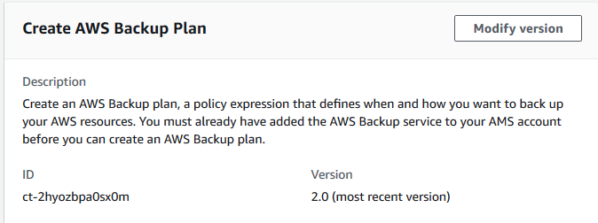

# Backup Plan | Create

Create an AWS Backup plan, a policy expression that defines when and how you want to back up your AWS resources.

**Full classification:** Deployment | AWS Backup | Backup plan | Create

## Change Type Details

|                             |                  |
| --------------------------- | ---------------- | ------------------------------------------------------------------------------------------------------------------------------------------------------------------------------------------------------------------------------------------------------------------------------------------------------------------------------------------------------------------------------------------------------------------------------------------------------------------------------------------------------------------------------------------------------------------------------------------------------------------------------------------------------------------------------------------------------------------------------------------------------------------------------------------------------------------------------------------------------------------------------------------------------------------------------------------------------------------------------------------------------------------------------------------------------------------------------------------------------------------------------------------------------------------------------------------------------------------------------------------------------------------------------------------------------------------------------------------------------------------------------------------------------------------------------------------------------------------------------------------------------------------------------------------------------------------------------------------------------------------------------------------------------------------------------------------------------------------------------------------------------------------------------------------------------------------------------------------------------------------------------------------------------------------------------------------------------------------------------------------------------------------------------------------------------------------------------------------------------------------------------------------------------------------------------------------------------------------------------------------------------------------------------------------------------------------------------------------------------------------------------------------------------------------------------------------------------------------------------------------------------------------------------------------------------------------------------------------------------------------------------------------------------------------------------------------------------------------------------------------------------------------------------------------------------------------------------------------------------------------------------------------------------------------------------------------------------------------------------------------------------------------------------------------------------------------------------------------------------------------------------------------------------------------------------------------------------------------------------------------------------------------------------------------------------------------------------------------------------------------------------------------------------------------------------------------------------------------------------------------------------------------------------------------------------------------------------------------------------------------------------------------------------------------------------------------------------------------------------------------------------------------------------------------------------------------------------------------------------------------------------------------------------------------------------------------------------------------------------------------------------------------------------------------------------------------------------------------------------------------------------------------------------------------------------------------------------------------------------------------------------------------------------------------------------------------------------------------------------------------------------------------------------------------------------------------------------------------------------------------------------------------------------------------------------------------------------------------------------------------------------------------------------------------------------------------------------------------------------------------------------------------------------------------------------------------------------------------------------------------------------------------------------------------------------------------------------------------------------------------------------------------------------------------------------------------------------------------------------------------------------------------------------------------------------------------------------------------------------------------------------------------------------------------------------------------------------------------------------------------------------------------------------------------------------------------------------------------------------------------------------------------------------------------------------------------------------------------------------------------------------------------------------------------------------------------------------------------------------------------------------------------------------------------------------------------------------------------------------------------------------------------------------------------------------------------------------------------------------------------------------------------------------------------------------------------------------------------------------------------------------------------------------------------------------------------------------------------------------------------------------------------------------------------------------------------------------------------------------------------------------------------------------------------------------------------------------------------------------------------------------------------------------------------------------------------------------------------------------------------------------------------------------------------------------------------------------------------------------------------------------------------------------------------------------------------------------------------------------------------------------------------------------------------------------------------------------------------------------------------------------------------------------------------------------------------------------------------------------------------------------------------------------------------------------------------------------------------------------------------------------------------------------------------------------------------------------------------------------------------------------------------------------------------------------------------------------------------------------------------------------------------------------------------------------------------------------------------------------------------------------------------------------------------------------------------------------------------------------------------------------------------------------------------------------------------------------------------------------------------------------------------------------------------------------------------------------------------------------------------------------------------------------------------------------------------------------------------------------------------------------------------------------------------------------------------------------------------------------------------------------------------------------------------------------------------------------------------------------------------------------------------------------------------------------------------------------------------------------------------------------------- | ---------------------------------------------------------------------------------------------------------------------------------------------------------------------------------------------------------------------------------------------------------------------------------------------------------------------------------------------------------------------------------------------------------------------------------------------------------------------------------------------------------------------------------------------------------------------------------------------------------------------------------------------------------------------------------------------------------------------------------------------------------------------------------------------------------------------------------------------------------------------------------------------------------------------------------------------------------------------------------------------------------------------------------------------------------------------------------------------------------------------------------------------------------------------------------------------------------------------------------------------------------------------------------------------------------------------------------------------------------------------------------------------------------------------------------------------------------------------------------------------------------------------------------------------------------------------------------------------------------------------------------------------------------------------------------------------------------------------------------------------------------------------------------------------------------------------------------------------------------------------------------------------------------------------------------------------------------------------------------------------------------------------------------------------------------------------------------------------------------------------------------------------------------------------------------------------------------------------------------------------------------------------------------------------------------------------------------------------------------------------------------------------------------------------------------------------------------------------------------------------------------------------------------------------------------------------------------------------------------------------------------------------------------------------------------------------------------------------------------------------------------------------------------------------------------------------------------------------------------------------------------------------------------------------------------------------------------------------------------------------------------------------------------------------------------------------------------------------------------------------------------------------------------------------------------------------------------------------------------------------------------------------------------------------------------------------------------------------------------------------------------------------------------------------------------------------------------------------------------------------------------------------------------------------------------------------------------------------------------------------------------------------------------------------------------------------------------------------------------------------------------------------------------------------------------------------------------------------------------------------------------------------------------------------------------------------------------------------------------------------------------------------------------------------------------------------------------------------------------------------------------------------------------------------------------------------------------------------------------------------------------------------------------------------------------------------------------------------------------------------------------------------------------------------------------------------------------------------------------------------------------------------------------------------------------------------------- |
| Change type ID              | ct-2hyozbpa0sx0m |
| Current version             | 2.0              |
| Expected execution duration | 360 minutes      |
| AWS approval                | Required         |
| Customer approval           | Not required     |
| Execution mode              | Automated        | ## Additional Information ### Create AWS Backup plan The following shows this change type in the AMS console.  How it works: 1. Navigate to the **Create RFC** page: In the left navigation pane of the AMS console click **RFCs** to open the RFCs list page, and then click **Create RFC**. 2. Choose a popular change type (CT) in the default **Browse change types** view, or select a CT in the **Choose by category** view.  • **Browse by change type**: You can click on a popular CT in the **Quick create** area to immediately open the **Run RFC** page. Note that you cannot choose an older CT version with quick create. To sort CTs, use the **All change types** area in either the **Card** or **Table** view. In either view, select a CT and then click **Create RFC** to open the **Run RFC** page. If applicable, a **Create with older version** option appears next to the **Create RFC** button.  • **Choose by category**: Select a category, subcategory, item, and operation and the CT details box opens with an option to **Create with older version** if applicable. Click **Create RFC** to open the **Run RFC** page. 3. On the **Run RFC** page, open the CT name area to see the CT details box. A **Subject** is required (this is filled in for you if you choose your CT in the **Browse change types** view). Open the **Additional configuration** area to add information about the RFC. In the **Execution configuration** area, use available drop-down lists or enter values for the required parameters. To configure optional execution parameters, open the **Additional configuration** area. 4. When finished, click **Run**. If there are no errors, the **RFC successfully created** page displays with the submitted RFC details, and the initial **Run output**. 5. Open the **Run parameters** area to see the configurations you submitted. Refresh the page to update the RFC execution status. Optionally, cancel the RFC or create a copy of it with the options at the top of the page. How it works: 1. Use either the Inline Create (you issue a `create-rfc` command with all RFC and execution parameters included), or Template Create (you create two JSON files, one for the RFC parameters and one for the execution parameters) and issue the `create-rfc` command with the two files as input. Both methods are described here. 2. Submit the RFC: `aws amscm submit-rfc --rfc-id `ID`` command with the returned RFC ID. Monitor the RFC: `aws amscm get-rfc --rfc-id `ID`` command. To check the change type version, use this command: `` aws amscm list-change-type-version-summaries --filter Attribute=ChangeTypeId,Value=`CT_ID` `` ###### Note You can use any `CreateRfc` parameters with any RFC whether or not they are part of the schema for the change type. For example, to get notifications when the RFC status changes, add this line, `--notification "{\"Email\": {\"EmailRecipients\" : [\"email@example.com\"]}}"` to the RFC parameters part of the request (not the execution parameters). For a list of all CreateRfc parameters, see the [AMS Change Management API Reference](../ApiReference-cm/API_CreateRfc.md "../ApiReference-cm/API_CreateRfc.md"). _INLINE CREATE_: Issue the create RFC command with execution parameters provided inline (escape quotes when providing execution parameters inline), and then submit the returned RFC ID. For example, you can replace the contents with something like this: With all parameters for one rule: ``aws amscm create-rfc --change-type-id "ct-2hyozbpa0sx0m" --change-type-version "2.0" --title "`AWS Backup custom backup plan for` AMS" \ --description "`RFC_DESCRIPTION`" \ --execution-parameters "{\"VpcId\":\"`VPC_ID`\",\"Description\":\"`PLAN_DESCRIPTION`\",\"Parameters\":{\"BackupPlanName\":\"`PLAN_NAME`\",\"ResourceTagKey\":\"`TAG_KEY`\",\"ResourceTagValue\":\"`TAG_VALUE`\",\"BackupRule1Name\":\"`RULE_NAME`\",\"BackupRule1Vault\":\"`VAULT`\",\"BackupRule1CompletionWindowMinutes\":`120`,\"BackupRule1ScheduleExpression\":\"cron(`0 1 ? * * *`)\",\"BackupRule1DeleteAfterDays\":`90`,\"BackupRule1MoveToColdStorageAfterDays\":`365`,\"BackupRule1StartWindowMinutes\":`60`,\"BackupRule1RecoveryPointTagKey\":\"`TAG_KEY`\",\"BackupRule1RecoveryPointTagValue\":\"`TAG_VALUE`\,\"BackupRule1EnableContinuousBackup\":\"`false`\",\"BackupRule1CopyActionsDestVaultArn\":\"`VAULT`\",\"BackupRule1CAMoveToColdStorageAfterDays\":`0`,\"BackupRule1CopyActionsDeleteAfterDays\":`90`},\"StackTemplateId\":\"stm-sc68a620000000000\",\"TimeoutInMinutes\":`60`,\"Name\":\"`TEST_STACK`\"}"`` With only required parameters for one rule: ``aws amscm create-rfc --change-type-id "ct-2hyozbpa0sx0m" --change-type-version "2.0" --title "`AWS Backup custom backup plan for AMS`" \ --description "`RFC_DESCRIPTION`" \ --execution-parameters "{\"VpcId\":\"`VPC_ID`\",\"Description\":\"`PLAN_DESCRIPTION`\",\"Parameters\":{\"BackupPlanName\":\"`PLAN_NAME`\",\"ResourceTagKey\":\"`TAG_KEY`\",\"ResourceTagValue\":\"`TAG_VALUE`\",\"BackupRule1Name\":\"`RULE_NAME`\",\"BackupRule1Vault\":\"`VAULT`\",\"BackupRule1ScheduleExpression\":\"`cron(0 1 ? * * *)`\"},\"StackTemplateId\":\"stm-sc68a620000000000\",\"TimeoutInMinutes\":`60`,\"Name\":\"`TEST_STACK`\"}"`` _TEMPLATE CREATE_: 1. Output the execution parameters JSON schema for this change type to a JSON file; this example names it CreateBackupPlanParams.json: `aws amscm get-change-type-version --change-type-id "ct-2hyozbpa0sx0m" --query "ChangeTypeVersion.ExecutionInputSchema" --output text > CreateBackupPlanParams.json` 2. Modify and save the CreateBackupPlanParams file. Note that the **BackupRule1EnableContinuousBackup** parameter set to **true** causes AWS Backup to create continuous backups capable of point-in-time restore (PITR); the default for this parameter is **false**. ``{ "VpcId": "`VPC_ID`", "Description": "`PLAN_DESCRIPTION`", "Parameters": { "BackupPlanName" : "`PLAN_NAME`", "ResourceTagKey" : "`TAG_KEY`", "ResourceTagValue" : "`TAG_VALUE`", "BackupRule1Name" : "`RULE_NAME`", "BackupRule1Vault" : "`VAULT`", "BackupRule1EnableContinuousBackup" : "`true`", "BackupRule1ScheduleExpression" : "`cron(0 1 ? * * *)`" }, "StackTemplateId": "stm-sc68a620000000000", "TimeoutInMinutes": `60`, "Name": "`TEST_STACK`" }`` 3. Output the RFC template to a file in your current folder; this example names it CreateBackupPlanRfc.json: `aws amscm create-rfc --generate-cli-skeleton > CreateBackupPlanRfc.json` 4. Modify and save the CreateBackupPlanRfc.json file. For example, you can replace the contents with something like this: ``{ "ChangeTypeId" : "ct-2hyozbpa0sx0m", "Version" : "2.0", "Title": "`AWS Backup create backup plan`" }`` 5. Create the RFC, specifying the CreateBackupPlanRfc file and the CreateBackupPlanParams file: `aws amscm create-rfc --cli-input-json file://CreateBackupPlanRfc.json --execution-parameters file://CreateBackupPlanParams.json` You receive the ID of the new RFC in the response and can use it to submit and monitor the RFC. Until you submit it, the RFC remains in the editing state and does not start.  • The continuous backup configuration requires some additional knowledge. With continuous backups, you can restore your AWS Backup-supported resource by rewinding it back to a specific time that you choose, within 1 second of precision (going back a maximum of 35 days). In AMS Advanced, you configure this with the **BackupRule1EnableContinuousBackup** parameter set to **true**, which causes AWS Backup to create continuous backups capable of point-in-time restore (PITR). To learn more, see [Restoring to a specified time using Point-In-Time Recovery (PITR)](../../../aws-backup/latest/devguide/point-in-time-recovery.md "../../../aws-backup/latest/devguide/point-in-time-recovery.md").  • Not all resource types supported by AWS Backup are enabled by default. Review the enabled resource types in your account using [Getting Started 1: Service Opt-In](../../../aws-backup/latest/devguide/service-opt-in.md "../../../aws-backup/latest/devguide/service-opt-in.md").  • If you need to change your backup plan, open an RFC using the [Other | Create (Review Required)](management-other-other-create-review-required.md "management-other-other-create-review-required.md") CT (ct-1e1xtak34nx76).  • To learn more about AWS Backup, see [AWS Backup: How It Works](../../../aws-backup/latest/devguide/how-it-works.md "../../../aws-backup/latest/devguide/how-it-works.md").  • Before creating backup plans, confirm supported resources at [Feature availability by resource](../../../aws-backup/latest/devguide/whatisbackup.md#features-by-resource "../../../aws-backup/latest/devguide/whatisbackup.md#features-by-resource"). ## Execution Input Parameters For detailed information about the execution input parameters, see [Schema for Change Type ct-2hyozbpa0sx0m](schemas.md#ct-2hyozbpa0sx0m-schema-section "schemas.md#ct-2hyozbpa0sx0m-schema-section"). ## Example: Required Parameters `{ "Description": "This is a test description.", "VpcId": "vpc-1234567890abcdef0", "Name": "Test Stack", "Parameters": { "BackupPlanName": "MyCustomBackupPlan", "ResourceTagKey": "custom_backup_test", "ResourceTagValue": "true", "BackupRule1Name": "BackupRule1", "BackupRule1Vault": "ams-custom-backups", "BackupRule1CompletionWindowMinutes": 1440, "BackupRule1ScheduleExpression": "cron(0 2 ? * * *)", "BackupRule1DeleteAfterDays": 0, "BackupRule1MoveToColdStorageAfterDays": 0, "BackupRule1StartWindowMinutes": 180, "BackupRule1RecoveryPointTagKey": "test", "BackupRule1RecoveryPointTagValue": "test" }, "TimeoutInMinutes": 60, "StackTemplateId": "stm-sc68a620000000000" }` ## Example: All Parameters `{ "Description": "This is a test description.", "VpcId": "vpc-1234567890abcdef0", "Name": "Test Stack", "Parameters": { "BackupPlanName": "MyCustomBackupPlan", "ResourceTagKey": "custom_backup_test", "ResourceTagValue": "true", "WindowsVSS" : "disabled", "BackupRule1Name": "BackupRule1", "BackupRule1Vault": "ams-custom-backups", "BackupRule1CompletionWindowMinutes": 1440, "BackupRule1ScheduleExpression": "cron(0 2 ? * * *)", "BackupRule1DeleteAfterDays": 0, "BackupRule1MoveToColdStorageAfterDays": 0, "BackupRule1StartWindowMinutes": 180, "BackupRule1RecoveryPointTagKey": "test", "BackupRule1RecoveryPointTagValue": "test", "BackupRule1EnableContinuousBackup": "false", "BackupRule2Name": "BackupRule2", "BackupRule2Vault": "ams-custom-backups", "BackupRule2CompletionWindowMinutes": 1440, "BackupRule2ScheduleExpression": "cron(0 2 ? * * *)", "BackupRule2DeleteAfterDays": 0, "BackupRule2MoveToColdStorageAfterDays": 0, "BackupRule2StartWindowMinutes": 180, "BackupRule2RecoveryPointTagKey": "test", "BackupRule2RecoveryPointTagValue": "test", "BackupRule2EnableContinuousBackup": "false", "BackupRule3Name": "BackupRule3", "BackupRule3Vault": "ams-custom-backups", "BackupRule3CompletionWindowMinutes": 1440, "BackupRule3ScheduleExpression": "cron(0 2 ? * * *)", "BackupRule3DeleteAfterDays": 0, "BackupRule3MoveToColdStorageAfterDays": 0, "BackupRule3StartWindowMinutes": 180, "BackupRule3RecoveryPointTagKey": "test", "BackupRule3RecoveryPointTagValue": "test", "BackupRule3EnableContinuousBackup": "false", "BackupRule4Name": "BackupRule4", "BackupRule4Vault": "ams-custom-backups", "BackupRule4CompletionWindowMinutes": 1440, "BackupRule4ScheduleExpression": "cron(0 2 ? * * *)", "BackupRule4DeleteAfterDays": 0, "BackupRule4MoveToColdStorageAfterDays": 0, "BackupRule4StartWindowMinutes": 180, "BackupRule4RecoveryPointTagKey": "test", "BackupRule4RecoveryPointTagValue": "test", "BackupRule4EnableContinuousBackup": "false", "BackupRule5Name": "BackupRule5", "BackupRule5Vault": "ams-custom-backups", "BackupRule5CompletionWindowMinutes": 1440, "BackupRule5ScheduleExpression": "cron(0 2 ? * * *)", "BackupRule5DeleteAfterDays": 0, "BackupRule5MoveToColdStorageAfterDays": 0, "BackupRule5StartWindowMinutes": 180, "BackupRule5RecoveryPointTagKey": "test", "BackupRule5RecoveryPointTagValue": "test", "BackupRule5EnableContinuousBackup": "false", "BackupRule6Name": "BackupRule6", "BackupRule6Vault": "ams-custom-backups", "BackupRule6CompletionWindowMinutes": 1440, "BackupRule6ScheduleExpression": "cron(0 2 ? * * *)", "BackupRule6DeleteAfterDays": 0, "BackupRule6MoveToColdStorageAfterDays": 0, "BackupRule6StartWindowMinutes": 180, "BackupRule6RecoveryPointTagKey": "test", "BackupRule6RecoveryPointTagValue": "test", "BackupRule6EnableContinuousBackup": "false" }, "TimeoutInMinutes": 60, "StackTemplateId": "stm-sc68a620000000000" }` |
