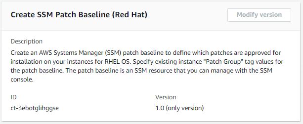

# SSM Patch Baseline | Create (Red Hat)

Create an AWS Systems Manager (SSM) patch baseline to define which patches are approved for installation on your instances for RHEL OS. Specify existing instance "Patch Group" tag values for the patch baseline. The patch baseline is an SSM resource that you can manage with the SSM console.

**Full classification:** Deployment | Patching | SSM patch baseline | Create (Red Hat)

## Change Type Details

|                             |                  |
| --------------------------- | ---------------- | -------------------------------------------------------------------------------------------------------------------------------------------------------------------------------------------------------------------------------------------------------------------------------------------------------------------------------------------------------------------------------------------------------------------------------------------------------------------------------------------------------------------------------------------------------------------------------------------------------------------------------------------------------------------------------------------------------------------------------------------------------------------------------------------------------------------------------------------------------------------------------------------------------------------------------------------------------------------------------------------------------------------------------------------------------------------------------------------------------------------------------------------------------------------------------------------------------------------------------------------------------------------------------------------------------------------------------------------------------------------------------------------------------------------------------------------------------------------------------------------------------------------------------------------------------------------------------------------------------------------------------------------------------------------------------------------------------------------------------------------------------------------------------------------------------------------------------------------------------------------------------------------------------------------------------------------------------------------------------------------------------------------------------------------------------------------------------------------------------------------------------------------------------------------------------------------------------------------------------------------------------------------------------------------------------------------------------------------------------------------------------------------------------------------------------------------------------------------------------------------------------------------------------------------------------------------------------------------------------------------------------------------------------------------------------------------------------------------------------------------------------------------------------------------------------------------------------------------------------------------------------------------------------------------------------------------------------------------------------------------------------------------------------------------------------------------------------------------------------------------------------------------------------------------------------------------------------------------------------------------------------------------------------------------------------------------------------------------------------------------------------------------------------------------------------------------------------------------------------------------------------------------------------------------------------------------------------------------------------------------------------------------------------------------------------------------------------------------------------------------------------------------------------------------------------------------------------------------------------------------------------------------------------------------------------------------------------------------------------------------------------------------------------------------------------------------------------------------------------------------------------------------------------------------------------------------------------------------------------------------------------------------------------------------------------------------------------------------------------------------------------------------------------------------------------------------------------------------------------------------------------------------------------------------------------------------------------------------------------------------------------------------------------------------------------------------------------------------------------------------------------------------------------------------------------------------------------------------------------------------------------------------------------------------------------------------------------------------------------------------------------------------------------------------------------------------------------------------------------------------------------------------------------------------------------------------------------------------------------------------------------------------------------------------------------------------------------------------------------------------------------------------------------------------------------------------------------------------------------------------------------------------------------------------------------------------------------------------------------------------------------------------------------------------------------------------------------------------------------------------------------------------------------------------------------------------------------------------------------------------------------------------------------------------------------------------------------------------------------------------------------------------------------------------------------------------------------------------------------------------------------------------------------------------------------------------------------------------------------------------------------------------------------------------------------------------------------------------------------------------------------------------------------------------------------------------------------------------------------------------------------------------------------------------------------------------------------------------------------------------------------------------------------------------------------------------------------------------------------------------------------------------------------------------------------------------------------------------------------------------------------------------------------------------------------------------------------------------------------------------------------------------------------------------------------------------------------------------------------------------------------------------------------------------------------------------------------------------------------------------------------------------------------------------------------------------------------------------------------------------------------------------------------------------------------------------------------------------------------------------------------------------------------------------------------------------------------------------------------------------------------------------------------------------------------------------------------------------------------------------------------------------------------------------------------------------------------------------------------------------------------------------------------------------------------------------------------------------------------------------------------------------------------------------------------------------------------------------------------------------------- |
| Change type ID              | ct-3ebotglihggse |
| Current version             | 1.0              |
| Expected execution duration | 60 minutes       |
| AWS approval                | Required         |
| Customer approval           | Not required     |
| Execution mode              | Automated        | ## Additional Information ### Create for RHEL Screenshot of this change type in the AMS console:  How it works: 1. Navigate to the **Create RFC** page: In the left navigation pane of the AMS console click **RFCs** to open the RFCs list page, and then click **Create RFC**. 2. Choose a popular change type (CT) in the default **Browse change types** view, or select a CT in the **Choose by category** view.  • **Browse by change type**: You can click on a popular CT in the **Quick create** area to immediately open the **Run RFC** page. Note that you cannot choose an older CT version with quick create. To sort CTs, use the **All change types** area in either the **Card** or **Table** view. In either view, select a CT and then click **Create RFC** to open the **Run RFC** page. If applicable, a **Create with older version** option appears next to the **Create RFC** button.  • **Choose by category**: Select a category, subcategory, item, and operation and the CT details box opens with an option to **Create with older version** if applicable. Click **Create RFC** to open the **Run RFC** page. 3. On the **Run RFC** page, open the CT name area to see the CT details box. A **Subject** is required (this is filled in for you if you choose your CT in the **Browse change types** view). Open the **Additional configuration** area to add information about the RFC. In the **Execution configuration** area, use available drop-down lists or enter values for the required parameters. To configure optional execution parameters, open the **Additional configuration** area. 4. When finished, click **Run**. If there are no errors, the **RFC successfully created** page displays with the submitted RFC details, and the initial **Run output**. 5. Open the **Run parameters** area to see the configurations you submitted. Refresh the page to update the RFC execution status. Optionally, cancel the RFC or create a copy of it with the options at the top of the page. In the AWS Console, you can view the patch baselines you created at Systems Manager --> Patch Manager --> Patch Baselines. How it works: 1. Use either the Inline Create (you issue a `create-rfc` command with all RFC and execution parameters included), or Template Create (you create two JSON files, one for the RFC parameters and one for the execution parameters) and issue the `create-rfc` command with the two files as input. Both methods are described here. 2. Submit the RFC: `aws amscm submit-rfc --rfc-id `ID`` command with the returned RFC ID. Monitor the RFC: `aws amscm get-rfc --rfc-id `ID`` command. To check the change type version, use this command: `` aws amscm list-change-type-version-summaries --filter Attribute=ChangeTypeId,Value=`CT_ID` `` ###### Note You can use any `CreateRfc` parameters with any RFC whether or not they are part of the schema for the change type. For example, to get notifications when the RFC status changes, add this line, `--notification "{\"Email\": {\"EmailRecipients\" : [\"email@example.com\"]}}"` to the RFC parameters part of the request (not the execution parameters). For a list of all CreateRfc parameters, see the [AMS Change Management API Reference](../ApiReference-cm/API_CreateRfc.md "../ApiReference-cm/API_CreateRfc.md"). _INLINE CREATE_: Issue the create RFC command with execution parameters provided inline (escape quotes when providing execution parameters inline), and then submit the returned RFC ID. For example, you can replace the contents with something like this: ``aws amscm create-rfc --title `Patch-Baseline-Create-Rhel-RFC` --change-type-id ct-3ebotglihggse --change-type-version 1.0 --execution-parameters '{"ApprovalRules": [{"ApproveAfterDays": `7`, "Classification": ["`Security`"], "Severity": ["`All`"]}], "OperatingSystem": "Red Hat Enterprise Linux", "Name": "`TestBaselineRHEL`", "PatchGroupTagValues": ["`MyRHELPatchGroup`"]}'`` _TEMPLATE CREATE_: 1. Output the execution parameters JSON schema for this change type to a JSON file; this example names it CreateRhelPatchBaselineParams.json: `aws amscm get-change-type-version --change-type-id "ct-2taqdgegqthjr" --query "ChangeTypeVersion.ExecutionInputSchema" --output text > CreateRhelPatchBaselineParams.json` 2. Modify and save the CreateRhelPatchBaselineParams file. See examples below; make sure to modify these parameters to meet your specific needs. In this example, all critical security updates are approved for installation five days after release. Patches included in Red Hat Security Advisory RHSA-2018:0151 are approved immediately even if they are not a critical severity. Finally, example-pkg-0.710.10-2.7.abcd.x86_64 will not be installed, even if it matches an approval rule. ``{ "ApprovalRules":[{ "ApproveAfterDays": `5`, "Severity": [ "`Critical`" ], "Classification": [ "`Security`" ] }], "ApprovedPatches":["`RHSA-2018:0151`"], "Description": "`Patch Baseline`", "Name": "`PatchBaseline-Unit-test`", "OperatingSystem": "Red Hat Enterprise Linux", "PatchGroupTagValues": [ "`test1`" ], "RejectedPatches":["`example-pkg-0.710.10-2.7.abcd.x86_64`"], "Tags": [ { "Key":"`patchGroupRhel`", "Value":"`test1`" } ]`` 3. Output the RFC template to a file in your current folder; this example names it CreateRhelPatchBaselineRfc.json: `aws amscm create-rfc --generate-cli-skeleton > CreateRhelPatchBaselineRfc.json` 4. Modify and save the CreateRhelPatchBaselineRfc.json file. For example, you can replace the contents with something like this: ``{ "ChangeTypeVersion":    "`1.0`", "ChangeTypeId":         "ct-3ebotglihggse", "Title":                "`Patch-Baseline-Create-Rhel-RFC`" }`` 5. Create the RFC, specifying the CreateRhelPatchBaselineRfc file and the CreateRhelPatchBaselineParams file: `aws amscm create-rfc --cli-input-json file://CreateRhelPatchBaselineRfc.json --execution-parameters file://CreateRhelPatchBaselineParams.json` You receive the ID of the new RFC in the response and can use it to submit and monitor the RFC. Until you submit it, the RFC remains in the editing state and does not start. 6. To view the SSM patch baseline, look in the execution output: Use the stack_id to view the patch baseline in the Systems Manager console. ###### Note There are five change types for creating an SSM patch baseline, for the various operating systems. ###### Important At least one of **ApprovalRules** or **ApprovedPatches** is required. If you create a patch baseline, it must have at least one approval rule and/or approved patch defined. An approval rule allows you to specify which classification (for example, SecurityUpdates) and severity (for example, Critical) patches will be installed. In your approval rules, you can define how many days after a patch is released it may be installed. A patch specified in the approved patches list will be installed irrespective of whether it is matched by an approval rule. Finally, items in the rejected patches list will exclude those patches from being installed, even if they match an approval rule and/or approved patch. For more information, see [About predefined and custom patch baselines](../../../systems-manager/latest/userguide/sysman-patch-baselines.md "../../../systems-manager/latest/userguide/sysman-patch-baselines.md"). To create an SSM patch window, see [Create SSM Patch Window](ex-patch-window-create-col.md "ex-patch-window-create-col.md"). ## Execution Input Parameters For detailed information about the execution input parameters, see [Schema for Change Type ct-3ebotglihggse](schemas.md#ct-3ebotglihggse-schema-section "schemas.md#ct-3ebotglihggse-schema-section"). ## Example: Required Parameters `Example not available.` ## Example: All Parameters `Example not available.` |
