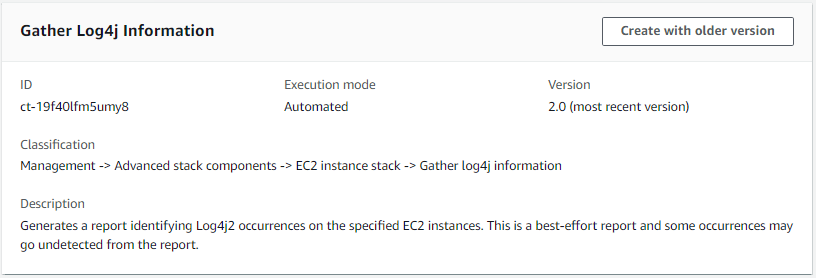

# EC2 Instance Stack | Gather Log4j Information

Generates a report identifying Log4j2 occurrences on the specified EC2 instances. This is a best-effort report and some occurrences may go undetected from the report.

**Full classification:** Management | Advanced stack components | EC2 instance stack | Gather log4j information

## Change Type Details

|                             |                  |
| --------------------------- | ---------------- | -------------------------------------------------------------------------------------------------------------------------------------------------------------------------------------------------------------------------------------------------------------------------------------------------------------------------------------------------------------------------------------------------------------------------------------------------------------------------------------------------------------------------------------------------------------------------------------------------------------------------------------------------------------------------------------------------------------------------------------------------------------------------------------------------------------------------------------------------------------------------------------------------------------------------------------------------------------------------------------------------------------------------------------------------------------------------------------------------------------------------------------------------------------------------------------------------------------------------------------------------------------------------------------------------------------------------------------------------------------------------------------------------------------------------------------------------------------------------------------------------------------------------------------------------------------------------------------------------------------------------------------------------------------------------------------------------------------------------------------------------------------------------------------------------------------------------------------------------------------------------------------------------------------------------------------------------------------------------------------------------------------------------------------------------------------------------------------------------------------------------------------------------------------------------------------------------------------------------------------------------------------------------------------------------------------------------------------------------------------------------------------------------------------------------------------------------------------------------------------------------------------------------------------------------------------------------------------------------------------------------------------------------------------------------------------------------------------------------------------------------------------------------------------------------------------------------------------------------------------------------------------------------------------------------------------------------------------------------------------------------------------------------------------------------------------------------------------------------------------------------------------------------------------------------------------------------------------------------------------------------------------------------------------------------------------------------------------------------------------------------------------------------------------------------------------------------------------------------------------------------------------------------------------------------------------------------------------------------------------------------------------------------------------------------------------------------------------------------------------------------------------------------------------------------------------------------------------------------------------------------------------------------------------------------------------------------------------------------------------------------------------------------------------------------------------------------------------------------------------------------------------------------------------------------------------------------------------------------------------------------------------------------------------------------------------------------------------------------------------------------------------------------------------------------------------------------------------------------------------------------------------------------------------------------------------------------------------------------------------------------------------------------------------------------------------------------------------------------------------------------------------------------------------------------------------------------------------------------------------------------------------------------------------------------------------------------------------------------------------------------------------------------------------------------------------------------------------------------------------------------------------------------------------------------------------------------------------------------------------------------------------------------------------------------------------------------------------------------------------------------------------------------------------------------------------------------------------------------------------------------------------------------------------------------------------------------------------------------------------------------------------------------------------------------------------------------------------------------------------------------------------------------------------------------------------------------------------------------------------------------------------------------------------------------------------------------------------------------------------------------------------------------------------------------------------------------------------------------------------------------------------------------------------------------------------------------------------------------------------------------------------------------------------------------------------------------------------------------------------------------------------------------------------------------------------------------------------------------------------------------------------------------------------------------------------------------------------------------------------------------------------------------------------------------------------------------------------------------------------------------------------------------------------------------------------------------------------------------------------------------------------------------------------------------------------------------------------------------------------------------------------------------------------------------------------------------------------------------------------------------------------------------------------------------------------------------------------------------------------------------------------------------------------------------------------------------------------------------------------------------------------------------------------------------------------------------------------------------------------------------------------------------------------------------------------------------------------------------------------------------------------------------------------------------------------------------------------------------------------------------------------------------------------------------------------------------------------------------------------------------------------------------------------------------------------------------------------------------------------------------------------------------------------------------------------------------------------------------------------------------------------------------------------------------------------------------------------------------------------------------------------------------------------------------------------------------------------------------------------------------------------------------------------------------------------------------------------------------------------------------------------------------------------------------------------------------------------------------------------------------------------------------------------------------------------------------------------------------------------------------------------------------------------------------------------------------------------------------------------------------------------------------------------------------------------------------------------------------------------------------------------------------------------------------------------------------------------------------------------------------------------------------------------------------------------------------------------------------------------------------------------------------------------------------------------------------------------------------------------------------------------------------------------------------------------------------------------------------------------------------------------------------------------------------------------------------------------------------------------------------------------------------------------------------------------------------------------------------------------------------------------------------------------------------------------------------------------------------------------------------------------------------------------------------------------------------------------------------------------------------------------------------------------------------------------------------------------------------------------------------------------------------------------------------------------------------------------------------------------------------------------------------------------------------------------------------------------------------------------------------------------------------------------------------------------------------------------------------------------------------------------------------------------------------------------------------------------------------------------------------------------------------------------------------------------------------------------------------------------------------------------------------------------------------------------------------------------------------------------------------------------------------------------------------------------------------------------------------------------------------------------------------------------------------------------------------------------------------------------------------------------------------------------------------------------------------------------------------------------------------------------------------------------------------------------------------------------------------------------------------------------------------------------------------------------------------------------------------------------------------------------------------------------------------------------------------------------------------------------------------------------------------------------------------------------------------------------------------------------------------------------------------------------------------------------------------------------------------------------------------------------------------------------------------------------------------------------------------------------------------------------------------------------------------------------------------------------------------------------------------------------------------------------------------------------------------------------------------------------------------------------------------------------------------------------------------------------------------------------------------------------------------------- |
| Change type ID              | ct-19f40lfm5umy8 |
| Current version             | 2.0              |
| Expected execution duration | 360 minutes      |
| AWS approval                | Required         |
| Customer approval           | Not required     |
| Execution mode              | Automated        | ## Additional Information ### Update Other Other CTs The following shows this change type in the AMS console.  How it works: 1. Navigate to the **Create RFC** page: In the left navigation pane of the AMS console click **RFCs** to open the RFCs list page, and then click **Create RFC**. 2. Choose a popular change type (CT) in the default **Browse change types** view, or select a CT in the **Choose by category** view. <br>• **Browse by change type**: You can click on a popular CT in the **Quick create** area to immediately open the **Run RFC** page. Note that you cannot choose an older CT version with quick create. To sort CTs, use the **All change types** area in either the **Card** or **Table** view. In either view, select a CT and then click **Create RFC** to open the **Run RFC** page. If applicable, a **Create with older version** option appears next to the **Create RFC** button. <br>• **Choose by category**: Select a category, subcategory, item, and operation and the CT details box opens with an option to **Create with older version** if applicable. Click **Create RFC** to open the **Run RFC** page. 3. On the **Run RFC** page, open the CT name area to see the CT details box. A **Subject** is required (this is filled in for you if you choose your CT in the **Browse change types** view). Open the **Additional configuration** area to add information about the RFC. In the **Execution configuration** area, use available drop-down lists or enter values for the required parameters. To configure optional execution parameters, open the **Additional configuration** area. 4. When finished, click **Run**. If there are no errors, the **RFC successfully created** page displays with the submitted RFC details, and the initial **Run output**. 5. Open the **Run parameters** area to see the configurations you submitted. Refresh the page to update the RFC execution status. Optionally, cancel the RFC or create a copy of it with the options at the top of the page. How it works: 1. Use either the Inline Create (you issue a `create-rfc` command with all RFC and execution parameters included), or Template Create (you create two JSON files, one for the RFC parameters and one for the execution parameters) and issue the `create-rfc` command with the two files as input. Both methods are described here. 2. Submit the RFC: `aws amscm submit-rfc --rfc-id `ID`` command with the returned RFC ID. Monitor the RFC: `aws amscm get-rfc --rfc-id `ID`` command. To check the change type version, use this command: `` aws amscm list-change-type-version-summaries --filter Attribute=ChangeTypeId,Value=`CT_ID` `` ###### Note You can use any `CreateRfc` parameters with any RFC whether or not they are part of the schema for the change type. For example, to get notifications when the RFC status changes, add this line, `--notification "{\"Email\": {\"EmailRecipients\" : [\"email@example.com\"]}}"` to the RFC parameters part of the request (not the execution parameters). For a list of all CreateRfc parameters, see the [AMS Change Management API Reference](../ApiReference-cm/API_CreateRfc.md "../ApiReference-cm/API_CreateRfc.md"). _INLINE CREATE_: Issue the create RFC command with execution parameters provided inline (escape quotation marks when providing execution parameters inline), and then submit the returned RFC ID. For example, you can replace the contents with something like this: **Version 2.0**: Scan all instances: ``aws amscm create-rfc --change-type-id "ct-19f40lfm5umy8" --change-type-version "2.0" --title "`Log4j Investigation`" --execution-parameters "{\"DocumentName\":\"AWSManagedServices-GatherLog4jInformation\",\"Region\":\"`us-east-1`\",\"Parameters\":{\"S3Bucket\":[\"s3://`BUCKET_NAME`\"]},\"TargetParameterName\": \"InstanceId\",\"Targets\": [{\"Key\": \"`AWS::EC2::Instance`\",\"Values\": [\"*\"]}],\"MaxConcurrency\": \"`10`\",\"MaxErrors\": \"`100%`\"}"`` Scan a list of instances: ``aws amscm create-rfc --change-type-id "ct-19f40lfm5umy8" --change-type-version "2.0" --title "`Log4j Investigation`" --execution-parameters "{\"DocumentName\":\"AWSManagedServices-GatherLog4jInformation\",\"Region\":\"`us-east-1`\",\"Parameters\":{\"S3Bucket\":[\"s3://`BUCKET_NAME`\"]},\"TargetParameterName\": \"InstanceId\",\"Targets\": [{\"Key\": \"`ParameterValues`\",\"Values\": [\"`INSTANCE_ID_1`\",\"`INSTANCE_ID_2`\",\"`INSTANCE_ID_3`\",\"`INSTANCE_ID_4`\",\"`INSTANCE_ID_5`\"]}],\"MaxConcurrency\": \"`10`\",\"MaxErrors\": \"`100%`\"}"`` _TEMPLATE CREATE_: 1. Output the execution parameters for this change type to a JSON file; this example names it GatherLog4jInfoParams.json: `aws amscm get-change-type-version --change-type-id "ct-19f40lfm5umy8" --query "ChangeTypeVersion.ExecutionInputSchema" --output text > GatherLog4jInfoParams.json` 2. Modify and save the GatherLog4jInfoParams file, retaining only the parameters that you want to change. For example, you can replace the contents with something like this: **Version 2.0**: Scan all instances: ``{ "DocumentName": "AWSManagedServices-GatherLog4jInformation", "Region": "`us-east-1`", "Parameters": { "S3Bucket": [ "s3://`BUCKET_NAME`" ] }, "TargetParameterName": "InstanceId", "Targets": [ { "Key": "`AWS::EC2::Instance`", "Values": [ "*" ] } ], "MaxConcurrency": "`10`", "MaxErrors": "`100%`" }`` Scan a list of instances: ```{ "DocumentName": "AWSManagedServices-GatherLog4jInformation", "Region": "`us-east-1`", "Parameters": { "S3Bucket": [ "s3://``BUCKET_NAME``" ] }, "TargetParameterName": "InstanceId", "Targets": [ { "Key": "`ParameterValues`", "Values": [ "`INSTANCE_ID_1`", "`INSTANCE_ID_2`", "`INSTANCE_ID_3`", "`INSTANCE_ID_4`", "`INSTANCE_ID_5`" ] } ], "MaxConcurrency": "`10`", "MaxErrors": "100%" }``` 3. Output the RFC template to a file in your current folder; this example names it GatherLog4jInfoRfc.json: `aws amscm create-rfc --generate-cli-skeleton > GatherLog4jInfoRfc.json` 4. Modify and save the GatherLog4jInfoRfc.json file. For example, you can replace the contents with something like this: ``{ "ChangeTypeVersion":    "`2.0`", "ChangeTypeId":         "ct-19f40lfm5umy8", "Title":                "`Log4j Investigation`" }`` 5. Create the RFC, specifying the GatherLog4jInfoRfc file and the GatherLog4jInfoParams file: `aws amscm create-rfc --cli-input-json file://GatherLog4jInfoRfc.json  --execution-parameters file://GatherLog4jInfoParams.json` This change type scans the specified EC2 instance for packages containing an impacted version of the Apache Log4j Java class. This functionality produces a best-effort report, some occurrences may go undetected or mis-identified. AWS CloudShell is a browser-based shell that makes it easy to securely manage, explore, and interact with your AWS resources. AWS CloudShell is pre-authenticated with your console credentials when you log in. Common development and operations tools are pre-installed, so no local installation or configuration is required. With AWS CloudShell, you can quickly run scripts with the AWS Command Line Interface (AWS CLI), experiment with AWS service APIs using the AWS SDKs, or use a range of other tools to be productive. You can use AWS CloudShell right from your browser at no additional cost. ###### Note You can use the CloudShell AWS console from any other, or the closest, AWS Region where it is available, to perform the aggregation. For example, to perform the aggregation of data stored in the Virginia region, open a CloudShell in the "US East(Virginia) us-east-1" AWS Region in the AWS Console and follow the instructions given next. The report data includes information about Java Archives (JAR Files), found within the specified environment that contain the vulnerable JndiLookup class. AMS recommends upgrading impacted libraries to the latest available version, which can be downloaded directly from Apache at [Download Apache Log4j 2](https://logging.apache.org/log4j/2.x/download.html "https://logging.apache.org/log4j/2.x/download.html"). Additionally, we scan for Web Application Resource (WAR), Enterprise Archive (EAR), Jupiter Encrypted XML (JPI), Hemera Technologies (HPI), and ZIP files. To aggregate all the generated CSV files and build a single report with AWS CloudShell: 1. From any page or AWS Region in the AWS Management Console, open the AWS CloudShell to run the script shown next. Ensure that you are logged into the AWS Management Console with the AWSManagedServicesReadOnlyRole role. ``# Specify the S3 bucket and AWS region that contains the individual CSV files: BUCKET_NAME="YOUR BUCKET HERE" BUCKET_REGION="THE BUCKET REGION HERE" # Aggregate the CSV files: mkdir -p log4j-report aws s3 cp s3://$BUCKET_NAME/ams/log4j-scan/ ./log4j-report --recursive --include "*.csv" echo "aws_account_id,region,scan_time,instance_id,scan_type,location" > log4j-report/report.csv for i in `find log4j-report -type f \( -iname "*.csv" ! -iname "report.csv" \)`; do awk 'FNR > 1' $i >> log4j-report/report.csv; done # Upload the report to the same S3 bucket: file_name="report_$(date -d "today" +"%Y%m%d%H%M").csv" aws s3 cp log4j-report/report.csv s3://$BUCKET_NAME/ams/log4j-reports/$file_name # Open the following URL and select \"Download\" to download the report: echo "Report uploaded to: https://s3.console.aws.amazon.com/s3/object/$BUCKET_NAME?region=$BUCKET_REGION&prefix=ams/log4j-reports/$file_name"`` The script outputs the S3 URL to download the report from. 2. Copy and open the URL and then choose Download **Single-Account Landing Zone: Using the report** If you are working in a single-account landing zone, the AWS CloudShell service is not available. However, you can still leverage the AWS CLI to perform the necessary steps. Follow this documentation, [How do I grant my Active Directory users access to the API or AWS CLI with AD FS?](https://aws.amazon.com/premiumsupport/knowledge-center/adfs-grant-ad-access-api-cli/ "https://aws.amazon.com/premiumsupport/knowledge-center/adfs-grant-ad-access-api-cli/"), to configure CLI API Access through Active Directory Federation Services (ADFS) using IAM Roles. For Non-ADFS identity provider (IDP) implementations, visit [How to Implement a General Solution for Federated API/CLI Access Using SAML 2.0](https://aws.amazon.com/blogs/security/how-to-implement-a-general-solution-for-federated-apicli-access-using-saml-2-0/ "https://aws.amazon.com/blogs/security/how-to-implement-a-general-solution-for-federated-apicli-access-using-saml-2-0/"). Using the above options, obtain CLI Credentials for the desired role, the default recommended role is the `Customer_ReadOnly_Role`. Then execute the script in Step 1 to generate the required CSV report. **How to read the report** The report contains the following columns: <br>• **scan_time**: The time at which the instance scan was performed <br>• **instance_id**: The EC2 instance ID <br>• **scan_type**: The type of scan that was performed. For example, if the scan looked at in memory information, the scan_type will be MEMORY. If the filesystem was checked, the scan_type will be FILESYSTEM <br>• **location**: The path to the match ## Execution Input Parameters For detailed information about the execution input parameters, see [Schema for Change Type ct-19f40lfm5umy8](schemas.md#ct-19f40lfm5umy8-schema-section "schemas.md#ct-19f40lfm5umy8-schema-section"). ## Example: Required Parameters `Example not available.` ## Example: All Parameters `{ "DocumentName": "AWSManagedServices-GatherLog4jInformation", "Region": "us-east-1", "Parameters": { "S3Bucket": [ "s3://test" ] }, "TargetParameterName": "InstanceId", "Targets": [ { "Key": "ParameterValues", "Values": [ "i-1234567890abcdef0", "i-1234567890abcdef1", "i-1234567890abcdef2", "i-1234567890abcdef3", "i-1234567890abcdef4" ] } ], "MaxConcurrency": "10", "MaxErrors": "100%" }` |
