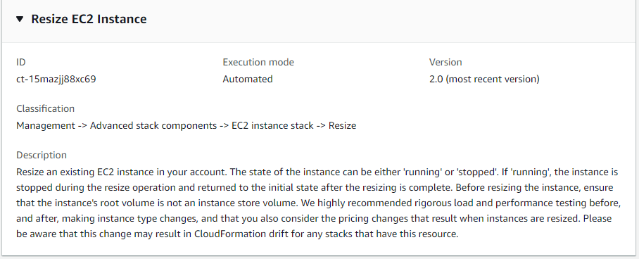

# EC2 Instance Stack | Resize

Resize an existing EC2 instance in your account. The state of the instance can be either 'running' or 'stopped'. If 'running', the instance is stopped during the resize operation and returned to the initial state after the resizing is complete. Before resizing the instance, ensure that the instance's root volume is not an instance store volume. We highly recommended rigorous load and performance testing before, and after, making instance type changes, and that you also consider the pricing changes that result when instances are resized. Please be aware that this change may result in CloudFormation drift for any stacks that have this resource.

**Full classification:** Management | Advanced stack components | EC2 instance stack | Resize

## Change Type Details

|                             |                  |
| --------------------------- | ---------------- |
| Change type ID              | ct-15mazjj88xc69 |
| Current version             | 2.0              |
| Expected execution duration | 240 minutes      |
| AWS approval                | Required         |
| Customer approval           | Not required     |
| Execution mode              | Automated        |

## Additional Information

### Resize instance

The following shows this change type in the AMS console.


How it works:

1. Navigate to the **Create RFC** page: In the left navigation pane of the AMS console click **RFCs** to open the RFCs list page, and then click **Create RFC**.
2. Choose a popular change type (CT) in the default **Browse change types** view, or select a CT in the
   **Choose by category** view.
   - **Browse by change type**: You can click on a popular CT in the **Quick create** area to immediately open the
     **Run RFC** page. Note that you cannot choose an older CT version with quick create.

   To sort CTs, use the **All change types** area in either the **Card** or **Table** view.
   In either view, select a CT and then click **Create RFC** to open the **Run RFC** page. If applicable,
   a **Create with older version** option appears next to the **Create RFC** button.
   - **Choose by category**: Select a category, subcategory, item, and operation and the CT details box opens with an option to
     **Create with older version** if applicable. Click **Create RFC** to open the **Run RFC** page.

3. On the **Run RFC** page, open the CT name area to see the CT details box.
   A **Subject** is required (this is filled in for you if you choose your CT in the **Browse change types** view). Open the
   **Additional configuration** area to add information about the RFC.

In the **Execution configuration** area, use available drop-down lists or enter values for the required parameters. To configure
optional execution parameters, open the **Additional configuration** area. 4. When finished, click **Run**. If there are no errors, the **RFC successfully created**
page displays with the submitted RFC details, and the initial **Run output**. 5. Open the **Run parameters** area to see the configurations you submitted. Refresh the page to update the RFC execution status.
Optionally, cancel the RFC or create a copy of it with the options at the top of the page.
How it works:

1. Use either the Inline Create (you issue a `create-rfc` command with all RFC and execution parameters included), or
   Template Create (you create two JSON files, one for the RFC parameters and one for the execution parameters) and issue the `create-rfc`
   command with the two files as input. Both methods are described here.
2. Submit the RFC: `aws amscm submit-rfc --rfc-id `ID`` command with the returned RFC ID.

Monitor the RFC: `aws amscm get-rfc --rfc-id `ID`` command.
To check the change type version, use this command:

```
aws amscm list-change-type-version-summaries --filter Attribute=ChangeTypeId,Value=`CT_ID`
```

###### Note

You can use any `CreateRfc` parameters with any RFC whether or not they are part of the schema for the
change type. For example, to get notifications when the RFC status changes, add this line, `--notification "{\"Email\": {\"EmailRecipients\" : [\"email@example.com\"]}}"` to the
RFC parameters part of the request (not the execution parameters). For a list of all CreateRfc parameters, see the
[AMS Change Management API Reference](../ApiReference-cm/API_CreateRfc.md "../ApiReference-cm/API_CreateRfc.md").

_INLINE CREATE_:

Issue the create RFC command with execution parameters provided inline (escape quotation marks when providing execution parameters inline), and then submit the returned RFC ID. For example, you can replace the contents with something like this:

```
aws amscm create-rfc --change-type-id "ct-15mazjj88xc69" --change-type-version "2.0" --title "`Resize EC2 Instance`" --execution-parameters "{\"DocumentName\":\"AWSManagedServices-ResizeInstance\",\"Region\":\"`ap-southeast-2`\",\"Parameters\":{\"InstanceId\":[\"`i-0db3254017174df45`\"],\"InstanceType\":[\"`t2.xlarge`\"],\"CreateAMIBeforeResize\":[`true`]}}"
```

_TEMPLATE CREATE_:

1. Output the execution parameters for this change type to a JSON file; this example names it ResizeEC2Params.json:

```
aws amscm get-change-type-version --change-type-id "ct-15mazjj88xc69" --query "ChangeTypeVersion.ExecutionInputSchema" --output text > ResizeEC2Params.json
```

2. Modify and save the ResizeEC2Params file. For example, you can replace the contents with something like this:

```
{
  "DocumentName": "AWSManagedServices-ChangeInstanceType",
  "Region": "ap-southeast-2",
  "Parameters": {
    "InstanceId": [
      "i-0db3254017174df45"
    ],
    "InstanceType": [
      "t2.xlarge"
    ],
    "CreateAMIBeforeResize": [
      true
    ]
  }
}
```

3. Output the RFC template to a file in your current folder; this example names it ResizeEC2Rfc.json:

```
aws amscm create-rfc --generate-cli-skeleton > ResizeEC2Rfc.json
```

4. Modify and save the ResizeEC2Rfc.json file. For example, you can replace the contents with something like this:.

```
{
  "ChangeTypeVersion": "2.0",
  "ChangeTypeId": "ct-15mazjj88xc69",
  "Title": "`Resize EC2 Instance`"
}
```

5. Create the RFC, specifying the ResizeEC2Rfc file and the ResizeEC2Params file:

```
aws amscm create-rfc --cli-input-json file://ResizeEC2Rfc.json  --execution-parameters file://ResizeEC2Params.json
```

You receive the ID of the new RFC in the response and can use it to submit and monitor the RFC. Until you submit it, the RFC remains in the editing state and does not start.

###### Note

Changing instance size can result in CloudFormation drift for any stacks that reference the changed instances.

For more information about Amazon EC2, including size recommendations, see [Amazon Elastic Compute Cloud Documentation](https://aws.amazon.com/documentation/ec2/ "https://aws.amazon.com/documentation/ec2/").

###### Important

You can create an AMI of the instance before the resize using the `CreateAMIBeforeResize` parameter. If you use this option, before you begin, prepare the EC2 instance that you will use to create
the AMI.

To avoid authentication issues from instances created from the new AMI, run
these system commands on the instance after applying custom changes, and before you call the EC2 Instance Stack | Resize CT with the `CreateAMIBeforeResize` parameter.

##### Linux Preparation for AMI Create

Download and run the following script to prepare your instance for AMI creation. You must run this script as the root user.

```
curl https://amazon-ams-us-east-1.s3.amazonaws.com/latest/linux/prepare_instance_for_ami_and_shutdown.sh -o ./prepare_instance_for_ami_and_shutdown.sh
chmod 744 prepare_instance_for_ami_and_shutdown.sh
./prepare_instance_for_ami_and_shutdown.sh
```

The preceding script performs a shut down on the instance and connected users are logged
out from the session.

##### Windows Preparation for AMI Create

Windows Powershell (run as Administrator):

```
Invoke-AMSSysprep
```

The instance is stopped and any connected user is logged out from the current Windows RDP session.

For more info on creating AWS Windows AMIs, see
[Create a custom Windows AMI](../../../AWSEC2/latest/WindowsGuide/Creating_EBSbacked_WinAMI.md#23ami-create-standard "../../../AWSEC2/latest/WindowsGuide/Creating_EBSbacked_WinAMI.md#23ami-create-standard").

##### UserData for AMI Create

If you want to execute user data on the next boot from your AMI, do the following:

- Make sure that the Registry Key
  `HKEY_LOCAL_MACHINE\SOFTWARE\Amazon\ManagedServices\RunUserDataViaAMSBootModule`
  is present. If this key isn't present, then user data isn't run the on the next boot.
- To set user data to run on next boot, complete the following steps:
  1.  Start a Windows PowerShell under administrator privilege
      (run as administrator)
  2.  Run the following command:

  ```
  Install-AMSDependencies
  ```

## Execution Input Parameters

For detailed information about the execution input parameters, see
[Schema for Change Type ct-15mazjj88xc69](schemas.md#ct-15mazjj88xc69-schema-section "schemas.md#ct-15mazjj88xc69-schema-section").

## Example: Required Parameters

```
Example not available.
```

## Example: All Parameters

```
{
    "DocumentName": "AWSManagedServices-ChangeInstanceType",
    "Region": "us-east-1",
    "Parameters": {
      "InstanceId": ["i-1234567890abababa"],
      "InstanceType": ["t3.xlarge"],
      "CreateAMIBeforeResize": [false]
    }
}
```
