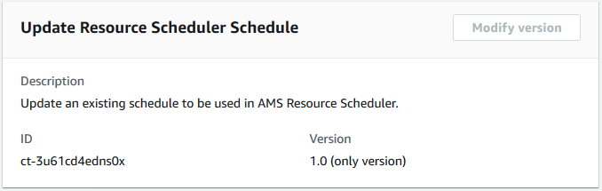

# Schedule | Update

Update an existing schedule to be used in AMS Resource Scheduler.

**Full classification:** Management | AMS Resource Scheduler | Schedule | Update

## Change Type Details

|                             |                  |
| --------------------------- | ---------------- | -------------------------------------------------------------------------------------------------------------------------------------------------------------------------------------------------------------------------------------------------------------------------------------------------------------------------------------------------------------------------------------------------------------------------------------------------------------------------------------------------------------------------------------------------------------------------------------------------------------------------------------------------------------------------------------------------------------------------------------------------------------------------------------------------------------------------------------------------------------------------------------------------------------------------------------------------------------------------------------------------------------------------------------------------------------------------------------------------------------------------------------------------------------------------------------------------------------------------------------------------------------------------------------------------------------------------------------------------------------------------------------------------------------------------------------------------------------------------------------------------------------------------------------------------------------------------------------------------------------------------------------------------------------------------------------------------------------------------------------------------------------------------------------------------------------------------------------------------------------------------------------------------------------------------------------------------------------------------------------------------------------------------------------------------------------------------------------------------------------------------------------------------------------------------------------------------------------------------------------------------------------------------------------------------------------------------------------------------------------------------------------------------------------------------------------------------------------------------------------------------------------------------------------------------------------------------------------------------------------------------------------------------------------------------------------------------------------------------------------------------------------------------------------------------------------------------------------------------------------------------------------------------------------------------------------------------------------------------------------------------------------------------------------------------------------------------------------------------------------------------------------------------------------------------------------------------------------------------------------------------------------------------------------------------------------------------------------------------------------------------------------------------------------------------------------------------------------------------------------------------------------------------------------------------------------------------------------------------------------------------------------------------------------------------------------------------------------------------------------------------------------------------------------------------------------------------------------------------------------------------------------------------------------------------------------------------------------------------------------------------------------------------------------------------------------------------------------------------------------------------------------------------------------------------------------------------------------------------------------------------------------------------------------------------------------------------------------------------------------------------------------------------------------------------------------------------------------------------------------------------------------------------------------------------------------------------------------------------------------------------------------------------------------------------------------------------------------------------------------------------------------------------------------------------------------------------------------------------------------------------------------------------------------------------------------------------------------------------------------------------------------------------------------------------------------------------------------------------------------------------------------------------------------------------------------------------------------------------------------------------------------------------------------------------------------------------------------------------------------------------------------------------------------------------------------------------------------------------------------------------------------------------------------------------------------------------------------------------------------------------------------------------------------------------------------------------------------------------------------------------------------------------------------------------------------------------------------------------------------------------------------------------------------------------------------------------------------------------------------------------------------------------------------------------------------------------------------------------------------------------------------------------------------------------------------------------------------------------------------------------------------------------------------------------------------------------------------------------------------------------------------------------------------------------------------------------------------------------------------------------------------------------------------------------------------------------------------------------------------------------------------------------------------------------------------------------------------------------------------------------------------------------------------------------------------------------------------------------------------------------------------------------------------------------------------------------------------------------------------------------------------------------------------------------------------------------------------------------------------------------------------------------------------------------------------------------------------------------------------------------------------- |
| Change type ID              | ct-3u61cd4edns0x |
| Current version             | 1.0              |
| Expected execution duration | 360 minutes      |
| AWS approval                | Required         |
| Customer approval           | Not required     |
| Execution mode              | Automated        | ## Additional Information ### Schedule update The following shows this change type in the AMS console.  How it works: 1. Navigate to the **Create RFC** page: In the left navigation pane of the AMS console click **RFCs** to open the RFCs list page, and then click **Create RFC**. 2. Choose a popular change type (CT) in the default **Browse change types** view, or select a CT in the **Choose by category** view.  • **Browse by change type**: You can click on a popular CT in the **Quick create** area to immediately open the **Run RFC** page. Note that you cannot choose an older CT version with quick create. To sort CTs, use the **All change types** area in either the **Card** or **Table** view. In either view, select a CT and then click **Create RFC** to open the **Run RFC** page. If applicable, a **Create with older version** option appears next to the **Create RFC** button.  • **Choose by category**: Select a category, subcategory, item, and operation and the CT details box opens with an option to **Create with older version** if applicable. Click **Create RFC** to open the **Run RFC** page. 3. On the **Run RFC** page, open the CT name area to see the CT details box. A **Subject** is required (this is filled in for you if you choose your CT in the **Browse change types** view). Open the **Additional configuration** area to add information about the RFC. In the **Execution configuration** area, use available drop-down lists or enter values for the required parameters. To configure optional execution parameters, open the **Additional configuration** area. 4. When finished, click **Run**. If there are no errors, the **RFC successfully created** page displays with the submitted RFC details, and the initial **Run output**. 5. Open the **Run parameters** area to see the configurations you submitted. Refresh the page to update the RFC execution status. Optionally, cancel the RFC or create a copy of it with the options at the top of the page. How it works: 1. Use either the Inline Create (you issue a `create-rfc` command with all RFC and execution parameters included), or Template Create (you create two JSON files, one for the RFC parameters and one for the execution parameters) and issue the `create-rfc` command with the two files as input. Both methods are described here. 2. Submit the RFC: `aws amscm submit-rfc --rfc-id `ID`` command with the returned RFC ID. Monitor the RFC: `aws amscm get-rfc --rfc-id `ID`` command. To check the change type version, use this command: `` aws amscm list-change-type-version-summaries --filter Attribute=ChangeTypeId,Value=`CT_ID` `` ###### Note You can use any `CreateRfc` parameters with any RFC whether or not they are part of the schema for the change type. For example, to get notifications when the RFC status changes, add this line, `--notification "{\"Email\": {\"EmailRecipients\" : [\"email@example.com\"]}}"` to the RFC parameters part of the request (not the execution parameters). For a list of all CreateRfc parameters, see the [AMS Change Management API Reference](../ApiReference-cm/API_CreateRfc.md "../ApiReference-cm/API_CreateRfc.md"). _INLINE CREATE_: Issue the create RFC command with execution parameters provided inline (escape quotes when providing execution parameters inline), and then submit the returned RFC ID. For example, you can replace the contents with something like this: ``aws amscm create-rfc --change-type-id "ct-3u61cd4edns0x" --change-type-version "1.0" --title "`Update a schedule used in AMS Resource Scheduler`" --execution-parameters "{\"DocumentName\":\"AWSManagedServices-AddOrUpdateSchedule\",\"Region\":\"`us-east-1`\",\"Parameters\":{\"Action\":[\"update\"],\"Name\":[\"`Schedule01`\"],\"Description\":[\"`Test schedule`\"],\"Hibernate\":[\"`true`\"],\"Enforced\":[\"`false`\"],\"OverrideStatus\":[\"`running`\"],\"Periods\":[\"`period01`\",\"`period02`\"],\"RetainRunning\":[\"`false`\"],\"StopNewInstances\":[\"`true`\"],\"SSMMaintenanceWindow\":[\"`window01`\"],\"TimeZone\":[\"`Australia/Sydney`\"],\"UseMaintenanceWindow\":[\"`true`\"],\"UseMetrics\":[\"`false`\"]}}"`` _TEMPLATE CREATE_: 1. Output the execution parameters JSON schema for this change type to a JSON file; this example names it UpdateScheduleParams.json: `aws amscm get-change-type-version --change-type-id "ct-3u61cd4edns0x" --query "ChangeTypeVersion.ExecutionInputSchema" --output text > UpdateScheduleParams.json` 2. Modify and save the UpdateScheduleParams file. ``{ "DocumentName" : "AWSManagedServices-AddOrUpdateSchedule", "Region" : "`us-east-1`", "Parameters" : { "Action" : ["update"], "Name" : ["`Schedule01`"] } }`` 3. Output the RFC template to a file in your current folder; this example names it UpdateScheduleRfc.json: `aws amscm create-rfc --generate-cli-skeleton > UpdateScheduleRfc.json` 4. Modify and save the UpdateScheduleRfc.json file. For example, you can replace the contents with something like this: ``{ "ChangeTypeVersion":    "`1.0`", "ChangeTypeId":         "ct-2ptn3u61cd4edns0x20pq7ur3x", "Title":                "`Update a schedule for AMS Resource Scheduler`" }`` 5. Create the RFC, specifying the UpdateScheduleRfc file and the UpdateScheduleParams file: `aws amscm create-rfc --cli-input-json file://UpdateScheduleRfc.json --execution-parameters file://UpdateScheduleParams.json` You receive the ID of the new RFC in the response and can use it to submit and monitor the RFC. Until you submit it, the RFC remains in the editing state and does not start. For more information, see [How the AMS Resource Scheduler works](../userguide/resource-scheduler-how-works.md "../userguide/resource-scheduler-how-works.md"). AMS Resource Scheduler is based on the AWS Instance Scheduler; to learn more, see [AWS Instance Scheduler](../../../solutions/latest/instance-scheduler-on-aws/welcome.md "../../../solutions/latest/instance-scheduler-on-aws/welcome.md"). ## Execution Input Parameters For detailed information about the execution input parameters, see [Schema for Change Type ct-3u61cd4edns0x](schemas.md#ct-3u61cd4edns0x-schema-section "schemas.md#ct-3u61cd4edns0x-schema-section"). ## Example: Required Parameters `{ "DocumentName" : "AWSManagedServices-AddOrUpdateSchedule", "Region" : "us-east-1", "Parameters" : { "Action" : ["update"], "Name" : ["Schedule01"] } }` ## Example: All Parameters `{ "DocumentName" : "AWSManagedServices-AddOrUpdateSchedule", "Region" : "us-east-1", "Parameters" : { "Action" : ["update"], "Name" : ["Schedule01"], "Description" : ["Test schedule"], "Hibernate" : ["true"], "Enforced" : ["false"], "OverrideStatus" : ["running"], "Periods" : ["period01, period02"], "RetainRunning" : ["false"], "StopNewInstances" : ["true"], "SSMMaintenanceWindow" : ["window01, window02"], "TimeZone" : ["Australia/Sydney"], "UseMaintenanceWindow" : ["true"], "UseMetrics" : ["false"] } }` |
