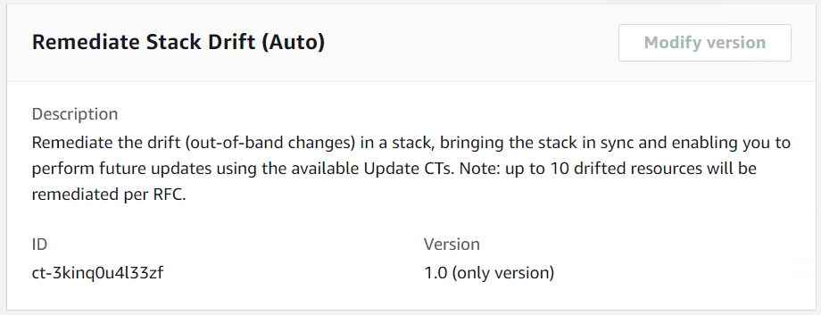

# Stack from CloudFormation Template | Remediate Drift

Remediate the drift (out-of-band changes) in a stack, bringing the stack in sync and enabling you to perform future updates using the available Update CTs. Note: up to 10 drifted resources will be remediated per RFC.

**Full classification:** Management | Custom Stack | Stack from CloudFormation Template | Remediate drift

## Change Type Details

|                             |                  |
| --------------------------- | ---------------- | ----------------------------------------------------------------------------------------------------------------------------------------------------------------------------------------------------------------------------------------------------------------------------------------------------------------------------------------------------------------------------------------------------------------------------------------------------------------------------------------------------------------------------------------------------------------------------------------------------------------------------------------------------------------------------------------------------------------------------------------------------------------------------------------------------------------------------------------------------------------------------------------------------------------------------------------------------------------------------------------------------------------------------------------------------------------------------------------------------------------------------------------------------------------------------------------------------------------------------------------------------------------------------------------------------------------------------------------------------------------------------------------------------------------------------------------------------------------------------------------------------------------------------------------------------------------------------------------------------------------------------------------------------------------------------------------------------------------------------------------------------------------------------------------------------------------------------------------------------------------------------------------------------------------------------------------------------------------------------------------------------------------------------------------------------------------------------------------------------------------------------------------------------------------------------------------------------------------------------------------------------------------------------------------------------------------------------------------------------------------------------------------------------------------------------------------------------------------------------------------------------------------------------------------------------------------------------------------------------------------------------------------------------------------------------------------------------------------------------------------------------------------------------------------------------------------------------------------------------------------------------------------------------------------------------------------------------------------------------------------------------------------------------------------------------------------------------------------------------------------------------------------------------------------------------------------------------------------------------------------------------------------------------------------------------------------------------------------------------------------------------------------------------------------------------------------------------------------------------------------------------------------------------------------------------------------------------------------------------------------------------------------------------------------------------------------------------------------------------------------------------------------------------------------------------------------------------------------------------------------------------------------------------------------------------------------------------------------------------------------------------------------------------------------------------------------------------------------------------------------------------------------------------------------------------------------------------------------------------------------------------------------------------------------------------------------------------------------------------------------------------------------------------------------------------------------------------------------------------------------------------------------------------------------------------------------------------------------------------------------------------------------------------------------------------------------------------------------------------------------------------------------------------------------------------------------------------------------------------------------------------------------------------------------------------------------------------------------------------------------------------------------------------------------------------------------------------------------------------------------------------------------------------------------------------------------------------------------------------------------------------------------------------------------------------------------------------------------------------------------------------------------------------------------------------------------------------------------------------------------------------------------------------------------------------------------------------------------------------------------------------------------------------------------------------------------------------------------------------------------------------------------------------------------------------------------------------------------------------------------------------------------------------------------------------------------------------------------------------------------------------------------------------------------------------------------------------------------------------------------------------------------------------------------------------------------------------------------------------------------------------------------------------------------------------------------------------------------------------------------------------------------------------------------------------------------------------------------------------------------------------------------------------------------------------------------------------------------------------------------------------------------------------------------------------------------------------------------------------------------------------------------------------------------------------------------------------------------------------------------------------------------------------------------------------------------------------------------------------------------------------------------------------------------------------------------------------------------------------------------------------------------------------------------------------------------------------------------------------------------------------------------------------------------------------------------------------------------------------------------------------------------------------------------------------------------------------------------------------------------------------------------------------------------------------------------------------------------------------------------------------------------------------------------------------------------------------------------------------------------------------------------------------------------------------------------------------------------------------------------------------------------------------------------------- |
| Change type ID              | ct-3kinq0u4l33zf |
| Current version             | 1.0              |
| Expected execution duration | 60 minutes       |
| AWS approval                | Required         |
| Customer approval           | Not required     |
| Execution mode              | Automated        | ## Additional Information ### Remediate stack drift #### Drift remediation supported resources (ct-3kinq0u4l33zf) These are the resources that are supported by the drift remediation change type, (ct-3kinq0u4l33zf). For remediation of any resource, use the "managed automation" (ct-34sxfo53yuzah) change type instead. `AWS::EC2::Instance AWS::EC2::SecurityGroup AWS::EC2::VPC AWS::EC2::Subnet AWS::EC2::NetworkInterface AWS::EC2::EIP AWS::EC2::InternetGateway AWS::EC2::NatGateway AWS::EC2::NetworkAcl AWS::EC2::RouteTable AWS::EC2::Volume AWS::AutoScaling::AutoScalingGroup AWS::AutoScaling::LaunchConfiguration AWS::AutoScaling::LifecycleHook AWS::AutoScaling::ScalingPolicy AWS::AutoScaling::ScheduledAction AWS::ElasticLoadBalancing::LoadBalancer AWS::ElasticLoadBalancingV2::Listener AWS::ElasticLoadBalancingV2::ListenerRule AWS::ElasticLoadBalancingV2::LoadBalancer AWS::CloudWatch::Alarm` Screenshot of this change type in the AMS console:  How it works: 1. Navigate to the **Create RFC** page: In the left navigation pane of the AMS console click **RFCs** to open the RFCs list page, and then click **Create RFC**. 2. Choose a popular change type (CT) in the default **Browse change types** view, or select a CT in the **Choose by category** view.  • **Browse by change type**: You can click on a popular CT in the **Quick create** area to immediately open the **Run RFC** page. Note that you cannot choose an older CT version with quick create. To sort CTs, use the **All change types** area in either the **Card** or **Table** view. In either view, select a CT and then click **Create RFC** to open the **Run RFC** page. If applicable, a **Create with older version** option appears next to the **Create RFC** button.  • **Choose by category**: Select a category, subcategory, item, and operation and the CT details box opens with an option to **Create with older version** if applicable. Click **Create RFC** to open the **Run RFC** page. 3. On the **Run RFC** page, open the CT name area to see the CT details box. A **Subject** is required (this is filled in for you if you choose your CT in the **Browse change types** view). Open the **Additional configuration** area to add information about the RFC. In the **Execution configuration** area, use available drop-down lists or enter values for the required parameters. To configure optional execution parameters, open the **Additional configuration** area. 4. When finished, click **Run**. If there are no errors, the **RFC successfully created** page displays with the submitted RFC details, and the initial **Run output**. 5. Open the **Run parameters** area to see the configurations you submitted. Refresh the page to update the RFC execution status. Optionally, cancel the RFC or create a copy of it with the options at the top of the page. How it works: 1. Use either the Inline Create (you issue a `create-rfc` command with all RFC and execution parameters included), or Template Create (you create two JSON files, one for the RFC parameters and one for the execution parameters) and issue the `create-rfc` command with the two files as input. Both methods are described here. 2. Submit the RFC: `aws amscm submit-rfc --rfc-id `ID`` command with the returned RFC ID. Monitor the RFC: `aws amscm get-rfc --rfc-id `ID`` command. To check the change type version, use this command: `` aws amscm list-change-type-version-summaries --filter Attribute=ChangeTypeId,Value=`CT_ID` `` ###### Note You can use any `CreateRfc` parameters with any RFC whether or not they are part of the schema for the change type. For example, to get notifications when the RFC status changes, add this line, `--notification "{\"Email\": {\"EmailRecipients\" : [\"email@example.com\"]}}"` to the RFC parameters part of the request (not the execution parameters). For a list of all CreateRfc parameters, see the [AMS Change Management API Reference](../ApiReference-cm/API_CreateRfc.md "../ApiReference-cm/API_CreateRfc.md"). _INLINE CREATE_: Issue the create RFC command with execution parameters provided inline (escape quotation marks when providing execution parameters inline), and then submit the returned RFC ID. For example, you can replace the contents with something like this: ``aws amscm create-rfc --change-type-id "ct-3kinq0u4l33zf" --change-type-version "1.0" --title "`Remediate Stack Drift, no ops review`" --execution-parameters "{\"DocumentName\": \"AWSManagedServices-StartDriftRemediation\", \"Region\": \"`us-east-1`\", \"Parameters\": {\"StackName\": [\"`stack-xxxxxxxxxxxxxxxxx`\"]}}"`` _TEMPLATE CREATE_: 1. Output the execution parameters JSON schema for this change type to a file; this example names it RemediateDriftNrrParams.json: `aws amscm create-rfc --generate-cli-skeleton > RemediateDriftNrrParams.json` 2. Modify and save the RemediateDriftNrrParams file. For example, you can replace the contents with something like this: ``{ "DocumentName": "AWSManagedServices-StartDriftRemediation", "Region": "`us-east-1`", "Parameters": { "StackName": [ "`stack-xxxxxxxxxxxxxxxxx`" ] } }`` 3. Output the RFC template JSON file to a file; this example names it RemediateDriftNrrRfc.json: `aws amscm create-rfc --generate-cli-skeleton > RemediateDriftNrrRfc.json` 4. Modify and save the RemediateDriftNrrRfc.json file. For example, you can replace the contents with something like this: ``{ "ChangeTypeId": "ct-3kinq0u4l33zf", "ChangeTypeVersion": "1.0", "Title": "`Remediate stack drift, no ops review`" }`` 5. Create the RFC, specifying the RemediateDriftNrrRfc file and the RemediateDriftNrrParams file: `aws amscm create-rfc --cli-input-json file://RemediateDriftNrrRfc.json  --execution-parameters file://RemediateDriftNrrParams.json` You receive the ID of the new RFC in the response and can use it to submit and monitor the RFC. Until you submit it, the RFC remains in the editing state and does not start. ###### Important Stack remediation modifies the stack template and/or parameter values. Once remediation is complete, you must update your local template repositories, or any automation, that would be updating the remediated stack, with the latest template and parameters provided in the RFC summary of the remeditation. It is very important to do this, because using the old template and/or parameters can cause destructive changes on the stack resources. For more details, including a list of _Limitations_, see [Drift remediation FAQs](../userguide/ex-rfc-updates-and-dd.md#drift-remeditate-faqs "../userguide/ex-rfc-updates-and-dd.md#drift-remeditate-faqs"). ###### Note When using manual CTs, AMS recommends that you use the ASAP **Scheduling** option (choose **ASAP** in the console, leave start and end time blank in the API/CLI) as these CTs require an AMS operator to examine the RFC, and possibly communicate with you before it can be approved and run. If you schedule these RFCs, be sure to allow at least 24 hours. If approval does not happen before the scheduled start time, the RFC is rejected automatically. ## Execution Input Parameters For detailed information about the execution input parameters, see [Schema for Change Type ct-3kinq0u4l33zf](schemas.md#ct-3kinq0u4l33zf-schema-section "schemas.md#ct-3kinq0u4l33zf-schema-section"). ## Example: Required Parameters `Example not available.` ## Example: All Parameters `{ "DocumentName": "AWSManagedServices-StartDriftRemediation", "Region": "us-east-1", "Parameters": { "StackName": ["stack-a1b2c3d4e5f678900"], "DryRun": ["true"] } }` |
