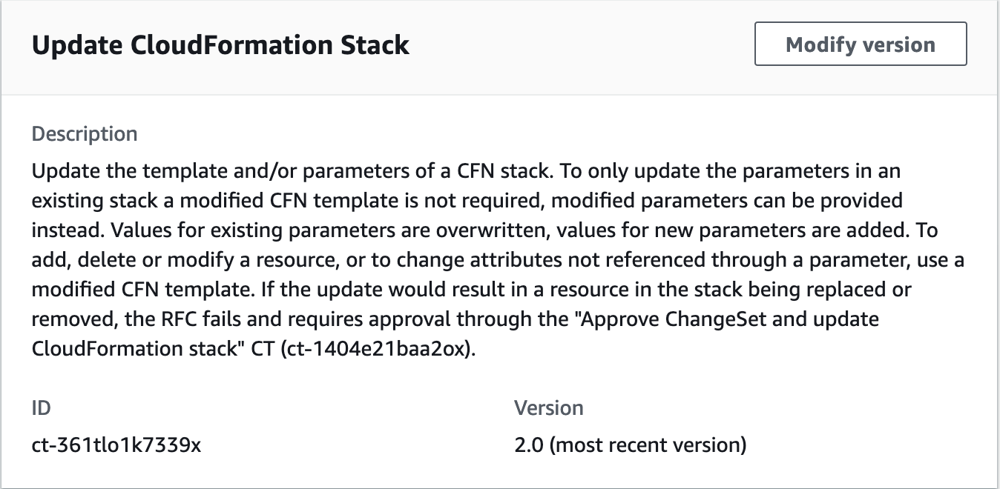

# Stack from CloudFormation Template | Update

Update the template and/or parameters of a CFN stack. To only update the parameters in an existing stack a modified CFN template is not required, modified parameters can be provided instead. Values for existing parameters are overwritten, values for new parameters are added. To add, delete or modify a resource, or to change attributes not referenced through a parameter, use a modified CFN template. If the update would result in a resource in the stack being replaced or removed, the RFC fails and requires approval through the "Approve ChangeSet and update CloudFormation stack" CT (ct-1404e21baa2ox).

**Full classification:** Management | Custom Stack | Stack from CloudFormation Template | Update

## Change Type Details

|                             |                  |
| --------------------------- | ---------------- |
| Change type ID              | ct-361tlo1k7339x |
| Current version             | 2.0              |
| Expected execution duration | 360 minutes      |
| AWS approval                | Required         |
| Customer approval           | Not required     |
| Execution mode              | Automated        |

## Additional Information

### Update AWS CloudFormation ingest stack


**To update a CloudFormation Ingest Stack using the console**

1. Navigate to the **Create RFC** page: In the left navigation pane of the AMS console click **RFCs** to open the RFCs list page, and then click **Create RFC**.
2. Choose a popular change type (CT) in the default **Browse change types** view, or select a CT in the
   **Choose by category** view.
   - **Browse by change type**: You can click on a popular CT in the **Quick create** area to immediately open the
     **Run RFC** page. Note that you cannot choose an older CT version with quick create.

   To sort CTs, use the **All change types** area in either the **Card** or **Table** view.
   In either view, select a CT and then click **Create RFC** to open the **Run RFC** page. If applicable,
   a **Create with older version** option appears next to the **Create RFC** button.
   - **Choose by category**: Select a category, subcategory, item, and operation and the CT details box opens with an option to
     **Create with older version** if applicable. Click **Create RFC** to open the **Run RFC** page.

3. On the **Run RFC** page, open the CT name area to see the CT details box.
   A **Subject** is required (this is filled in for you if you choose your CT in the **Browse change types** view). Open the
   **Additional configuration** area to add information about the RFC.

In the **Execution configuration** area, use available drop-down lists or enter values for the required parameters. To configure
optional execution parameters, open the **Additional configuration** area. 4. When finished, click **Run**. If there are no errors, the **RFC successfully created**
page displays with the submitted RFC details, and the initial **Run output**. 5. Open the **Run parameters** area to see the configurations you submitted. Refresh the page to update the RFC execution status.
Optionally, cancel the RFC or create a copy of it with the options at the top of the page.
**To update a CloudFormation ingest stack using the CLI**

1. Use either the Inline Create (you issue a `create-rfc` command with all RFC and execution parameters included), or
   Template Create (you create two JSON files, one for the RFC parameters and one for the execution parameters) and issue the `create-rfc`
   command with the two files as input. Both methods are described here.
2. Submit the RFC: `aws amscm submit-rfc --rfc-id `ID`` command with the returned RFC ID.

Monitor the RFC: `aws amscm get-rfc --rfc-id `ID`` command.
To check the change type version, use this command:

```
aws amscm list-change-type-version-summaries --filter Attribute=ChangeTypeId,Value=`CT_ID`
```

###### Note

You can use any `CreateRfc` parameters with any RFC whether or not they are part of the schema for the
change type. For example, to get notifications when the RFC status changes, add this line, `--notification "{\"Email\": {\"EmailRecipients\" : [\"email@example.com\"]}}"` to the
RFC parameters part of the request (not the execution parameters). For a list of all CreateRfc parameters, see the
[AMS Change Management API Reference](../ApiReference-cm/API_CreateRfc.md "../ApiReference-cm/API_CreateRfc.md").

1. Prepare the AWS CloudFormation template that you want to use to update the stack, and
   upload it to your S3 bucket. For important details, see
   [AWS CloudFormation Ingest Guidelines, Best Practices, and Limitations](../appguide/cfn-author-templates.md "../appguide/cfn-author-templates.md").
2. Create and submit the RFC to AMS:
   1. Create and save the execution parameters JSON file, include the
      CloudFormation template parameters that you want. This example names it
      UpdateCfnParams.json.

   Example UpdateCfnParams.json file with inline parameter updates:

   ```
   {
     "StackId": "`stack-yjjoo9aicjyqw4ro2`",
     "VpcId": "`VPC_ID`",
     "CloudFormationTemplate": "{\"AWSTemplateFormatVersion\":\"`2010-09-09`\",\"Description\":\"`Create a SNS topic`\",\"Parameters\":{\"`TopicName`\":{\"Type\":\"String\"},\"DisplayName\":{\"Type\":\"String\"}},\"`Resources`\":{\"SnsTopic\":{\"Type\":\"AWS::SNS::Topic\",\"Properties\":{\"TopicName\":{\"Ref\":\"TopicName\"},\"DisplayName\":{\"Ref\":\"DisplayName\"}}}}}",
     "TemplateParameters": [
       {
         "Key": "TopicName",
         "Value": "`TopicNameCLI`"
       },
       {
         "Key": "DisplayName",
         "Value": "`DisplayNameCLI`"
       }
     ],
     "TimeoutInMinutes": 1440
   }
   ```

   Example UpdateCfnParams.json file with S3 bucket endpoint containing an
   updated CloudFormation template:

   ```
   {
     "StackId": "`stack-yjjoo9aicjyqw4ro2`",
     "VpcId": "`VPC_ID`",
     "CloudFormationTemplateS3Endpoint": "`s3_url`",
     "TemplateParameters": [
       {
         "Key": "TopicName",
         "Value": "`TopicNameCLI`"
       },
       {
         "Key": "DisplayName",
         "Value": "`DisplayNameCLI`"
       }
     ],
     "TimeoutInMinutes": `1080`
   }
   ```

3. Create and save the RFC parameters JSON file with the following content. This
   example names it UpdateCfnRfc.json file.

```
{
   "ChangeTypeId": "ct-361tlo1k7339x",
   "ChangeTypeVersion": "1.0",
   "Title": "`cfn-ingest-template-update`"
}
```

4. Create the RFC, specifying the UpdateCfnRfc file and the UpdateCfnParams file:

```
aws amscm create-rfc --cli-input-json file://UpdateCfnRfc.json  --execution-parameters file://UpdateCfnParams.json
```

You receive the ID of the new RFC in the response and can use it to submit and monitor the RFC. Until you submit it, the RFC remains in the editing state and does not start.

- This change type is now at version 2.0. Changes include removing the **AutoApproveUpdateForResources** parameter, which was used in version
  1.0 of this CT, and adding two new parameters: **AutoApproveRiskyUpdates** and **BypassDriftCheck**.
- If the S3 bucket exists in an AMS account, you must use your AMS credentials for this command. For example, you may need to append
  `--profile saml` after obtaining your AMS AWS Security Token Service (AWS STS) credentials.
- All `Parameter` values for resources in the CloudFormation template must have a value, either through a default or a custom value through
  the parameters section of the CT. You can override the parameter value by structuring the
  CloudFormation template resources to reference a Parameters key. For examples that show how to do, see
  [CloudFormation ingest stack: CFN validator examples](../appguide/ex-cfn-ingest-validator.md "../appguide/ex-cfn-ingest-validator.md").

IMPORTANT: Missing parameters not supplied explicitly in the form, default to the currently set values on the existing stack or template.

- For a list of which self-provisioned services you can add using AWS CloudFormation Ingest, see
  [CloudFormation Ingest Stack: Supported Resources](../appguide/cfn-ingest-supp-services.md "../appguide/cfn-ingest-supp-services.md").

To learn more about AWS CloudFormation, see
[AWS Cloud​Formation](https://aws.amazon.com/cloudformation/ "https://aws.amazon.com/cloudformation/").

The template is validated to ensure that it can be created in an AMS account. If
it passes validation, it's updated to include any resources or configurations
required for it to conform with AMS. This includes adding resources such as Amazon CloudWatch
alarms in order to allow AMS Operations to monitor the stack.

The RFC is rejected if any of the following are true:

- RFC JSON Syntax is incorrect or does not follow the given format.
- The provided S3 bucket presigned URL is not valid.
- The template is not valid AWS CloudFormation syntax.
- The template does not have defaults set for all parameter values.
- The template fails AMS validation. For AMS validation steps, see the
  information later in this topic.
  The RFC fails if the CloudFormation stack fails to create due to a resource creation
  issue.

To learn more about CFN validation and validator, see
[Template Validation](../appguide/cfn-author-templates.md "../appguide/cfn-author-templates.md") and
[CloudFormation ingest stack: CFN validator examples](../appguide/ex-cfn-ingest-validator.md "../appguide/ex-cfn-ingest-validator.md").

## Execution Input Parameters

For detailed information about the execution input parameters, see
[Schema for Change Type ct-361tlo1k7339x](schemas.md#ct-361tlo1k7339x-schema-section "schemas.md#ct-361tlo1k7339x-schema-section").

## Example: Required Parameters

```
{
  "StackId": "stack-kiwonebfnadq08sol",
  "VpcId": "vpc-01234567890abcdef",
  "TimeoutInMinutes": 360
}
```

## Example: All Parameters

```
Example not available.
```
