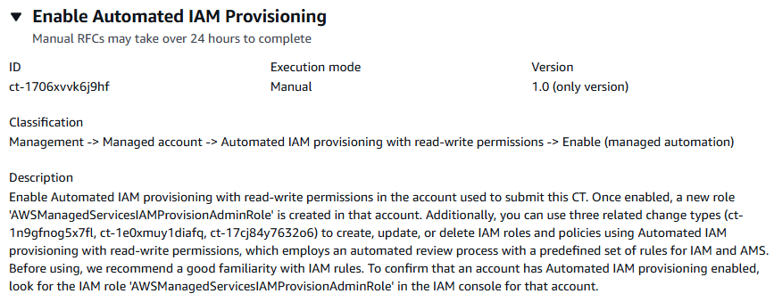

# Automated IAM Provisioning With Read-Write Permissions | Enable (Managed Automation)

Enable Automated IAM provisioning with read-write permissions in the account used to submit this CT. Once enabled, a new role 'AWSManagedServicesIAMProvisionAdminRole' is created in that account. Additionally, you can use three related change types (ct-1n9gfnog5x7fl, ct-1e0xmuy1diafq, ct-17cj84y7632o6) to create, update, or delete IAM roles and policies using Automated IAM provisioning with read-write permissions, which employs an automated review process with a predefined set of rules for IAM and AMS. Before using, we recommend a good familiarity with IAM rules. To confirm that an account has Automated IAM provisioning enabled, look for the IAM role 'AWSManagedServicesIAMProvisionAdminRole' in the IAM console for that account.

**Full classification:** Management | Managed account | Automated IAM provisioning with read-write permissions | Enable (managed automation)

## Change Type Details

|                             |                           |
| --------------------------- | ------------------------- |
| Change type ID              | ct-1706xvvk6j9hf          |
| Current version             | 1.0                       |
| Expected execution duration | 240 minutes               |
| AWS approval                | Required                  |
| Customer approval           | Not required if submitter |
| Execution mode              | Manual                    |

## Additional Information

### Create IAM entity or policy


How it works:

1. Navigate to the **Create RFC** page: In the left navigation pane of the AMS console click **RFCs** to open the RFCs list page, and then click **Create RFC**.
2. Choose a popular change type (CT) in the default **Browse change types** view, or select a CT in the
   **Choose by category** view.
   - **Browse by change type**: You can click on a popular CT in the **Quick create** area to immediately open the
     **Run RFC** page. Note that you cannot choose an older CT version with quick create.

   To sort CTs, use the **All change types** area in either the **Card** or **Table** view.
   In either view, select a CT and then click **Create RFC** to open the **Run RFC** page. If applicable,
   a **Create with older version** option appears next to the **Create RFC** button.
   - **Choose by category**: Select a category, subcategory, item, and operation and the CT details box opens with an option to
     **Create with older version** if applicable. Click **Create RFC** to open the **Run RFC** page.

3. On the **Run RFC** page, open the CT name area to see the CT details box.
   A **Subject** is required (this is filled in for you if you choose your CT in the **Browse change types** view). Open the
   **Additional configuration** area to add information about the RFC.

In the **Execution configuration** area, use available drop-down lists or enter values for the required parameters. To configure
optional execution parameters, open the **Additional configuration** area. 4. When finished, click **Run**. If there are no errors, the **RFC successfully created**
page displays with the submitted RFC details, and the initial **Run output**. 5. Open the **Run parameters** area to see the configurations you submitted. Refresh the page to update the RFC execution status.
Optionally, cancel the RFC or create a copy of it with the options at the top of the page.
How it works:

1. Use either the Inline Create (you issue a `create-rfc` command with all RFC and execution parameters included), or
   Template Create (you create two JSON files, one for the RFC parameters and one for the execution parameters) and issue the `create-rfc`
   command with the two files as input. Both methods are described here.
2. Submit the RFC: `aws amscm submit-rfc --rfc-id `ID`` command with the returned RFC ID.

Monitor the RFC: `aws amscm get-rfc --rfc-id `ID`` command.
To check the change type version, use this command:

```
aws amscm list-change-type-version-summaries --filter Attribute=ChangeTypeId,Value=`CT_ID`
```

###### Note

You can use any `CreateRfc` parameters with any RFC whether or not they are part of the schema for the
change type. For example, to get notifications when the RFC status changes, add this line, `--notification "{\"Email\": {\"EmailRecipients\" : [\"email@example.com\"]}}"` to the
RFC parameters part of the request (not the execution parameters). For a list of all CreateRfc parameters, see the
[AMS Change Management API Reference](../ApiReference-cm/API_CreateRfc.md "../ApiReference-cm/API_CreateRfc.md").

_INLINE CREATE_:

Issue the create RFC command with execution parameters provided inline (escape quotes when providing execution parameters inline), and then submit the returned RFC ID. For example, you can replace the contents with something like this:

```
aws amscm create-rfc --change-type-id "ct-1n9gfnog5x7fl" --change-type-version "1.0" --title "`Create role or policy`" --execution-parameters '{"DocumentName":"AWSManagedServices-HandleAutomatedIAMProvisioningCreate-Admin","Region":"`us-east-1`","Parameters":{"ValidateOnly":"`No`"},"RoleDetails":{"Roles":[{"RoleName":"`RoleTest01`","Description":"`This is a test role`","AssumeRolePolicyDocument":"{"Version": "2012-10-17", 		 	 	 		 	 	 "Statement":`[{"Effect":"Allow","Principal":{"AWS":"arn:aws:iam::123456789012:root"},"Action":"sts:AssumeRole"}]}","ManagedPolicyArns":["arn:aws:iam::123456789012:policy/policy01","arn:aws:iam::123456789012:policy/policy02"],"Path":"/","MaxSessionDuration":"7200","PermissionsBoundary":"arn:aws:iam::123456789012:policy/permission_boundary01","InstanceProfile":"No"}]},"ManagedPolicyDetails":{"Policies":[{"ManagedPolicyName":"TestPolicy01","Description":"This is customer policy","Path":"/test/","PolicyDocument":"{"`Version`":"2012-10-17","Statement":[{"Sid":"AllQueueActions","Effect":"Allow","Action":"sqs:ListQueues","Resource":"*","Condition":{"ForAllValues:StringEquals":{"aws:tagKeys":["temporary"]}}}]}"}]}`}'
```

_TEMPLATE CREATE_:

1. Output the execution parameters JSON schema for this change type to a file; example names it CreateIamResourceParams.json:

```
aws amscm get-change-type-version --change-type-id "ct-1n9gfnog5x7fl" --query "ChangeTypeVersion.ExecutionInputSchema" --output text > CreateIamResourceParams.json
```

2. Modify and save the CreateIamResourceParams file; example creates an IAM Role with policy documents pasted inline.

```
{
  "DocumentName": "AWSManagedServices-HandleAutomatedIAMProvisioningCreate-Admin",
  "Region": "`us-east-1`",
  "Parameters": {
    "ValidateOnly": "`No`"
  },
  "RoleDetails": {
    "Roles": [
      {
        "RoleName": "`RoleTest01`",
        "Description": "`This is a test role`",
        "AssumeRolePolicyDocument": {
          "Version": "2012-10-17",
          "Statement": [
            {
              "Effect": "`Allow`",
              "Principal": {
                "AWS": "`arn:aws:iam::123456789012:root`"
              },
              "Action": "`sts:AssumeRole`"
            }
          ]
        },
        "ManagedPolicyArns": [
          "`arn:aws:iam::123456789012:policy/policy01`",
          "`arn:aws:iam::123456789012:policy/policy02`"
        ],
        "Path": "/",
        "MaxSessionDuration": "`7200`",
        "PermissionsBoundary": "`arn:aws:iam::123456789012:policy/permission_boundary01`",
        "InstanceProfile": "`No`"
      }
    ]
  },
  "ManagedPolicyDetails": {
    "Policies": [
      {
        "ManagedPolicyName": "`TestPolicy01`",
        "Description": "`This is customer policy`",
        "Path": "`/test/`",
        "PolicyDocument": {
          "Version": "2012-10-17",
          "Statement": [
            {
              "Sid": "`AllQueueActions`",
              "Effect": "`Allow`",
              "Action": "`sqs:ListQueues`",
              "Resource": "`*`",
              "Condition": {
                "`ForAllValues:StringEquals`": {
                  "`aws:tagKeys`": [
                    "`temporary`"
                  ]
                }
              }
            }
          ]
        }
      }
    ]
  }
}
```

3. Output the RFC template JSON file to a file named CreateIamResourceRfc.json:

```
aws amscm create-rfc --generate-cli-skeleton > CreateIamResourceRfc.json
```

4. Modify and save the CreateIamResourceRfc.json file. For example, you can replace the contents with something like this:

```
{
  "ChangeTypeVersion": "1.0",
  "ChangeTypeId": "ct-1n9gfnog5x7fl",
  "Title": "`Create entity or policy (read-write permissions)`"
}
```

5. Create the RFC, specifying the CreateIamResourceRfc file and the CreateIamResourceParams file:

```
aws amscm create-rfc --cli-input-json file://CreateIamResourceRfc.json  --execution-parameters file://CreateIamResourceParams.json
```

You receive the ID of the new RFC in the response and can use it to submit and monitor the RFC. Until you submit it, the RFC remains in the editing state and does not start.

- After an IAM role is provisioned in your account,
  depending on the role and the policy document you attach to the role,
  you may need to onboard the role in your federation solution.
- For information about AWS Identity and Access Management, see
  [AWS Identity and Access Management (IAM)](https://aws.amazon.com/iam/ "https://aws.amazon.com/iam/") and for policy information, see
  [Managed policies and inline policies](../../../IAM/latest/UserGuide/access_policies_managed-vs-inline.md "../../../IAM/latest/UserGuide/access_policies_managed-vs-inline.md").
  For information about AMS permissions, see
  [Deploying IAM resources](../userguide/deploy-iam-resources.md "../userguide/deploy-iam-resources.md").

## Execution Input Parameters

For detailed information about the execution input parameters, see
[Schema for Change Type ct-1706xvvk6j9hf](schemas.md#ct-1706xvvk6j9hf-schema-section "schemas.md#ct-1706xvvk6j9hf-schema-section").

## Example: Required Parameters

```
Example not available.
```

## Example: All Parameters

```
{
  "SAMLIdentityProviderArns": ["arn:aws:iam::123456789012:saml-provider/customer-saml"],
  "IamEntityArns": ["arn:aws:iam::123456789012:role/test-role-one", "arn:aws:iam::123456789012:role/test-role-two"],
  "CustomerCustomDenyActionsList1": "ec2:Create*,ec2:Delete*,sso-admin:*,resource-explorer-2:*",
  "Priority": "High"
}
```
