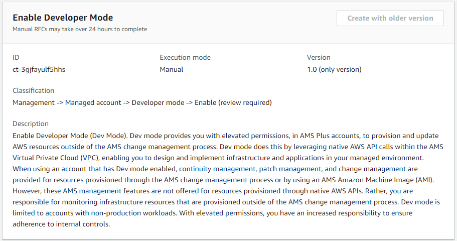

# Developer Mode | Enable (Managed Automation)

Enable Developer Mode (Dev Mode). Dev mode provides you with elevated permissions, in AMS Plus accounts, to provision and update AWS resources outside of the AMS change management process. Dev mode does this by leveraging native AWS API calls within the AMS Virtual Private Cloud (VPC), enabling you to design and implement infrastructure and applications in your managed environment. When using an account that has Dev mode enabled, continuity management, patch management, and change management are provided for resources provisioned through the AMS change management process or by using an AMS Amazon Machine Image (AMI). However, these AMS management features are not offered for resources provisioned through native AWS APIs. Rather, you are responsible for monitoring infrastructure resources that are provisioned outside of the AMS change management process. Dev mode is limited to accounts with non-production workloads. With elevated permissions, you have an increased responsibility to ensure adherence to internal controls.

**Full classification:** Management | Managed account | Developer mode | Enable (managed automation)

## Change Type Details

|                             |                           |
| --------------------------- | ------------------------- | ------------------------------------------------------------------------------------------------------------------------------------------------------------------------------------------------------------------------------------------------------------------------------------------------------------------------------------------------------------------------------------------------------------------------------------------------------------------------------------------------------------------------------------------------------------------------------------------------------------------------------------------------------------------------------------------------------------------------------------------------------------------------------------------------------------------------------------------------------------------------------------------------------------------------------------------------------------------------------------------------------------------------------------------------------------------------------------------------------------------------------------------------------------------------------------------------------------------------------------------------------------------------------------------------------------------------------------------------------------------------------------------------------------------------------------------------------------------------------------------------------------------------------------------------------------------------------------------------------------------------------------------------------------------------------------------------------------------------------------------------------------------------------------------------------------------------------------------------------------------------------------------------------------------------------------------------------------------------------------------------------------------------------------------------------------------------------------------------------------------------------------------------------------------------------------------------------------------------------------------------------------------------------------------------------------------------------------------------------------------------------------------------------------------------------------------------------------------------------------------------------------------------------------------------------------------------------------------------------------------------------------------------------------------------------------------------------------------------------------------------------------------------------------------------------------------------------------------------------------------------------------------------------------------------------------------------------------------------------------------------------------------------------------------------------------------------------------------------------------------------------------------------------------------------------------------------------------------------------------------------------------------------------------------------------------------------------------------------------------------------------------------------------------------------------------------------------------------------------------------------------------------------------------------------------------------------------------------------------------------------------------------------------------------------------------------------------------------------------------------------------------------------------------------------------------------------------------------------------------------------------------------------------------------------------------------------------------------------------------------------------------------------------------------------------------------------------------------------------------------------------------------------------------------------------------------------------------------------------------------------------------------------------------------------------------------------------------------------------------------------------------------------------------------------------------------------------------------------------------------------------------------------------------------------------------------------------------------------------------------------------------------------------------------------------------------------------------------------------------------------------------------------------------------------------------------------------------------------------------------------------------------------------------------------------------------------------------------------------------------------------------------------------------------------------------------------------------------------------------------------------------------------------------------------------------------------------------------------------------------------------------------------------------------------------------------------------------------------------------------------------------------------------------------------------------------------------------------------------------------------------------------------------------------------------------------------------------------------------------------------------------------------------------------------------------------------------------------------------------------------------------------------------------------------------------------------------------------------------------------------------------------------------------------------------------------------------------------------------------------------------------------------------------------------------------------------------------------------------------------------------------------------------------------------------------------------------------------------------------------------------------------------------------------------------------------------------------------------------------------------------------------------------------------------------------------------------------------------------------------------------------------------------------------------------------------------------------------------------------------------------------------------------------------------------------------ |
| Change type ID              | ct-3gjfayulf5hhs          |
| Current version             | 1.0                       |
| Expected execution duration | 240 minutes               |
| AWS approval                | Required                  |
| Customer approval           | Not required if submitter |
| Execution mode              | Manual                    | ## Additional Information ### Enable Developer mode (Managed Automation) The following shows this change type in the AMS console.  How it works: 1. Navigate to the **Create RFC** page: In the left navigation pane of the AMS console click **RFCs** to open the RFCs list page, and then click **Create RFC**. 2. Choose a popular change type (CT) in the default **Browse change types** view, or select a CT in the **Choose by category** view.  • **Browse by change type**: You can click on a popular CT in the **Quick create** area to immediately open the **Run RFC** page. Note that you cannot choose an older CT version with quick create. To sort CTs, use the **All change types** area in either the **Card** or **Table** view. In either view, select a CT and then click **Create RFC** to open the **Run RFC** page. If applicable, a **Create with older version** option appears next to the **Create RFC** button.  • **Choose by category**: Select a category, subcategory, item, and operation and the CT details box opens with an option to **Create with older version** if applicable. Click **Create RFC** to open the **Run RFC** page. 3. On the **Run RFC** page, open the CT name area to see the CT details box. A **Subject** is required (this is filled in for you if you choose your CT in the **Browse change types** view). Open the **Additional configuration** area to add information about the RFC. In the **Execution configuration** area, use available drop-down lists or enter values for the required parameters. To configure optional execution parameters, open the **Additional configuration** area. 4. When finished, click **Run**. If there are no errors, the **RFC successfully created** page displays with the submitted RFC details, and the initial **Run output**. 5. Open the **Run parameters** area to see the configurations you submitted. Refresh the page to update the RFC execution status. Optionally, cancel the RFC or create a copy of it with the options at the top of the page. How it works: 1. Use either the Inline Create (you issue a `create-rfc` command with all RFC and execution parameters included), or Template Create (you create two JSON files, one for the RFC parameters and one for the execution parameters) and issue the `create-rfc` command with the two files as input. Both methods are described here. 2. Submit the RFC: `aws amscm submit-rfc --rfc-id `ID`` command with the returned RFC ID. Monitor the RFC: `aws amscm get-rfc --rfc-id `ID`` command. To check the change type version, use this command: `` aws amscm list-change-type-version-summaries --filter Attribute=ChangeTypeId,Value=`CT_ID` `` ###### Note You can use any `CreateRfc` parameters with any RFC whether or not they are part of the schema for the change type. For example, to get notifications when the RFC status changes, add this line, `--notification "{\"Email\": {\"EmailRecipients\" : [\"email@example.com\"]}}"` to the RFC parameters part of the request (not the execution parameters). For a list of all CreateRfc parameters, see the [AMS Change Management API Reference](../ApiReference-cm/API_CreateRfc.md "../ApiReference-cm/API_CreateRfc.md"). _INLINE CREATE_: ###### Note Run this change type from your Application account. Issue the create RFC command with execution parameters provided inline (escape quotes when providing execution parameters inline), and then submit the returned RFC ID. For example, you can replace the contents with something like this: ``aws amscm create-rfc --change-type-id "ct-3gjfayulf5hhs" --change-type-version "1.0" --title "`RFC Title`" --execution-parameters "{\"Enable\":\"Yes\"}"`` _TEMPLATE CREATE_: 1. Output the execution parameters JSON schema for this change type to a file; this example names it EnableDevModeParams.json: `aws amscm get-change-type-version --change-type-id "ct-3gjfayulf5hhs" --query "ChangeTypeVersion.ExecutionInputSchema" --output text > EnableDevModeParams.json` 2. Modify and save the EnableDevModeParams file. For example, you can replace the contents with something like this: `{"Enable": "Yes"}` 3. Output the RFC template JSON file to a file; this example names it EnableDevModeRfc.json: `aws amscm create-rfc --generate-cli-skeleton > EnableDevModeRfc.json` 4. Modify and save the EnableDevModeRfc.json file. For example, you can replace the contents with something like this: ``{ "ChangeTypeVersion":    "`1.0`", "ChangeTypeId":         "ct-3gjfayulf5hhs", "Title":                "`Enable-Dev-Mode-RFC`" }`` 5. Create the RFC, specifying the EnableDevModeRfc file and the EnableDevModeParams file: `aws amscm create-rfc --cli-input-json file://EnableDevModeRfc.json  --execution-parameters file://EnableDevModeParams.json` You receive the ID of the new RFC in the response and can use it to submit and monitor the RFC. Until you submit it, the RFC remains in the editing state and does not start. This is a manual change type (an AMS operator must review and run the CT), which means that the RFC can take longer to run and you might have to communicate with AMS through the RFC details page correspondance option. Additionally, if you schedule a manual change type RFC, be sure to allow at least 24 hours, if approval does not happen before the scheduled start time, the RFC is rejected automatically. ###### Note When using manual CTs, AMS recommends that you use the ASAP **Scheduling** option (choose **ASAP** in the console, leave start and end time blank in the API/CLI) as these CTs require an AMS operator to examine the RFC, and possibly communicate with you before it can be approved and run. If you schedule these RFCs, be sure to allow at least 24 hours. If approval does not happen before the scheduled start time, the RFC is rejected automatically.  • Resources that you create using developer mode can be managed by AMS only if they are created using AMS change management processes.  • For more information about Developer mode, see [AMS Developer Mode](../userguide/developer-mode.md "../userguide/developer-mode.md"). ## Execution Input Parameters For detailed information about the execution input parameters, see [Schema for Change Type ct-3gjfayulf5hhs](schemas.md#ct-3gjfayulf5hhs-schema-section "schemas.md#ct-3gjfayulf5hhs-schema-section"). ## Example: Required Parameters `Example not available.` ## Example: All Parameters `{ "Enable": "Yes", "Priority": "Medium" }` |
