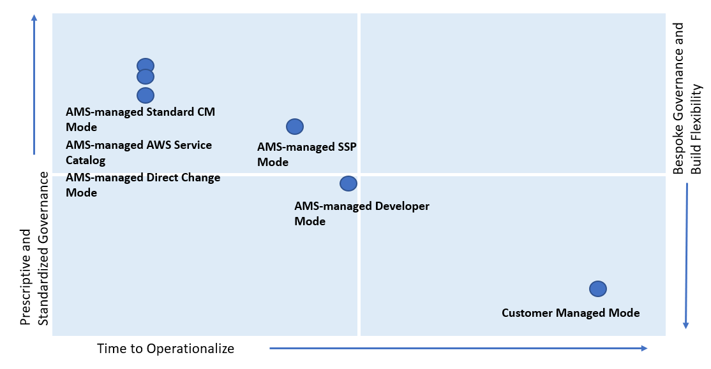

# AMS modes and applications or workloads

Consider operational and governance requirements for your applications when selecting
the right mode, either by requesting a new application account or hosting the application in an existing application account.
The selection of the appropriate AMS mode for each application or workload depends on the following factors:

- The type of SDLC lifecycle function that the environment will provide (e.g., sandbox with unmoderated
  changes, UAT with some frequent changes, production with minimal changes and highly regulated)
- The governance policies needed (enforced through SCPs at the OU level)
- Operational Model (if you want to own the operational responsibility or want to outsource that to AMS)
- The desired business outcomes, like time to operate in the cloud, and cost of operations.

###### Note

For a descriptions of the mode types per AMS service, see
[Types of modes and accounts in AMS](../userguide/ams-modes-types.md "../userguide/ams-modes-types.md").

For real-world use cases of the different modes, see
[Real world use cases for AMS modes](../userguide/ams-modes-and-use-cases.md "../userguide/ams-modes-and-use-cases.md")

The following table outlines key considerations for application owners to help decide on the most suitable AMS mode.
Application owners should include an assessment phase ahead of application migration to fully understand which
mode applies to their specific application. Example: For applications based on cloud-native services or serverless
architecture, the best option could be to start building and iterating in Developer mode and deploy the final
Infrastructure as Code using AMS Managed – SSP mode. In this case light re-factoring may be required to ensure
that any CloudFormation templates created for automated deployment meet the ingest guidelines laid out by AMS.
Additionally, any IAM permissions need to be approved by AMS Security to ensure they follow the least privilege
model.

The AMS mode selected to host the application, can help enable you to build towards
you desired cloud operating model.

###### Note

More than one cloud operating model can existing in a single AMS Managed Landing
Zone based on the different AMS modes selected to host the applications.

| Decision issues                                         | Standard CM mode / OOD**\***                                                  | AWS Service Catalog                                                                                          | Direct Change mode                                                                            | Self-service provisioning                                                           | Developer mode                                                                                                                                                                                                                                                                                                                                                                                                                                                                                                                                                                                                                                                                                                                                                                                                                                                                                                                                                                                                                                                                                                                                                                                                                                                                                                                                                            | Customer Managed                                                                                             |
| ------------------------------------------------------- | ----------------------------------------------------------------------------- | ------------------------------------------------------------------------------------------------------------ | --------------------------------------------------------------------------------------------- | ----------------------------------------------------------------------------------- | ------------------------------------------------------------------------------------------------------------------------------------------------------------------------------------------------------------------------------------------------------------------------------------------------------------------------------------------------------------------------------------------------------------------------------------------------------------------------------------------------------------------------------------------------------------------------------------------------------------------------------------------------------------------------------------------------------------------------------------------------------------------------------------------------------------------------------------------------------------------------------------------------------------------------------------------------------------------------------------------------------------------------------------------------------------------------------------------------------------------------------------------------------------------------------------------------------------------------------------------------------------------------------------------------------------------------------------------------------------------------- | ------------------------------------------------------------------------------------------------------------ | -------------------------------------------------------------------------------------------------------- | --------------------------------------------------------------------------------------------- | ------------------------------------------------------------- | ------------------------------------------------------------ | --- |
| Operational readiness                                   |                                                                               | Logging, Monitoring and Event Management                                                                     | AMS responsible for all managed infrastructure                                                | Customer responsible for Self-Service Provisioned Services (SSP)                    | Customer responsible for resources provisioned using developer IAM role outside AMS CM system                                                                                                                                                                                                                                                                                                                                                                                                                                                                                                                                                                                                                                                                                                                                                                                                                                                                                                                                                                                                                                                                                                                                                                                                                                                                             | Customer responsible                                                                                         |
| Continuity Management                                   | AMS responsibility to execute backup plan selected by customer                | Customer responsible for Self-Service Provisioned Services (SSP)                                             | Customer responsible for resources provisioned using developer IAM role outside AMS CM system |                                                                                     | Instance Level Access Management                                                                                                                                                                                                                                                                                                                                                                                                                                                                                                                                                                                                                                                                                                                                                                                                                                                                                                                                                                                                                                                                                                                                                                                                                                                                                                                                          | AMS-managed through one-way AD trust with on-prem domain. Requires managed infrastructure to join AMS domain | Not applicable                                                                                           | Customer responsible for resources provisioned using developer IAM role outside AMS CM system |
| Security Management and Account Level Access Management | AMS responsibility for all managed accounts                                   | AMS responsible for all managed accounts                                                                     | Customer responsible for resources provisioned using developer IAM role outside AMS CM system |                                                                                     | Patch Management                                                                                                                                                                                                                                                                                                                                                                                                                                                                                                                                                                                                                                                                                                                                                                                                                                                                                                                                                                                                                                                                                                                                                                                                                                                                                                                                                          | AMS responsibility for all managed accounts                                                                  | Customer responsible for Self-Service Provisioned Services (SSP)                                         | Customer responsible for resources provisioned using developer IAM role outside AMS CM system |
| Change Management                                       | AMS responsibility for all managed accounts                                   | Customer responsible for Self-Service Provisioned Services (SSP)                                             | Customer responsible for resources provisioned using developer IAM role outside AMS CM system |                                                                                     | Provisioning Management                                                                                                                                                                                                                                                                                                                                                                                                                                                                                                                                                                                                                                                                                                                                                                                                                                                                                                                                                                                                                                                                                                                                                                                                                                                                                                                                                   | Prescriptive and standardized for the provisioning options offered in AMS                                    | Flexibility to directly use AWS service API for AWS Service Catalog following AMS prescriptive standards | Flexibility to directly use AWS service API following AMS prescriptive standards              | Flexibility to directly use AWS service APIs for SSP services | Flexibility to directly use AWS service API for provisioning |
| Incident Management and Audit                           | AMS responsibile for all managed accounts                                     | Customer responsible for resources provisioned using developer IAM role outside AMS Change Management System |                                                                                               | GuardRails and Shared infrastructure (Network) and Security Framework               | Prescriptive and standardized leveraging AMS Core Accounts                                                                                                                                                                                                                                                                                                                                                                                                                                                                                                                                                                                                                                                                                                                                                                                                                                                                                                                                                                                                                                                                                                                                                                                                                                                                                                                | Flexible and bespoke leveraging AMS Core Accounts                                                            |
| Application readiness                                   |                                                                               | Application refactoring                                                                                      | Light refactoring is needed                                                                   | Light refactoring is needed (if provisioned using AMS Standard CM)                  | No need for refactoring                                                                                                                                                                                                                                                                                                                                                                                                                                                                                                                                                                                                                                                                                                                                                                                                                                                                                                                                                                                                                                                                                                                                                                                                                                                                                                                                                   |                                                                                                              | Support for AWS services                                                                                 | Limited to what is supported by AMS                                                           | Not limited                                                   |
| Business considerations                                 |                                                                               | Time to operational readiness                                                                                | Three to six months                                                                           | 6 months + dependent on customer application operations competencies                | 6-18 months dependent on customer infrastructure and application operations competencies                                                                                                                                                                                                                                                                                                                                                                                                                                                                                                                                                                                                                                                                                                                                                                                                                                                                                                                                                                                                                                                                                                                                                                                                                                                                                  |                                                                                                              | Costs                                                                                                    | $$$$                                                                                          | $$$                                                           | $$                                                           | $   |
| Application examples                                    | Webserver with 3 tier stack, apps with compliance and regulatory requirements | Webserver using API Gateway, containerized application leveraging ECS/EKS                                    | Iterating/optimizing on Data Lake application that uses Lambda, Glue, Athena, etc             | De-centralized accounts/applications like sandbox, third party managed applications | **\***Operations On Demand (OOD) has an offering for customers using the Standard CM mode to manage their changes through dedicated resourcing. For more details, see the [Operations on Demand catalog of offerings](../userguide/ood-catalog.md "../userguide/ood-catalog.md") and talk to your cloud service delivery manager (CSDM). ###### Note The price comparison between SSP mode and Developer mode assumes that the same AWS services are provisioned. Comparing AMS Modes against business and IT objectives  As shown, if you are looking for a highly controlled and standardized governance model for you applications, then AMS-managed Standard Change, AWS Service Catalog, or Direct Change modes are the best fit. If you require a bespoke governance model with a focus on application innovation without the need for operational readiness, select Customer Managed mode. With Customer Managed mode, it could take you a longer time to operationalize you applications as you bear the responsibility to establish people, processes, and tools to support operational capabilities such as Incident Management, Configuration Management, Provisioning Management, Security Management, Patch Management, etc. |
