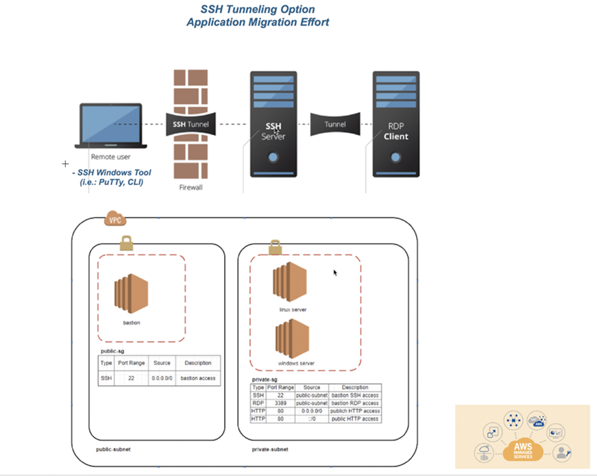
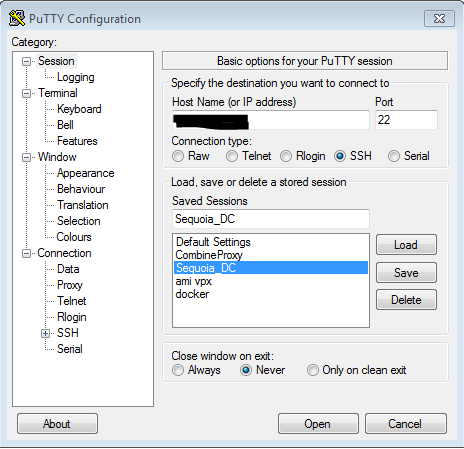
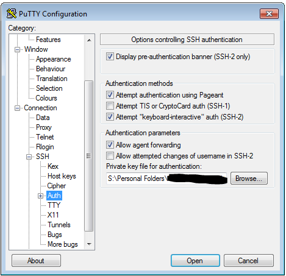
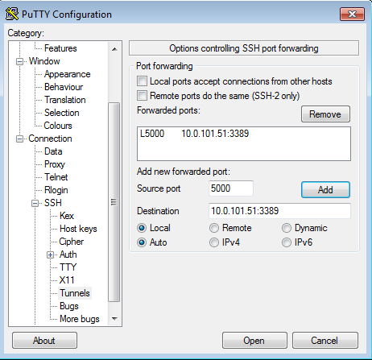
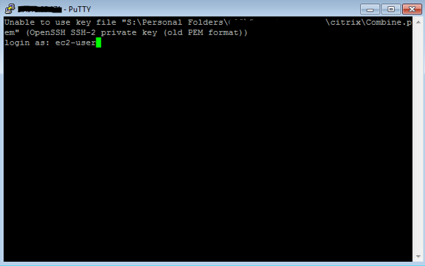
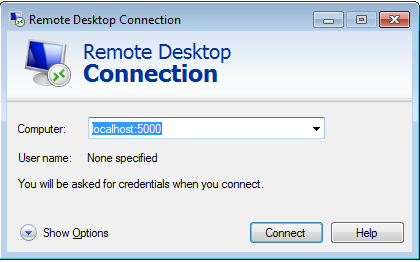

End of support notice: On June 30, 2027, AWS
will end support for AMS Advanced. After June 30, 2027, you will
no longer be able to access the AMS Advanced console or AMS Advanced resources.
For more information, see [AMS Advanced end of support](../userguide/SunsetPlan.md "../userguide/SunsetPlan.md").

# AMS Bastion Options during Application Migrations/Onboarding

In order to provide you with the best experience during migration efforts, below are the potential options AMS could currently leverage:

- _Option 1_: Bypass Bastions for migration efforts only (you must sign off on this for security purposes as a temporary measure).

Note: Auditing capabilities will still be in place to ensure AMS has visibility into each request.

- _Option 2_: SSH Tunneling with a tool of choice; for example, PuTTy, as illustrated.

The environment components described would already need to be in place for this option.

AMS would provide additional notes and instructions.

SSH tunneling steps with PuTTy:

Within PuTTY, you would create an SSH session, with the public IP of the bastion host, provide the PEM key in the AUTH section, and then create a Tunnel.
The tunnel’s source port should be an unused local port (e.g. 5000) and the IP would be the IP of the destination host
(the Windows box you are trying to reach) with the RDP port appended (3389). Be sure to save your configuration, as you don’t want to have to do
it each time you log into the box. Connect to the bastion host, and log in. Then, start an RDP session for localhost:5000 (or whichever port you choose).

1. Set Host Name or public IP of the bastion host

 2. In SSH ->Auth, set the private key file in .ppk format

 3. In SSH ->Tunnels, add the new forwarded port. The Source Port should be the arbitrary unused port, and the Destination
should be the IP of the destination server behind the bastion host, with the RDP port appended.

 4. Connect to the bastion host via PuTTY and log in.

 5. Start an RDP session to localhost:5000 to reach the destination server.

