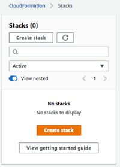
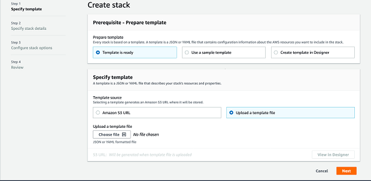
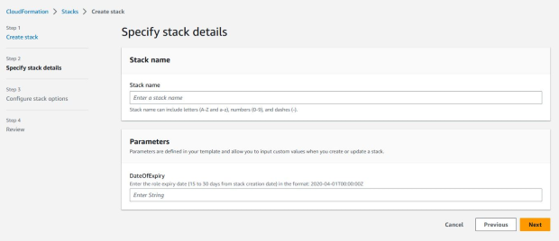
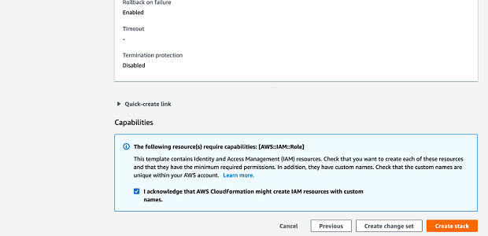

# Create an IAM Role for AMS to use

1. Obtain a JSON or YAML file that defines an IAM role for AMS to use to create your infrastructure. Either:
   - Your AMS cloud architect (CA) provides you with a JSON or YAML file.
   - You can download [onboarding_iam_roles.zip](samples/onboarding_iam_roles.md "samples/onboarding_iam_roles.md") and
     choose one of the following:
     - **onboarding_role_admin.json** (shorter, grants full admin access)
     - **onboarding_role_minimal.json** (longer, grants
       [least privilege](https://en.wikipedia.org/wiki/Principle_of_least_privilege "https://en.wikipedia.org/wiki/Principle_of_least_privilege"))

2. Sign in to the AWS Management Console and open the CloudFormation console at
   [https://console.aws.amazon.com/cloudformation](https://console.aws.amazon.com/cloudformation/ "https://console.aws.amazon.com/cloudformation/").

 3. Choose **Create Stack**. You see the following page.

 4. Choose **Upload a template file**, upload the JSON or YAML file of the IAM role,
and then choose **Next**. You see the following page.

 5. Enter `ams-onboarding-role` into the **Stack name** section and
continue scrolling down and selecting next until you reach this page.

 6. Make sure the check box is selected and then select **Create Stack**. 7. Make sure the stack was created successfully.
