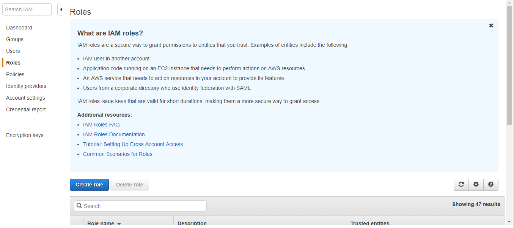
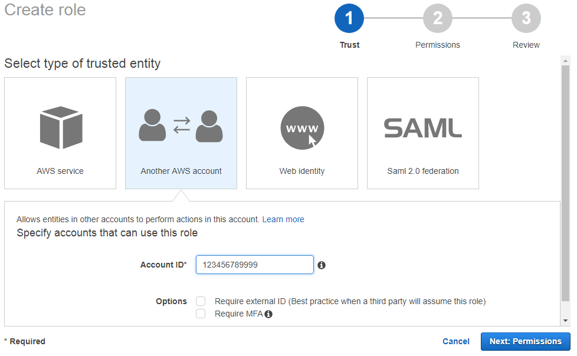
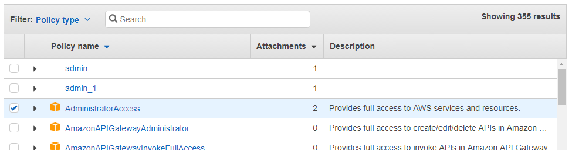
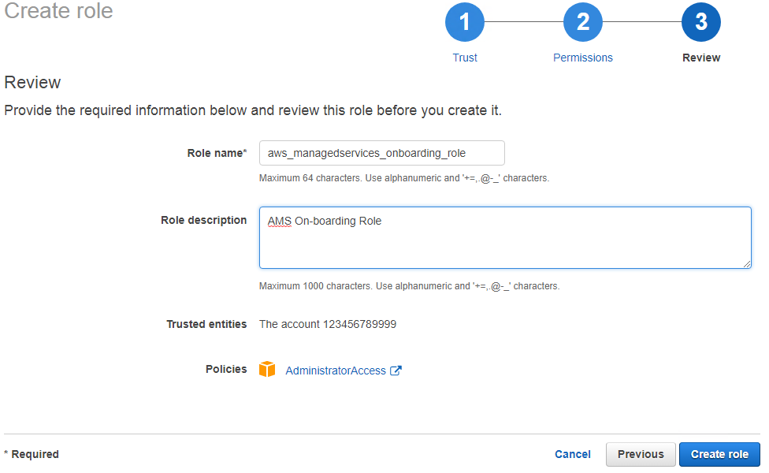

# Create an IAM role with access to the AWS website

AWS Identity and Access Management (IAM) is a web service that helps you securely control access to AWS resources for your users.
You use IAM to control who can use your AWS resources (authentication) and what resources they can use and in what ways (authorization).

1. Go to the [IAM Management Console](https://console.aws.amazon.com/iam/home?#home "https://console.aws.amazon.com/iam/home?#home"), click **Roles** in the left nav pane.

The Roles management page opens with information about IAM roles, a **Create role** option, and a list of existing roles.

 2. Click **Create role**.

The Create role **Select type of trusted entity** page opens. Click **Another AWS account** and a settings area opens up below.

Enter the AMS trusted **Account ID** provided to you by AMS. Leave the **Require external ID** and **Require MFA** options de-selected.

 3. Click **Next: Permissions**.

The Create role **Attach permissions policies** page opens with options for creating a new policy,
refreshing the page, and searching existing policies. A list of existing policies is provided.

 4. Select the **AdministratorAccess** policy and then click **Next: Review**.

The Create role **Review** page opens.

 5. Name the new role **aws_managedservices_onboarding_role** and type "AMS Onboarding Role" for the **Role description**.
Review the settings for the new role and, if satisfied, click **Create role**.

The role management page opens with your new role listed.
