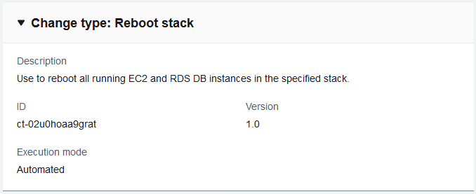
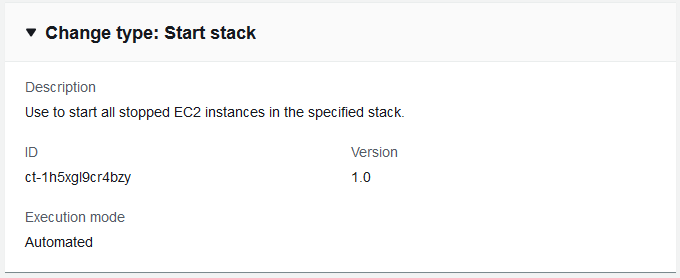
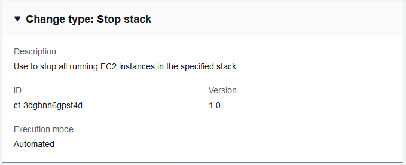

# Any stack: deleting, rebooting, starting, stopping

You can use the AMS console or API/CLI to delete, reboot, start, or stop, an AMS stack.

## Delete stack

Screenshot of this change type in the AMS console:


How it works:

1. Navigate to the **Create RFC** page: In the left navigation pane of the AMS console click **RFCs** to open the RFCs list page, and then click **Create RFC**.
2. Choose a popular change type (CT) in the default **Browse change types** view, or select a CT in the
   **Choose by category** view.
   - **Browse by change type**: You can click on a popular CT in the **Quick create** area to immediately open the
     **Run RFC** page. Note that you cannot choose an older CT version with quick create.

   To sort CTs, use the **All change types** area in either the **Card** or **Table** view.
   In either view, select a CT and then click **Create RFC** to open the **Run RFC** page. If applicable,
   a **Create with older version** option appears next to the **Create RFC** button.
   - **Choose by category**: Select a category, subcategory, item, and operation and the CT details box opens with an option to
     **Create with older version** if applicable. Click **Create RFC** to open the **Run RFC** page.

3. On the **Run RFC** page, open the CT name area to see the CT details box.
   A **Subject** is required (this is filled in for you if you choose your CT in the **Browse change types** view). Open the
   **Additional configuration** area to add information about the RFC.

In the **Execution configuration** area, use available drop-down lists or enter values for the required parameters. To configure
optional execution parameters, open the **Additional configuration** area. 4. When finished, click **Run**. If there are no errors, the **RFC successfully created**
page displays with the submitted RFC details, and the initial **Run output**. 5. Open the **Run parameters** area to see the configurations you submitted. Refresh the page to update the RFC execution status.
Optionally, cancel the RFC or create a copy of it with the options at the top of the page.
How it works:

1. Use either the Inline Create (you issue a `create-rfc` command with all RFC and execution parameters included), or
   Template Create (you create two JSON files, one for the RFC parameters and one for the execution parameters) and issue the `create-rfc`
   command with the two files as input. Both methods are described here.
2. Submit the RFC: `aws amscm submit-rfc --rfc-id `ID`` command with the returned RFC ID.

Monitor the RFC: `aws amscm get-rfc --rfc-id `ID`` command.
To check the change type version, use this command:

```
aws amscm list-change-type-version-summaries --filter Attribute=ChangeTypeId,Value=`CT_ID`
```

###### Note

You can use any `CreateRfc` parameters with any RFC whether or not they are part of the schema for the
change type. For example, to get notifications when the RFC status changes, add this line, `--notification "{\"Email\": {\"EmailRecipients\" : [\"email@example.com\"]}}"` to the
RFC parameters part of the request (not the execution parameters). For a list of all CreateRfc parameters, see the
[AMS Change Management API Reference](../ApiReference-cm/API_CreateRfc.md "../ApiReference-cm/API_CreateRfc.md").

_INLINE CREATE_:

Issue the create RFC command with execution parameters provided inline (escape quotation marks when providing execution parameters inline), and then submit the returned RFC ID. For example, you can replace the contents with something like this:

```
aws amscm create-rfc --change-type-id "ct-0q0bic0ywqk6c" --change-type-version "1.0" --title "Delete My Stack" --execution-parameters "{\"StackId\":\"`STACK_ID`\"}"
```

_TEMPLATE CREATE_:

1. Output the RFC template to a file in your current folder; this example names it DeleteStackRfc.json:

```
aws amscm create-rfc --generate-cli-skeleton > DeleteStackRfc.json
```

2. Modify and save the DeleteStackRfc.json file.

The internal quotation marks in the ExecutionParameters JSON extension must be escaped with a backslash (\). Example without start and end time:

```
{
"ChangeTypeVersion":    "`1.0`",
"ChangeTypeId":         "ct-0q0bic0ywqk6c",
"Title":                "`Delete-My-Stack-RFC`"
"ExecutionParameters":  "{
        \"StackId\":\"`STACK_ID`\"}"
}
```

3. Create the RFC:

```
aws amscm create-rfc --cli-input-json file://DeleteStackRfc.json
```

You receive the ID of the new RFC in the response and can use it to submit and monitor the RFC. Until you submit it, the RFC remains in the editing state and does not start.

###### Note

If deleting an S3 bucket, it must be emptied of objects first.

###### Important

Deleting stacks can have unwanted and unanticipated consequences. For important caveats, see
RFC Troubleshooting section
[RFCs for Delete Stack](../ctref/rfc-failures.md#rfc-delete-stack-fail "../ctref/rfc-failures.md#rfc-delete-stack-fail").

## Reboot stack

Screenshot of this change type in the AMS console:


How it works:

1. Navigate to the **Create RFC** page: In the left navigation pane of the AMS console click **RFCs** to open the RFCs list page, and then click **Create RFC**.
2. Choose a popular change type (CT) in the default **Browse change types** view, or select a CT in the
   **Choose by category** view.
   - **Browse by change type**: You can click on a popular CT in the **Quick create** area to immediately open the
     **Run RFC** page. Note that you cannot choose an older CT version with quick create.

   To sort CTs, use the **All change types** area in either the **Card** or **Table** view.
   In either view, select a CT and then click **Create RFC** to open the **Run RFC** page. If applicable,
   a **Create with older version** option appears next to the **Create RFC** button.
   - **Choose by category**: Select a category, subcategory, item, and operation and the CT details box opens with an option to
     **Create with older version** if applicable. Click **Create RFC** to open the **Run RFC** page.

3. On the **Run RFC** page, open the CT name area to see the CT details box.
   A **Subject** is required (this is filled in for you if you choose your CT in the **Browse change types** view). Open the
   **Additional configuration** area to add information about the RFC.

In the **Execution configuration** area, use available drop-down lists or enter values for the required parameters. To configure
optional execution parameters, open the **Additional configuration** area. 4. When finished, click **Run**. If there are no errors, the **RFC successfully created**
page displays with the submitted RFC details, and the initial **Run output**. 5. Open the **Run parameters** area to see the configurations you submitted. Refresh the page to update the RFC execution status.
Optionally, cancel the RFC or create a copy of it with the options at the top of the page.
How it works:

1. Use either the Inline Create (you issue a `create-rfc` command with all RFC and execution parameters included), or
   Template Create (you create two JSON files, one for the RFC parameters and one for the execution parameters) and issue the `create-rfc`
   command with the two files as input. Both methods are described here.
2. Submit the RFC: `aws amscm submit-rfc --rfc-id `ID`` command with the returned RFC ID.

Monitor the RFC: `aws amscm get-rfc --rfc-id `ID`` command.
To check the change type version, use this command:

```
aws amscm list-change-type-version-summaries --filter Attribute=ChangeTypeId,Value=`CT_ID`
```

###### Note

You can use any `CreateRfc` parameters with any RFC whether or not they are part of the schema for the
change type. For example, to get notifications when the RFC status changes, add this line, `--notification "{\"Email\": {\"EmailRecipients\" : [\"email@example.com\"]}}"` to the
RFC parameters part of the request (not the execution parameters). For a list of all CreateRfc parameters, see the
[AMS Change Management API Reference](../ApiReference-cm/API_CreateRfc.md "../ApiReference-cm/API_CreateRfc.md").

_INLINE CREATE_:

Issue the create RFC command with execution parameters provided inline (escape quotation marks when providing execution parameters inline), and then submit the returned RFC ID. For example, you can replace the contents with something like this:

```
aws amscm create-rfc --change-type-id "ct-02u0hoaa9grat" --change-type-version "1.0" --title "`Reboot My Stack`" --execution-parameters "{\"StackId\":\"`STACK_ID`\"}"
```

_TEMPLATE CREATE_:

1. Output the RFC template to a file in your current folder. This example names it RebootStackRfc.json. Note
   that since there is only one execution parameter for stopping (rebooting, or starting) an
   instance, the execution parameter can be in the schema JSON file itself and
   there is no need to create a separate execution parameters JSON file.

```
aws amscm create-rfc --generate-cli-skeleton > StopInstanceRfc.json
```

2. Modify and save the RebootStackRfc.json file.

The internal quotation marks in the `ExecutionParameters` JSON extension must be escaped with a backslash (\). Example:

```
{
"ChangeTypeId":         "ct-02u0hoaa9grat",
"Title":                "`Reboot-My-EC2-RFC`",
"TimeoutInMinutes":     `60`,
"ExecutionParameters":  "{
        \"StackId\":\"`STACK_ID`\"
    }"
}
```

3. Create the RFC:

```
aws amscm create-rfc --cli-input-json file://RebootStackRfc.json
```

You receive the ID of the new RFC in the response and can use it to submit and monitor the RFC. Until you submit it, the RFC remains in the editing state and does not start.

For information about Application Load Balancers, see
[Application Load Balancers](../../../elasticloadbalancing/latest/application/application-load-balancers.md "../../../elasticloadbalancing/latest/application/application-load-balancers.md").

## Start stack

Screenshot of this change type in the AMS console:


How it works:

1. Navigate to the **Create RFC** page: In the left navigation pane of the AMS console click **RFCs** to open the RFCs list page, and then click **Create RFC**.
2. Choose a popular change type (CT) in the default **Browse change types** view, or select a CT in the
   **Choose by category** view.
   - **Browse by change type**: You can click on a popular CT in the **Quick create** area to immediately open the
     **Run RFC** page. Note that you cannot choose an older CT version with quick create.

   To sort CTs, use the **All change types** area in either the **Card** or **Table** view.
   In either view, select a CT and then click **Create RFC** to open the **Run RFC** page. If applicable,
   a **Create with older version** option appears next to the **Create RFC** button.
   - **Choose by category**: Select a category, subcategory, item, and operation and the CT details box opens with an option to
     **Create with older version** if applicable. Click **Create RFC** to open the **Run RFC** page.

3. On the **Run RFC** page, open the CT name area to see the CT details box.
   A **Subject** is required (this is filled in for you if you choose your CT in the **Browse change types** view). Open the
   **Additional configuration** area to add information about the RFC.

In the **Execution configuration** area, use available drop-down lists or enter values for the required parameters. To configure
optional execution parameters, open the **Additional configuration** area. 4. When finished, click **Run**. If there are no errors, the **RFC successfully created**
page displays with the submitted RFC details, and the initial **Run output**. 5. Open the **Run parameters** area to see the configurations you submitted. Refresh the page to update the RFC execution status.
Optionally, cancel the RFC or create a copy of it with the options at the top of the page.
How it works:

1. Use either the Inline Create (you issue a `create-rfc` command with all RFC and execution parameters included), or
   Template Create (you create two JSON files, one for the RFC parameters and one for the execution parameters) and issue the `create-rfc`
   command with the two files as input. Both methods are described here.
2. Submit the RFC: `aws amscm submit-rfc --rfc-id `ID`` command with the returned RFC ID.

Monitor the RFC: `aws amscm get-rfc --rfc-id `ID`` command.
To check the change type version, use this command:

```
aws amscm list-change-type-version-summaries --filter Attribute=ChangeTypeId,Value=`CT_ID`
```

###### Note

You can use any `CreateRfc` parameters with any RFC whether or not they are part of the schema for the
change type. For example, to get notifications when the RFC status changes, add this line, `--notification "{\"Email\": {\"EmailRecipients\" : [\"email@example.com\"]}}"` to the
RFC parameters part of the request (not the execution parameters). For a list of all CreateRfc parameters, see the
[AMS Change Management API Reference](../ApiReference-cm/API_CreateRfc.md "../ApiReference-cm/API_CreateRfc.md").

_INLINE CREATE_:

Issue the create RFC command with execution parameters provided inline (escape quotation marks when providing execution parameters inline), and then submit the returned RFC ID. For example, you can replace the contents with something like this:

```
aws amscm create-rfc --change-type-id "ct-1h5xgl9cr4bzy" --change-type-version "1.0" --title "`Start My Stack`" --execution-parameters "{\"StackId\":\"`STACK_ID`\"}"
```

_TEMPLATE CREATE_:

1. Output the RFC template to a file in your current folder. This example names it StartInstanceRfc.json. Note
   that since there is only one execution parameter for starting a stack, the execution parameter can be in the schema JSON file itself and
   there is no need to create a separate execution parameters JSON file.

```
aws amscm create-rfc --generate-cli-skeleton > StartStackRfc.json
```

2. Modify and save the StartStackRfc.json file. For example, you can replace the contents with something like this:

```
{
"ChangeTypeId":         "ct-1h5xgl9cr4bzy",
"Title":                "`Start-My-EC2-RFC`",
"TimeoutInMinutes":     `60`,
"ExecutionParameters":  "{
        \"StackId\":\"`STACK_ID`\"
    }"
}
```

3. Create the RFC:

```
aws amscm create-rfc --cli-input-json file://StartStackRfc.json
```

You receive the ID of the new RFC in the response and can use it to submit and monitor the RFC. Until you submit it, the RFC remains in the editing state and does not start.

For information about Application Load Balancers, see
[Application Load Balancers](../../../elasticloadbalancing/latest/application/application-load-balancers.md "../../../elasticloadbalancing/latest/application/application-load-balancers.md").

## Stop stack

Screenshot of this change type in the AMS console:


How it works:

1. Navigate to the **Create RFC** page: In the left navigation pane of the AMS console click **RFCs** to open the RFCs list page, and then click **Create RFC**.
2. Choose a popular change type (CT) in the default **Browse change types** view, or select a CT in the
   **Choose by category** view.
   - **Browse by change type**: You can click on a popular CT in the **Quick create** area to immediately open the
     **Run RFC** page. Note that you cannot choose an older CT version with quick create.

   To sort CTs, use the **All change types** area in either the **Card** or **Table** view.
   In either view, select a CT and then click **Create RFC** to open the **Run RFC** page. If applicable,
   a **Create with older version** option appears next to the **Create RFC** button.
   - **Choose by category**: Select a category, subcategory, item, and operation and the CT details box opens with an option to
     **Create with older version** if applicable. Click **Create RFC** to open the **Run RFC** page.

3. On the **Run RFC** page, open the CT name area to see the CT details box.
   A **Subject** is required (this is filled in for you if you choose your CT in the **Browse change types** view). Open the
   **Additional configuration** area to add information about the RFC.

In the **Execution configuration** area, use available drop-down lists or enter values for the required parameters. To configure
optional execution parameters, open the **Additional configuration** area. 4. When finished, click **Run**. If there are no errors, the **RFC successfully created**
page displays with the submitted RFC details, and the initial **Run output**. 5. Open the **Run parameters** area to see the configurations you submitted. Refresh the page to update the RFC execution status.
Optionally, cancel the RFC or create a copy of it with the options at the top of the page.
How it works:

1. Use either the Inline Create (you issue a `create-rfc` command with all RFC and execution parameters included), or
   Template Create (you create two JSON files, one for the RFC parameters and one for the execution parameters) and issue the `create-rfc`
   command with the two files as input. Both methods are described here.
2. Submit the RFC: `aws amscm submit-rfc --rfc-id `ID`` command with the returned RFC ID.

Monitor the RFC: `aws amscm get-rfc --rfc-id `ID`` command.
To check the change type version, use this command:

```
aws amscm list-change-type-version-summaries --filter Attribute=ChangeTypeId,Value=`CT_ID`
```

###### Note

You can use any `CreateRfc` parameters with any RFC whether or not they are part of the schema for the
change type. For example, to get notifications when the RFC status changes, add this line, `--notification "{\"Email\": {\"EmailRecipients\" : [\"email@example.com\"]}}"` to the
RFC parameters part of the request (not the execution parameters). For a list of all CreateRfc parameters, see the
[AMS Change Management API Reference](../ApiReference-cm/API_CreateRfc.md "../ApiReference-cm/API_CreateRfc.md").

_INLINE CREATE_:

Issue the create RFC command with execution parameters provided inline (escape quotation marks when providing execution parameters inline), and then submit the returned RFC ID. For example, you can replace the contents with something like this:

```
aws amscm create-rfc --change-type-id "ct-3dgbnh6gpst4d" --change-type-version "1.0" --title "`Stop My Stack`" --execution-parameters "{\"StackId\":\"`STACK_ID`\"}"
```

_TEMPLATE CREATE_:

1. Output the RFC template to a file in your current folder. This example names it StopStackRfc.json. Note
   that since there is only one execution parameter for stopping (rebooting, or starting) an
   instance, the execution parameter can be in the schema JSON file itself and
   there is no need to create a separate execution parameters JSON file.

```
aws amscm create-rfc --generate-cli-skeleton > StopStackRfc.json
```

2. Modify and save the StopStackRfc.json file. For example, you can replace the contents with something like this:

```
{
"ChangeTypeId":         "ct-3dgbnh6gpst4d",
"Title":                "`Stop-My-EC2-RFC`",
"TimeoutInMinutes":     `60`,
"ExecutionParameters":  "{
        \"StackId\":\"`STACK_ID`\"
    }"
}
```

3. Create the RFC:

```
aws amscm create-rfc --cli-input-json file://StopInstanceRfc.json
```

You receive the ID of the new RFC in the response and can use it to submit and monitor the RFC. Until you submit it, the RFC remains in the editing state and does not start.
Stopped instances remain stopped unless you have scheduled restarts using the
[AMS Resource Scheduler](../ctref/ctex-resource-scheduler.md "../ctref/ctex-resource-scheduler.md").

If needed, see [EC2 instance stack stop fail](../ctref/rfc-failures.md#rfc-valid-execute-ec2-stop "../ctref/rfc-failures.md#rfc-valid-execute-ec2-stop").
