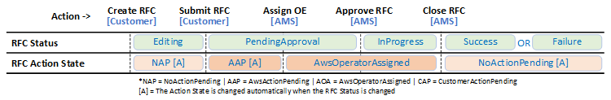

# Understand RFC action and activity states

`RfcActionState` (API) / **Activity State** (console) help
you understand the status of human intervention, or action, on an RFC. Used primarily for
manual RFCs, the `RfcActionState` helps you understand when there is action
needed by either you or AMS operations, and helps you see when AMS Operations is
actively working on your RFC. This provides increased transparency into the actions being taken
on an RFC during its lifecycle.

`RfcActionState` (API) / **Activity State** (console) definitions:

- **AwsOperatorAssigned**: An AWS operator is actively working on your RFC.
- **AwsActionPending**: A response or action from AWS is expected.
- **CustomerActionPending**: A response or action from the customer is expected.
- **NoActionPending**: No action is required from either AWS or the customer.
- **NotApplicable**: This state can't be set by AWS operators or customers, and is used only for
  RFCs that were created prior to this functionality being released.
  RFC action states differ depending on whether the change type submitted requires manual
  review and has scheduling set to **ASAP** or not.

- RFC **ActionState** changes during the review, approval,
  and start of a manual change type with deferred scheduling:
  - After you submit a manual, scheduled, RFC, the
    **ActionState** automatically changes to
    **AwsActionPending** to indicate that an operator needs to review
    and approve the RFC.
  - When an operator begins actively reviewing your RFC, the
    **ActionState** changes to
    **AwsOperatorAssigned**.
  - When the operator approves your RFC, the RFC Status changes to
    Scheduled, and the **ActionState** automatically changes to
    **NoActionPending**.
  - When the scheduled start time of the RFC is reached, the RFC Status
    changes to **InProgress**, and the **ActionState**
    automatically changes to **AwsActionPending** to indicate that an
    operator needs to be assigned for review of the RFC.
  - When an operator begins actively running the RFC, they change the
    **ActionState** to **AwsOperatorAssigned**.
  - Once completed, the Operator closes the RFC. This automatically changes
    the **ActionState** to **NoActionPending**.

###### Important

- Action states can't be set by you. They are either set automatically
  based on changes in the RFC, or set manually by AMS operators.
- If you add correspondence to an RFC, the
  **ActionState** is automatically set to
  **AwsActionPending**.
- When an RFC is created, the **ActionState** is
  automatically set to **NoActionPending**.
- When an RFC is submitted, the **ActionState** is
  automatically set to **AwsActionPending**.
- When an RFC is Rejected, Canceled, or completed with a status of
  Success or Failure, the **ActionState** is
  automatically reset to **NoActionPending**.
- Action states are enabled for both automated and manual RFCs, but
  mostly matter for manual RFCs because those type of RFCs often require
  communications.
