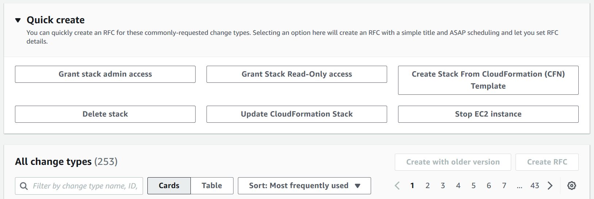
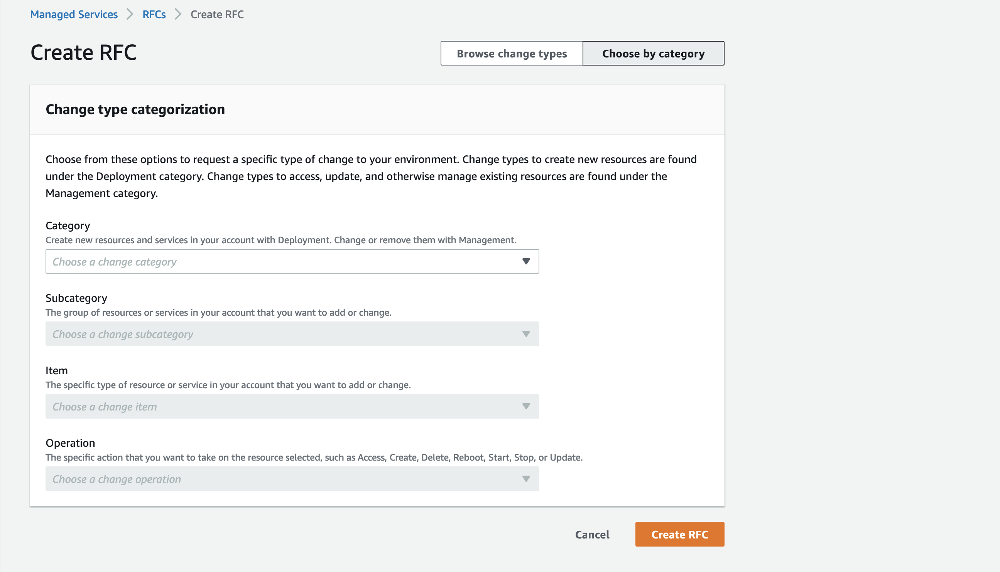

# Create an RFC

The following is the first page of the RFC Create process in the AMS console, with
**Quick cards** open and **Browse change types** active:


The following is the first page of the RFC Create process in the AMS console,
with **Select by category** active:


How it works:

1. Navigate to the **Create RFC** page: In the left navigation pane of the AMS console click **RFCs** to open the RFCs list page, and then click **Create RFC**.
2. Choose a popular change type (CT) in the default **Browse change types** view, or select a CT in the
   **Choose by category** view.
   - **Browse by change type**: You can click on a popular CT in the **Quick create** area to immediately open the
     **Run RFC** page. Note that you cannot choose an older CT version with quick create.

   To sort CTs, use the **All change types** area in either the **Card** or **Table** view.
   In either view, select a CT and then click **Create RFC** to open the **Run RFC** page. If applicable,
   a **Create with older version** option appears next to the **Create RFC** button.
   - **Choose by category**: Select a category, subcategory, item, and operation and the CT details box opens with an option to
     **Create with older version** if applicable. Click **Create RFC** to open the **Run RFC** page.

3. On the **Run RFC** page, open the CT name area to see the CT details box.
   A **Subject** is required (this is filled in for you if you choose your CT in the **Browse change types** view). Open the
   **Additional configuration** area to add information about the RFC.

In the **Execution configuration** area, use available drop-down lists or enter values for the required parameters. To configure
optional execution parameters, open the **Additional configuration** area. 4. When finished, click **Run**. If there are no errors, the **RFC successfully created**
page displays with the submitted RFC details, and the initial **Run output**. 5. Open the **Run parameters** area to see the configurations you submitted. Refresh the page to update the RFC execution status.
Optionally, cancel the RFC or create a copy of it with the options at the top of the page.
How it works:

1. Use either the Inline Create (you issue a `create-rfc` command with all RFC and execution parameters included), or
   Template Create (you create two JSON files, one for the RFC parameters and one for the execution parameters) and issue the `create-rfc`
   command with the two files as input. Both methods are described here.
2. Submit the RFC: `aws amscm submit-rfc --rfc-id `ID`` command with the returned RFC ID.

Monitor the RFC: `aws amscm get-rfc --rfc-id `ID`` command.
To check the change type version, use this command:

```
aws amscm list-change-type-version-summaries --filter Attribute=ChangeTypeId,Value=`CT_ID`
```

###### Note

You can use any `CreateRfc` parameters with any RFC whether or not they are part of the schema for the
change type. For example, to get notifications when the RFC status changes, add this line, `--notification "{\"Email\": {\"EmailRecipients\" : [\"email@example.com\"]}}"` to the
RFC parameters part of the request (not the execution parameters). For a list of all CreateRfc parameters, see the
[AMS Change Management API Reference](../ApiReference-cm/API_CreateRfc.md "../ApiReference-cm/API_CreateRfc.md").

_INLINE CREATE_:

Issue the create RFC command with execution parameters provided inline (escape quotes when providing execution parameters inline), and then submit the returned RFC ID. For example, you can replace the contents with something like this::

```
aws amscm create-rfc --change-type-id "`CT_ID`" --change-type-version "`VERSION`" --title "`TITLE`" --execution-parameters "{\"`Description`\": \"`example`\"}"
```

_TEMPLATE CREATE_:

###### Note

This example of creating an RFC uses the Load Balancer (ELB) stack change type.

1. Find the relevant CT. The following command searches CT classification summaries for those that contain "ELB" in the **Item**
   name and creates output of the Category, Item, Operation, and ChangeTypeID in table form (Subcategory for both is `Advanced stack components`).

```
aws amscm list-change-type-classification-summaries --query "ChangeTypeClassificationSummaries[?contains(Item,'ELB')].[Category,Item,Operation,ChangeTypeId]" --output table
```

```
---------------------------------------------------------------------
|                            CtSummaries                            |
+-----------+---------------------------+---------------------------+
| Deployment| Load balancer (ELB) stack | Create | ct-123h45t6uz7jl |
| Management| Load balancer (ELB) stack | Update | ct-0ltm873rsebx9 |
+-----------+---------------------------+---------------------------+
```

2. Find the most current version of the CT:

`ChangeTypeId` and `ChangeTypeVersion`: The change type ID for this walkthrough is `ct-123h45t6uz7jl` (create ELB),
to find out the latest version, run this command:

```
aws amscm list-change-type-version-summaries --filter Attribute=ChangeTypeId,Value=ct-123h45t6uz7jl
```

3. Learn the options and requirements. The following command outputs the schema to a JSON file named CreateElbParams.json.

```
aws amscm get-change-type-version --change-type-id "ct-123h45t6uz7jl" --query "ChangeTypeVersion.ExecutionInputSchema" --output text > CreateElbParams.json
```

4. Modify and save the execution parameters JSON file. This example names the file
   CreateElbParams.json.

For a provisioning CT, the StackTemplateId is included in the schema and must be
submitted in the execution parameters.

For TimeoutInMinutes, how many minutes are allowed for the creation of the stack
before the RFC is failed, this setting will not delay the RFC execution, but you must
give enough time (for example, don't specify "5"). Valid values are "60" up to "360,"
for CTs with long-running UserData: Create EC2 and Create ASG. We recommend the max
allowed "60" for all other provisioning CTs.

Provide the ID of the VPC where you want the stack to be created; you can get the VPC ID with the CLI command `aws amsskms list-vpc-summaries`.

```
{
"Description":      "`ELB-Create-RFC`",
"VpcId":            "`VPC_ID`",
"StackTemplateId":  "stm-sdhopv00000000000",
"Name":             "`MyElbInstance`",
"TimeoutInMinutes": `60`,
"Parameters":   {
    "ELBSubnetIds":                     `["SUBNET_ID"]`,
    "ELBHealthCheckHealthyThreshold":   `4`,
    "ELBHealthCheckInterval":           `5`,
    "ELBHealthCheckTarget":             `"HTTP:80/"`,
    "ELBHealthCheckTimeout":            `60`,
    "ELBHealthCheckUnhealthyThreshold": `5`,
    "ELBScheme":                        `false`
    }
}
```

5. Output the RFC JSON template to a file in your current folder named CreateElbRfc.json:

```
aws amscm create-rfc --generate-cli-skeleton > CreateElbRfc.json
```

6. Modify and save the CreateElbRfc.json file. Because you created the execution parameters in a
   separate file, remove the `ExecutionParameters` line. For example, you can replace the contents with something like this:

```
{
"ChangeTypeVersion":    "`2.0`",
"ChangeTypeId":         "ct-123h45t6uz7jl",
"Title":                "`Create ELB`"
}
```

7. Create the RFC. The following command specifies the execution parameters file and the RFC template file:

```
aws amscm create-rfc --cli-input-json file://CreateElbRfc.json --execution-parameters file://CreateElbParams.json
```

You receive the ID of the new RFC in the response and can use it to submit and monitor the RFC. Until you submit it, the RFC remains in the editing state and does not start.

###### Note

You can use the AMS API/CLI to create an RFC without creating an RFC JSON file or a CT execution parameters JSON file. To do this, you
use the `create-rfc` command and add the required RFC and execution parameters to the command, this is called "Inline Create".
Note that all provisioning CTs have contained within the `execution-parameters` block a `Parameters` array with the parameters for the resource. The
parameters must have quote marks escaped with a back slash (\).

The other documented method of creating an RFC is called "Template Create." This is where you create a JSON file for the RFC parameters and
another JSON file for the execution parameters, and submit the two files with the `create-rfc` command. These files can serve as
templates and be re-used for future RFCs.

When creating RFCs with templates, you can use a command to create the JSON file with the contents you want by issuing a command as shown.
The commands create a file named "parameters.json" with the shown content; you could also use these commands to create the
RFC JSON file.
