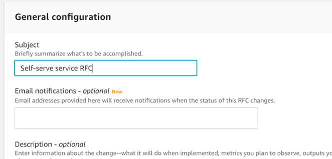

# Configure RFC email notifications (console)

The AMS console **Requests for Change** create page
provides you with an option to add email addresses to receive notifications of RFC
state changes:


Additionally, you can add email addresses for notifications to any change type, for example:

```
aws amscm create-rfc --change-type-id <Change type ID>
                    --change-type-version 1.0 --title "TITLE"
                    --notification "{\"Email\": {\"EmailRecipients\" : [\"email@example.com\"]}}"
```

Add a similar line
(`--notification "{\"Email\": {\"EmailRecipients\" : [\"email@example.com\"]}}"`)
to any change type inline or template request in the RFC parameters part of the
request, not the parameters part.
