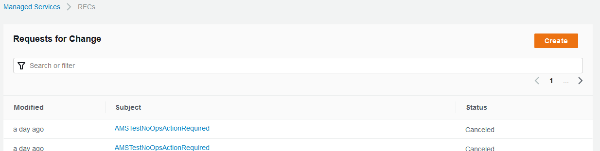
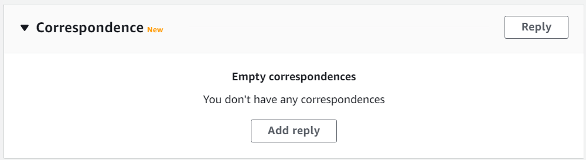
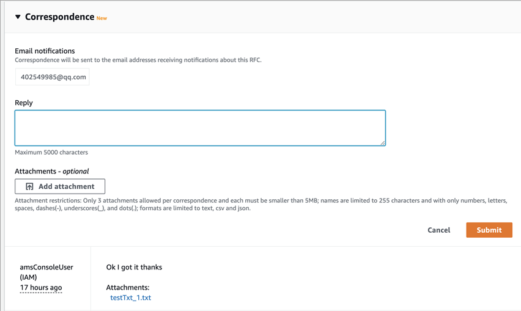
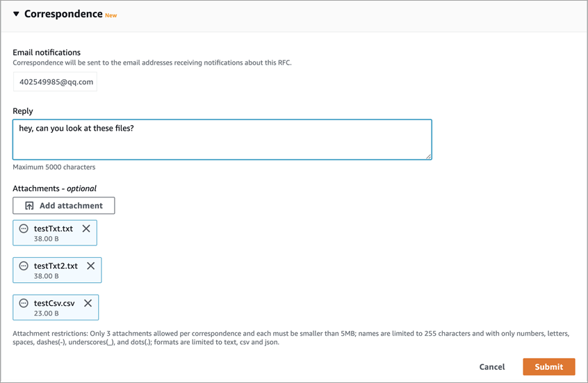
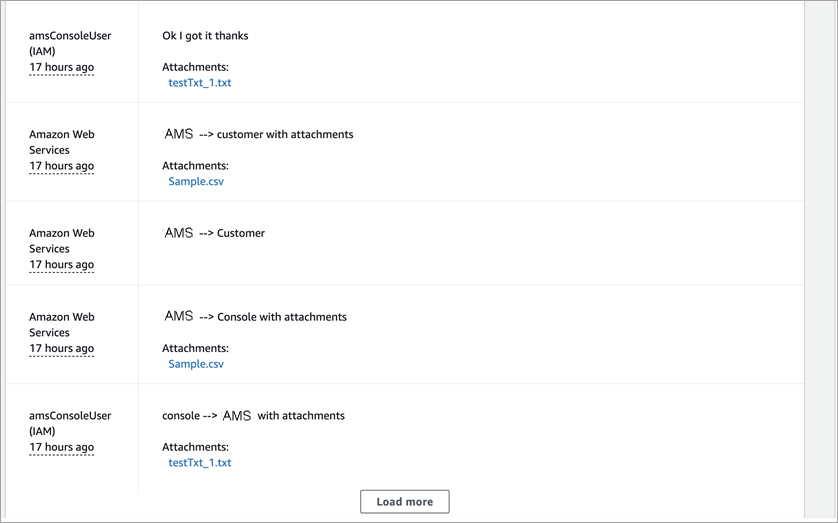

# Use the AMS console with RFCs

The AMS console provides features to help you succeed with creating and submitting RFCs.

## Use the RFC List page (Console)

The AMS console **RFCs** list page provides you with the following options:

- Advanced RFC search through a **Filter**. For
  information, see [Find RFCs](ex-rfc-find-col.md "ex-rfc-find-col.md").
- Finding the last time the RFC was **Modified**. This
  value represents that last time that the RFC status was changed.
- Viewing RFC details with the RFC **Subject**.
  Choosing this link opens the details page for that RFC.
- Viewing RFC status. For information, see
  [Understand RFC status codes](ex-rfc-status-codes.md "ex-rfc-status-codes.md")

## Use RFC quick create (console)

Use the RFC quick create cards, or list table, or choose change types for RFCs by classification.

To learn more, see
[Create an RFC](ex-rfc-create-col.md "ex-rfc-create-col.md").

## Add RFC correspondence and attachments (console)

You can add correspondence to an RFC after it has been submitted and before it
is approved; for example, while it's in the state of "PendingApproval". After an RFC is
approved (in a state of "Scheduled" or "InProgress"), correspondence cannot be added,
because it could be construed as a change to the request. After an RFC is completed
(in a state of "Canceled", "Rejected", "Success", or "Failure"), correspondence is once
again enabled, though correspondence is disabled once an RFC is closed for more than 30 days.

###### Note

Each correspondence is limited to 5,000 characters.

**Limitations for attachments:**

- Only three attachments per correspondence.
- Limit fifty attachments per RFC.
- Each attachment must be less than 5 MB in size.
- Only text files are accepted such as plaintext (`.txt`), comma-separated values (`.csv`), JSON (`.json`), or
  YAML (`.yaml`). In the case of YAML format, the file must be attached using file extension `.yaml`.

###### Note

Text files that have XML content are prohibited. If you have XML content to share with AMS, use a service request.

- File names are limited to 255 characters, with only numbers, letters, spaces, dashes (-), underscores (\_), and dots (.).
- Updating and deleting attachments on an RFC is not currently supported.

To add correspondence and attachments to an RFC, follow these steps:

1. In the AMS console, on the RFC details page for an RFC, find the
   **Correspondence** section at the bottom of the page.

Before any correspondence:

After some correspondence:

 2. To add a new correspondence, type your message in the
**Reply** text box. To attach files related to the
correspondence, choose **Add Attachment**, and then
choose the files you want.

 3. When you're finished, choose **Submit**.

The new correspondence, along with links to the attached files, appear
in the correspondence list on the RFC details page.

