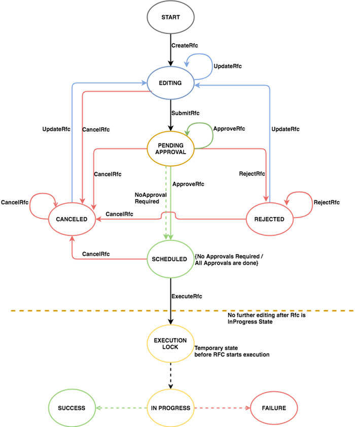

# Understand RFC status codes

RFC status codes help you track your requests. You can observe these status
codes during an RFC run in the CLI output, or by refreshing the RFC list page in the console.

You can also see the codes for an RFC on the details page for that RFC, which
might look like this:

You might see an RFC in your list that you didn't submit. When AMS
operators use an internal-only CT, they submit it in an RFC and it displays in your RFC
list. For more information, see
[Internal-only change types](ct-internals.md "ct-internals.md").

###### Important

You can request notifications of RFC state changes. For details, see
[RFC State Change Notifications](../userguide/rfc-state-change-notices.md "../userguide/rfc-state-change-notices.md").

| RFC status codes                                                                                                                                                                                                                                                                                                                                                                                                                                                                                                                                                                                                                                                                                             | Success                                                                                                                                                                                                                                                                                                                                                                                                                                     | Failure                                                                                                                                                                                                                                                                                                                                                                                                                                                                                                                                                                                                                                                                                                                                                                                                                                                                                                                                                                                                                                                                                                                                                                                                                                                                                                                                                                                                                                                                                                                                                                                                                                                                                                                                                                                                                                                                                                                                                                                                                                                                                                                                                                                                                                                                                                                                                                                                                                                                                                                                                                                                 |
| ------------------------------------------------------------------------------------------------------------------------------------------------------------------------------------------------------------------------------------------------------------------------------------------------------------------------------------------------------------------------------------------------------------------------------------------------------------------------------------------------------------------------------------------------------------------------------------------------------------------------------------------------------------------------------------------------------------ | ------------------------------------------------------------------------------------------------------------------------------------------------------------------------------------------------------------------------------------------------------------------------------------------------------------------------------------------------------------------------------------------------------------------------------------------- | ------------------------------------------------------------------------------------------------------------------------------------------------------------------------------------------------------------------------------------------------------------------------------------------------------------------------------------------------------------------------------------------------------------------------------------------------------------------------------------------------------------------------------------------------------------------------------------------------------------------------------------------------------------------------------------------------------------------------------------------------------------------------------------------------------------------------------------------------------------------------------------------------------------------------------------------------------------------------------------------------------------------------------------------------------------------------------------------------------------------------------------------------------------------------------------------------------------------------------------------------------------------------------------------------------------------------------------------------------------------------------------------------------------------------------------------------------------------------------------------------------------------------------------------------------------------------------------------------------------------------------------------------------------------------------------------------------------------------------------------------------------------------------------------------------------------------------------------------------------------------------------------------------------------------------------------------------------------------------------------------------------------------------------------------------------------------------------------------------------------------------------------------------------------------------------------------------------------------------------------------------------------------------------------------------------------------------------------------------------------------------------------------------------------------------------------------------------------------------------------------------------------------------------------------------------------------------------------------------- |
| Editing: the RFC has been created but not submitted PendingApproval / Submitted: The RFC has been submitted and the system is determining if it requires approval, and obtaining that approval, if required Approved by AWS / Approved by customer: the RFC has been approved. Automated RFCs are approved by AWS, manual RFCs are approved by Operators and, sometimes, customers Scheduled: the RFC has passed syntax and requirement checks and is scheduled for running InProgress: the RFC is being run, note that RFCs that provision multiple resources or have long-running UserData, take longer to run Executed: The RFC has been run Success / Succeeded: The RFC has been successfully completed | Rejected: RFCs are rejected typically because they fail validation; for example, an unusable resource, i.e. a subnet, is specified Canceled: RFCs are canceled typically because they do not pass validation before the configured start time has passed Failure: The RFC has failed; see the StatusReason in the output for failure reasons, and AMS operations automatically creates a trouble ticket and communicates with you as needed | ###### Note Canceled or rejected RFCs can be re-submitted using [UpdateRfc](../ApiReference-cm/API_UpdateRfc.md "../ApiReference-cm/API_UpdateRfc.md"); see also [Update RFCs](ex-update-rfcs.md "ex-update-rfcs.md"). If the RFC passes all the necessary conditions (for example, all required parameters are specified), the status changes to `PendingApproval` (even automated CTs require approval, which happens automatically if syntax and parameter checks pass). If it does not pass, the status changes to `Rejected`. The `StatusReason` provides information about rejections; the `ExecutionOutput` fields provide information about approval and completion. Error codes include:  • InvalidRfcStateException: The RFC is in a status that doesn't allow the operation that was called. For example, if the RFC has moved to the Submitted state, it can no longer be modified.  • InvalidRfcScheduleException: The StartTime, EndTime, or TimeoutInMinutes parameters were breached.  • InternalServerError: A difficulty with the system was encountered.  • InvalidArgumentException: A parameter is incorrectly specified; for example, an unacceptable value is used.  • ResourceNotFoundException: A value, such as the stack ID, cannot be found. If the scheduled requested start and end times (also known as the change run window) occur before the change is approved, the RFC status changes to `Canceled`. If the change is approved, the RFC status changes to `Scheduled`. The change run window for ASAP RFCs is the submitted time plus the `ExpectedExecutionDuration` value for the CT. At any time before the arrival of the change run window, a scheduled change (submitted with a `RequestedStartTime` in the CLI) can be modified or canceled. If the scheduled change is modified, it must then be re-submitted. When the change start time arrives (scheduled or ASAP) and after approvals are complete, the status changes to `InProgress` and no modifications can be made. If the change is completed within the specified change run window, the status changes to `Success`. If any part of the change fails, or if the change is still in progress when the change run window ends, the status changes to `Failure`. ###### Note During the `InProgress`, `Success`, or `Failure` change states, the RFC cannot be modified or canceled. The following diagram illustrates the RFC statuses from the CreateRFC call through to resolution.  |
