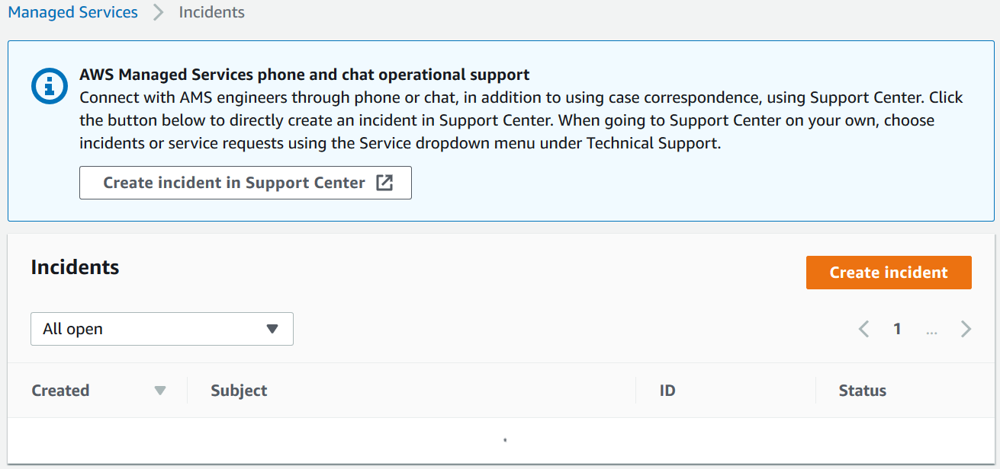
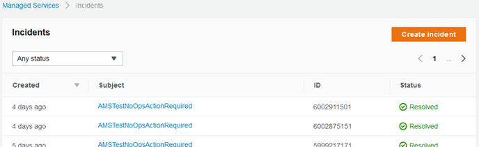
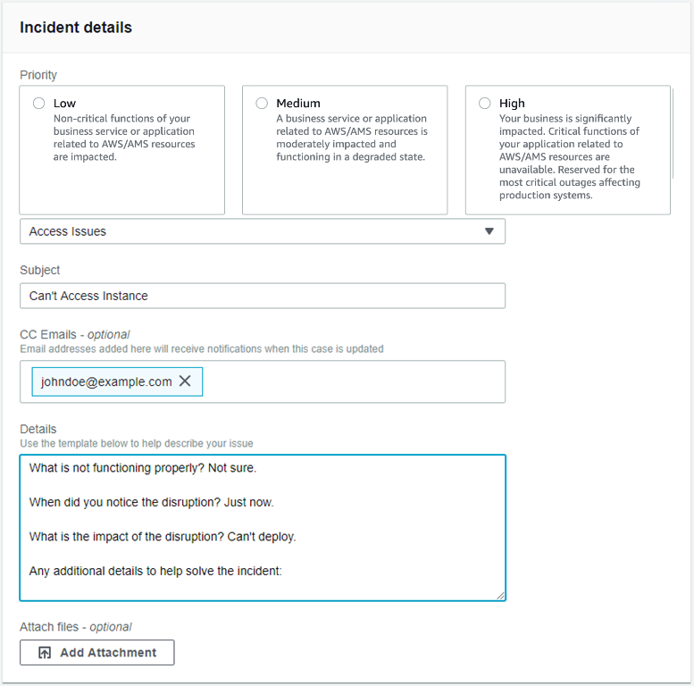
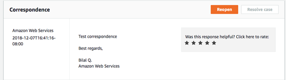

# Reporting an incident

Use the AMS console to report an incident. It's important to create a new incident for each new issue or question.
When opening cases related to old inquiries, it's helpful to include the related case number so we can refer to previous
correspondence.

###### Note

If case correspondence strays from the original issue, an AMS operator might ask you to report a new incident.

To report an incident using the AMS console:

1. From the left navigation, choose **Incidents**

The **Incidents** list opens:

If your incident list is empty, the **Clear filter** option
resets the filter to **Any status**.

If you know you want to use phone or chat, click **Create incident in Support Center** to
open the incident **Create** page in the Support Center Console, auto-populated with the AMS service type.

###### Important

    * Phone calls initiated with Support are recorded, to better improve response. If the call drops, you must
     call back through the Support Center case, AWS has no mechanism for calling you back.
    * Phone and chat support is designed to help with support cases, incidents. and service requests, not RFC or security issues.
    * For RFC issues, use the correspondence option on the relevant RFC details page, to reach an AMS engineer.
    * For security issues, create a high-priority (P1 or P2) support case. The live chat feature is not for security events.

 2. If you want to find an existing incident, select an incident status filter in the drop-down list.

|                                                                                     |                                                                                                                                                                                                                                                                                                                                                                                                                                    |
| ----------------------------------------------------------------------------------- | ---------------------------------------------------------------------------------------------------------------------------------------------------------------------------------------------------------------------------------------------------------------------------------------------------------------------------------------------------------------------------------------------------------------------------------- | --------------------------------------------------------------------------------------------------------------------------------------------------------------------------------------------------------------------------------------------------------------------------------------------------------------------------------------------------------------------------------------------------------------------------------------------------------------------------------------------------------------------------------------------------------------------------------------------------------------------------------------------------------------------------------------------------------------------------------------------------------------------------------------------------------------------------------------------------------------------------------------------------------------------------------------------------------------------------------------------------------------------------------------------------------------------------------------------------------------------------------------------------------------------------------------------------------------------------------------------------------------------------------------------------------------------------------------------------------------------------------------------------------------------------------------------------------------------------------------------------------------------------------------------------------------------------------------------------------------------------------------------------------------------------------------------------------------------------------------------------------------------------------------------------------------------------------------------------------------------------------------------------------------------------------------------------------------------------------------------------------------------------------------------------------------------------------------------------------------------------------------------------------------------------------------------------------------------------------------------------------------------------------------------------------------- |
| Dropdown menu showing ticket status options including Open, Reopened, and Resolved. |  • All incidents that are not yet resolved.  • A new incident that is not yet assigned.  • An incident that has been assigned.  • An incident that you reopened.  • An assigned, complicated incident.  • Incidents that require your feedback before the next step.  • Incidents to which you have recently submitted information.  • An incident that has concluded.  • All incidents in the account. | 3. Choose **Create**. The **Create an incident** page opens:  4. Select a **Priority**:  • **Low**: Non-critical functions of your business service or application related to AWS/AMS resources are impacted.  • **Medium**: A business service or application related to AWS/AMS resources is moderately impacted and functioning in a degraded state.  • **High**: Your business is significantly impacted. Critical functions of your application related to AWS/AMS resources are unavailable. Reserved for the most critical outages affecting production systems. 5. Select a **Category**. ###### Note If you are going to test incident functionality, then add the no-action flag (AMSTestNoOpsActionRequired) to your incident title. 6. Enter information for:  • **Subject**: A descriptive title for the incident report.  • **CC emails**: A list of email addresses for people you want informed about the incident report and resolution.  • **Details**: A comprehensive description of the incident, the systems impacted, and the expected outcome of the resolution. Answer the pre-set questions, or delete them and enter any relevant information. To add an attachment, choose **Add Attachment**, browse to the attachment you want, and click **Open**. To delete the attachment, click the Delete icon:  . 7. Choose **Submit**. A details page opens with information on the incident—such as **Type**, **Subject**, **Created**, **ID**, and **Status**—and a **Correspondence** area that includes the description of the request you created. Click **Reply** to open a correspondence area and provide additional details or updates in status. Click **Close Case** when the incident has been resolved. Click **Load More** if there is more correspondence than will fit on one page. Don't forget to rate the communication!  Your incident displays on the **Incidents** list page. |
