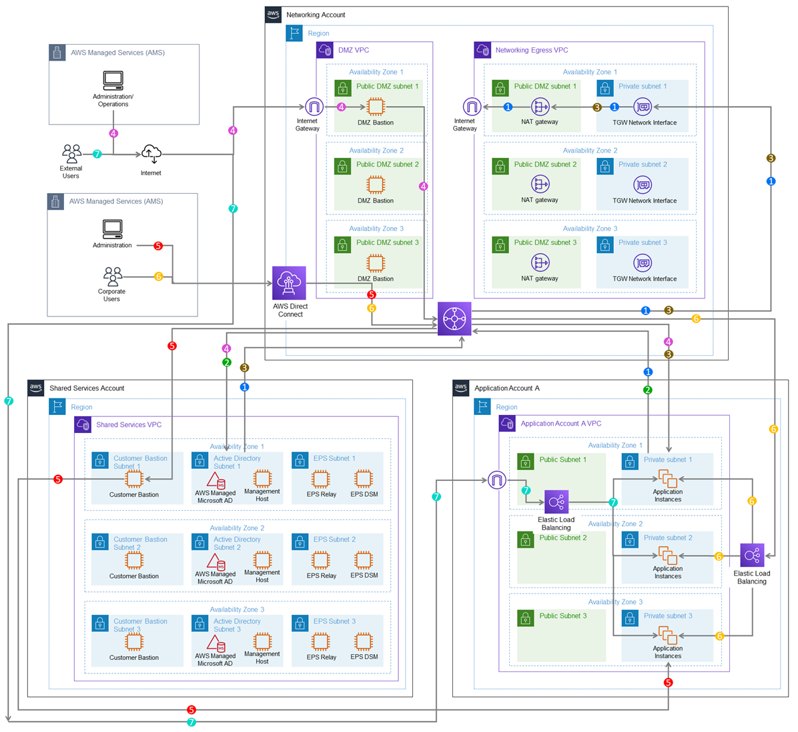
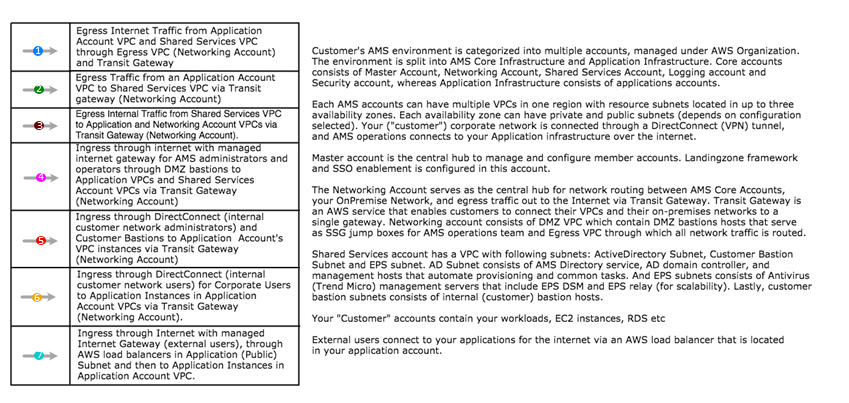

# Networking account architecture

The following diagram depicts the AMS multi-account landing zone environment, showcasing network traffic flows
across account, and is an example of a highly-available setup.

 

AMS configures all aspects of networking for you based on our standard templates
and your selected options provided during onboarding. A standard AWS network design
is applied to your AWS account, and a VPC is created for you and connected to AMS
by either VPN or Direct Connect. For more information about Direct Connect, see
[AWS Direct Connect](https://aws.amazon.com/directconnect/ "https://aws.amazon.com/directconnect/").
Standard VPCs include the DMZ, shared services, and an application subnet. During
the onboarding process, additional VPCs might be requested and created to match your
needs (for example, customer divisions, partners). After onboarding, you are
provided with a network diagram: an environment document that explains how your
network has been set up.

###### Note

For information about default service limits and constraints for all active services, see the
[AWS Service Limits](../../../general/latest/gr/aws_service_limits.md "../../../general/latest/gr/aws_service_limits.md") documentation.

Our network design is built around the Amazon
["Principle of Least Privilege"](https://en.wikipedia.org/wiki/Principle_of_least_privilege "https://en.wikipedia.org/wiki/Principle_of_least_privilege"). In order to accomplish
this, we route all traffic, ingress and egress, through a DMZ, except traffic coming from a trusted network. The
only trusted network is the one configured between your on-premises environment and
the VPC through the use of a VPN and/or an AWS Direct Connect (DX). Access is
granted through the use of bastion instances, thereby preventing direct access to
any production resources. All of your applications and resources reside inside
private subnets that are reachable through public load balancers. Public egress
traffic flows through the NAT Gateways in the egress VPC (in the Networking account)
to the Internet Gateway and then to the Internet. Alternatively, the traffic can
flow over your VPN or Direct Connect to your on-premises environment.
