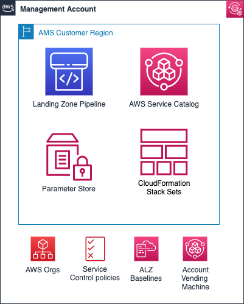

# Management account

The management account is your initial AWS account when you begin onboarding with AMS. It utilizes AWS
Organizations as a management account (also known as the payer account that pays the charges of all the member accounts),
which gives the account the ability to create and financially manage member
accounts. It contains the AWS landing zone (ALZ) framework, account configuration stack sets, AWS Organization
service control policies (SCPs), etc.

For more information on using a management account, see
[Best practices for the management account](../../../organizations/latest/userguide/orgs_best-practices_mgmt-acct.md "../../../organizations/latest/userguide/orgs_best-practices_mgmt-acct.md").

The following diagram provides a high-level overview of the resources contained in the management account.

## Resources in the management account

Other than the above standard services, no additional AWS resources are created in the
management account during onboarding. The following inputs are required during onboarding to AMS:

- _Management account ID_: AWS Account ID that is created initially by you.
- _Core Accounts emails_: Provide the emails to be associated with each of the core accounts: Networking, Shared Services, Logging, and Security account.
- _Service Region_: Provide the AWS region to which all resources of your AMS landing zone will be deployed.
