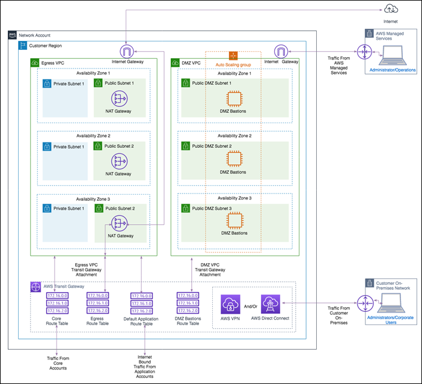

# Networking account

The Networking account serves as the central hub for network routing
between AMS multi-account landing zone accounts, your on-premises network, and egress traffic out to the Internet. In
addition, this account contains public DMZ bastions that are the entry point for AMS
engineers to access hosts in the AMS environment. For details, see the following high-level
diagram of the networking account below.

