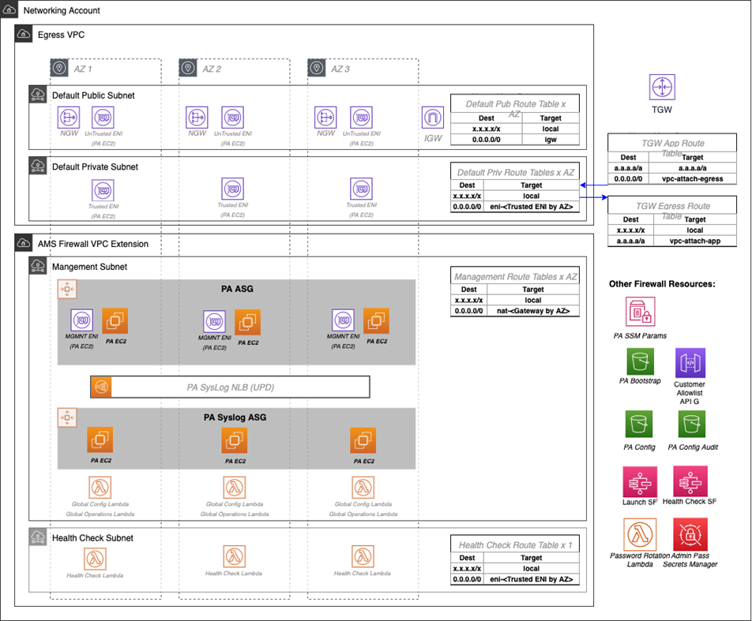
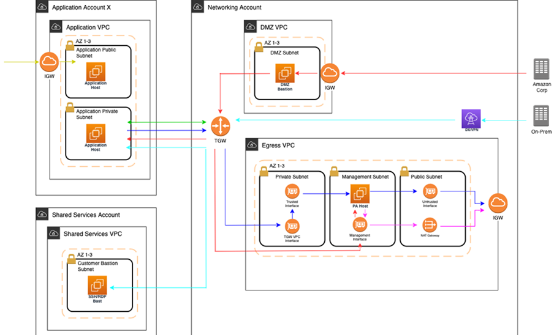
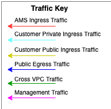

# Managed Palo Alto egress firewall

AMS provides a Managed Palo Alto egress firewall solution, which enables internet-bound
outbound traffic filtering for all networks in the Multi-Account Landing Zone environment (excluding public facing services).
This solution combines industry-leading firewall technology (Palo Alto VM-300) with AMS' infrastructure
management capabilities to deploy, monitor, manage, scale, and restore infrastructure within
compliant operating environments. Third parties, including Palo Alto Networks, do not have access
to the firewalls; they are managed solely by AMS engineers.

## Traffic control

The managed outbound firewall solution manages a domain allow-list
composed of AMS-required domains for services such as backup and patch, as well as your defined domains.
When outbound
internet traffic is routed to the firewall, a session is opened, traffic is evaluated,
and if it matches an allowed domain, the traffic is forwarded to the destination.

## Architecture

The managed egress firewall solution follows a high-availability model, where two to three
firewalls are deployed depending on number of availability zones (AZs). The solution utilizes part of the
IP space from the default egress VPC, but also provisions a VPC extension (/24) for additional
resources required for managing the firewalls.



## Network flow





At a high level, public egress traffic routing remains the same, except for how traffic is routed
to the internet from the egress VPC:

1. Egress traffic destined for the internet is sent to the Transit Gateway (TGW) through
   VPC route table
2. TGW routes traffic to the egress VPC via the TGW route table
3. VPC routes traffic to the internet via the private subnet route tables
   1. In the default Multi-Account Landing Zone environment, internet traffic is sent directly to a
      network address translation (NAT) gateway.
      The managed firewall solution reconfigures the private subnet route tables to point the default
      route (0.0.0.0/0) to a firewall interface instead.

The firewalls themselves contain three interfaces:

1. Trusted interface: Private interface for receiving traffic to be processed.
2. Untrusted interface: Public interface to send traffic to the internet. Because the firewalls perform NAT,
   external servers accept requests from these public IP addresses.
3. Management interface: Private interface for firewall API, updates, console, and so on.

Throughout all the routing, traffic is maintained within the same availability zone (AZ) to
reduce cross-AZ traffic. Traffic only crosses AZs when a failover occurs.

## Allow-list modification

After onboarding, a default allow-list named `ams-allowlist` is created, containing
AMS-required public endpoints as well as public endpoints for patching Windows and Linux hosts.
Once operating, you can create RFC's in the AMS console under the
Management | Managed Firewall | Outbound (Palo Alto) category to create or delete allow-lists, or modify
the domains. Be aware that `ams-allowlist` cannot be modified. The RFC's are handled with
full automation (they are not manual).

## Custom security policy

Security policies determine whether to block or allow a session based on traffic attributes, such as
the source and destination security zone, the source and destination IP address, and the service.
Custom security policies are supported with fully automated RFCs. CTs to create or delete security
policy can be found under Management | Managed Firewall | Outbound (Palo Alto) category, and the
CT to edit an existing security policy can be found under Deployment | Managed Firewall | Outbound
(Palo Alto) category. You'll be able to create new security policies, modify security policies, or
delete security policies.

###### Note

The default security policy `ams-allowlist` cannot be modified

## CloudWatch PA egress dashboards

Two dashboards can be found in CloudWatch to provide an aggregated view of Palo Alto (PA).
the **AMS-MF-PA-Egress-Config-Dashboard** provides a PA config overview, links to
allow-lists, and a list of all security policies including their attributes.
The **AMS-MF-PA-Egress-Dashboard** can be customized to filter traffic logs.
For example, to create a dashboard for a security policy, you can create an RFC with a filter like:

```
fields @timestamp, @message
| filter @logStream like /pa-traffic-logs/
| filter @message like /<Security Policy Name>/
| parse @message "*,*,*,*,*,*,*,*,*,*,*,*,*,*,*,*,*,*,*,*,*,*,*,*,*,*,*,*,*,*,*,*,*,*,*,*,*,*,*,*,*,*,*,*,*,*,*,*,*,*," as x1, @x2, @x3, @x4, @type, @x6, @x7, @source_ip, @destination_ip, @source_nat_ip, @dest_nat_ip, @rule, @x13, @x14, @application, @x16, @from_zone, @to_zone, @x19, @x20, @x21, @x22, @session_id, @x24, @source_port, @destination_port, @source_nat_port, @destination_nat_port, @x29, @protocol, @action, @bytes, @bytes_sent, @bytes_recieved, @packets, @x36, @x37, @category, @x39, @x40, @x41, @source_country, @destination_country, @x44, @packets_sent, @packets_recieved, @session_end_reason, @x48, @x49, @x50
| display @timestamp, @rule, @action, @session_end_reason, @protocol, @source_ip, @destination_ip, @source_port, @destination_port, @session_id, @from_zone, @to_zone, @category, @bytes_sent, @bytes_recieved, @packets_sent, @packets_recieved, @source_country, @destination_country
```

## Failover model

The firewalls solution includes two-three Palo Alto (PA) hosts (one per AZ). Healthy check canaries
run on a constant schedule to evaluate the health of the hosts. If a host is identified as
unhealthy, AMS is notified and the traffic for that AZ is automatically shifted to a healthy
host in a different AZ via route table change. Since the health check workflow is running
constantly, if the host becomes healthy again due to transient issues or manual remediation,
then traffic is shifted back to the correct AZ with the healthy host.

## Scaling

AMS monitors the firewall for throughput and scaling limits. When throughput limits
exceed lower watermark thresholds (CPU/Networking), AMS receives an alert. A low
watermaker threshold indicates that resources are approaching saturation,
reaching a point where AMS will evaluate the metrics over time and reach out to suggest scaling solutions.

## Backup and Restore

Backups are created during initial launch, after any configuration changes, and on a
regular interval. Initial launch backups are created on a per host basis, but
configuration change and regular interval backups are performed across all firewall
hosts when the backup workflow is invoked. AMS engineers can create additional backups
outside of those windows or provide backup details if requested.

AMS engineers can perform restoration of configuration backups if required. If a
restoration is required, it will occur across all hosts to keep configuration between hosts in sync.

Restoration also can occur when a host requires a complete recycle of an instance.
An automatic restoration of the latest backup occurs when a new EC2 instance is provisioned.
In general, hosts are not recycled regularly, and are reserved for severe failures or
required AMI swaps. Host recycles are initiated manually, and you are notified before a recycle occurs.

Other than the firewall configuration backups, your specific allow-list rules are backed
up separately. A backup is automatically created when your defined allow-list rules are modified.
Restoration of the allow-list backup can be performed by an AMS engineer, if required.

## Updates

AMS Managed Firewall Solution requires various updates over time to add improvements
to the system, additional features, or updates to the firewall operating system (OS) or software.

Most changes will not affect the running environment such as updating automation infrastructure,
but other changes such as firewall instance rotation or OS update may cause disruption.
When a potential service disruption due to updates is evaluated, AMS will coordinate with
you to accommodate maintenance windows.

## Operator access

AMS operators use their ActiveDirectory credentials to log into the Palo Alto device
to perform operations (e.g., patching, responding to an event, etc.). The solution retains
standard AMS Operator authentication and configuration change logs to track actions performed
on the Palo Alto Hosts.

## Default logs

By default, the logs generated by the firewall reside in local storage for each firewall.
Overtime, local logs will be deleted based on storage utilization. The AMS solution provides
real-time shipment of logs off of the machines to CloudWatch logs; for more information, see
[CloudWatch Logs integration](#networking-pa-firewall-cw-logs "#networking-pa-firewall-cw-logs").

AMS engineers still have the ability to query and export logs directly off the machines
if required. In addition, logs can be shipped to a customer-owned Panorama; for more information,
see [Panorama integration](#networking-pa-firewall-panorama "#networking-pa-firewall-panorama").

The Logs collected by the solution are the following:

| RFC Status Codes | Log Type                                                                                                                                                                                                                                                                                                                                                                                                                                                                                                                                                                                                                                                                                                                                                                                                                             | Description |
| ---------------- | ------------------------------------------------------------------------------------------------------------------------------------------------------------------------------------------------------------------------------------------------------------------------------------------------------------------------------------------------------------------------------------------------------------------------------------------------------------------------------------------------------------------------------------------------------------------------------------------------------------------------------------------------------------------------------------------------------------------------------------------------------------------------------------------------------------------------------------ | ----------- |
| Traffic          | Displays an entry for the start and end of each session. Each entry includes<br>the date and time, source and destination zones, addresses and ports, application name,<br>security rule name applied to the flow, rule action (allow, deny, or drop), ingress<br>and egress interface, number of bytes, and session end reason.<br>The Type column indicates whether the entry is for the start or end of the session,<br>or whether the session was denied or dropped. A "drop" indicates that the security<br>rule that blocked the traffic specified "any" application, while a "deny" indicates<br>the rule identified a specific application.<br>If traffic is dropped before the application is identified, such as when a<br>rule drops all traffic for a specific service, the application is shown as<br>"not-applicable". |
| Threat           | Displays an entry for each security alarm generated by the firewall.<br>Each entry includes the date and time, a threat name or URL, the source and destination<br>zones, addresses, and ports, the application name, and the alarm action (allow or<br>block) and severity.<br>The Type column indicates the type of threat, such as "virus" or "spyware;"<br>the Name column is the threat description or URL; and the Category column is<br>the threat category (such as "keylogger") or URL category.                                                                                                                                                                                                                                                                                                                            |
| URL Filtering    | Displays logs for URL filters, which control access to websites and whether<br>users can submit credentials to websites.                                                                                                                                                                                                                                                                                                                                                                                                                                                                                                                                                                                                                                                                                                             |
| Configuration    | Displays an entry for each configuration change. Each entry includes the<br>date and time, the administrator user name, the IP address from where the change was<br>made, the type of client (web interface or CLI), the type of command run, whether<br>the command succeeded or failed, the configuration path, and the values before and<br>after the change.                                                                                                                                                                                                                                                                                                                                                                                                                                                                     |
| System           | Displays an entry for each system event. Each entry includes the date<br>and time, the event severity, and an event description.                                                                                                                                                                                                                                                                                                                                                                                                                                                                                                                                                                                                                                                                                                     |
| Alarms           | The alarms log records detailed information on alarms that are generated<br>by the system. The information in this log is also reported in Alarms. Refer<br>to "Define Alarm Settings".                                                                                                                                                                                                                                                                                                                                                                                                                                                                                                                                                                                                                                              |
| Authentication   | Displays information about authentication events that occur when end users<br>try to access network resources for which access is controlled by Authentication<br>policy rules. Users can use this information to help troubleshoot access issues<br>and to adjust user Authentication policy as needed. In conjunction with correlation<br>objects, users can also use Authentication logs to identify suspicious activity on<br>the users network, such as brute force attacks.<br>Optionally, users can configure Authentication rules to Log Authentication Timeouts.<br>These timeouts relate to the period of time when a user needs authenticate for a<br>resource only once but can access it repeatedly. Seeing information about the<br>timeouts helps users decide if and how to adjust them.                             |
| Unified          | Displays the latest Traffic, Threat, URL Filtering, WildFire Submissions,<br>and Data Filtering log entries in a single view. The collective log view enables<br>users to investigate and filter these different types of logs together (instead<br>of searching each log set separately). Or, users can choose which log types to<br>display: click the arrow to the left of the filter field and select traffic, threat,<br>url, data, and/or wildfire to display only the selected log types.                                                                                                                                                                                                                                                                                                                                     |

## Event management

AMS continually monitors the capacity, health status, and availability of the firewall.
Metrics generated from the firewall, as well as AWS/AMS generated metrics, are used to create
alarms that are received by AMS operations engineers, who will investigate and resolve the
issue. The current alarms cover the following cases:

Event Alarms:

- Firewall Dataplane CPU Utilization
  - CPU Utilization - Dataplane CPU (Processing traffic)

- Firewall Dataplane Packet Utilization is above 80%
  - Packet utilization - Dataplane (Processing traffic)

- Firewall Dataplane Session Utilization
- Firewall Dataplane Session Active
- Aggregate Firewall CPU Utilization
  - CPU Utilization across all CPUs

- Failover By AZ
  - Alarms when a fail over occurs in an AZ

- Unhealthy Syslog Host
  - Syslog host fails health check

Management Alarms:

- Health Check Monitor Failure Alarm
  - When health check workflow fails unexpectedly
  - This is for the workflow itself, not if a firewall health check fails

- Password Rotation Failure Alarm
  - When password rotation fails
  - API/Service user password is rotated every 90 days

## Metrics

All metrics are captured and stored in CloudWatch in the Networking account. These can be
viewed by gaining console access to the Networking account and navigating to the CloudWatch
console. Individual metrics can be viewed under the metrics tab or a single-pane dashboard
view of select metrics and aggregated metrics can be viewed by navigating to the Dashboard
tab, and selecting **AMS-MF-PA-Egress-Dashboard**.

Custom Metrics:

- Health Check
  - Namespace: AMS/MF/PA/Egress
    - PARouteTableConnectionsByAZ
    - PAUnhealthyByInstance
    - PAUnhealthyAggregatedByAZ
    - PAHealthCheckLockState

- Firewall Generated
  - Namespace: AMS/MF/PA/Egress/<instance-id>
    - DataPlaneCPUUtilizationPct
    - DataPlanePacketBuffferUtilization
    - panGPGatewayUtilizationPct
    - panSessionActive
    - panSessionUtilization

## CloudWatch Logs integration

CloudWatch Logs integration forwards logs from the firewalls into CloudWatch Logs,
which mitigates the risk of losing logs due to local storage utilization. Logs are
populated in real-time as the firewalls generate them, and can be viewed on-demand
through the console or API.

Complex queries can be built for log analysis or exported to CSV using CloudWatch
Insights. In addition, the custom AMS Managed Firewall CloudWatch dashboard will also
show a quick view of specific traffic log queries and a graph visualization of traffic
and policy hits over time. Utilizing CloudWatch logs also enables native integration
to other AWS services such as a AWS Kinesis.

###### Note

PA logs cannot be directly forwarded to an existing on-prem or 3rd party Syslog collector.
AMS Managed Firewall solution provides real-time shipment of logs off of the PA machines to
AWS CloudWatch Logs. You can use CloudWatch Logs Insight feature to run ad-hoc queries. In addition,
logs can be shipped to your Palo Alto's Panorama management solution. CloudWatch logs can also be forwarded
to other destinations using CloudWatch Subscription Filters. Learn more about Panorama in the following
section. To learn more about Splunk, see
[Integrating with Splunk](../userguide/enable-Splunk-log-push.md "../userguide/enable-Splunk-log-push.md").

## Panorama integration

AMS Managed Firewall can, optionally, be integrated with your existing Panorama.
This allows you to view firewall configurations from Panorama or forward
logs from the firewall to the Panorama. Panorama integration with AMS Managed Firewall
is read only, and configuration changes to the firewalls from Panorama are not allowed.
Panorama is completely managed and configured by you, AMS will only be responsible
for configuring the firewalls to communicate with it.

## Licensing

The price of the AMS Managed Firewall depends on the type of license used, hourly
or bring your own license (BYOL), and the instance size in which the appliance runs. You are
required to order the instances size and the licenses of the Palo Alto firewall you
prefer through AWS Marketplace.

- Marketplace Licenses: Accept the terms and conditions of the VM-Series
  Next-Generation Firewall Bundle 1 from the networking account in MALZ.
- BYOL Licenses: Accept the terms and conditions of the VM-Series Next-Generation
  Firewall (BYOL) from the networking account in MALZ and share the
  "BYOL auth code" obtained after purchasing the license to AMS.

## Limitations

At this time, AMS supports VM-300 series or VM-500 series firewall. Configurations can be found here:
[VM-Series Models on AWS EC2 Instances](https://docs.paloaltonetworks.com/vm-series/10-0/vm-series-performance-capacity/vm-series-performance-capacity/vm-series-on-aws-models-and-instances.html "https://docs.paloaltonetworks.com/vm-series/10-0/vm-series-performance-capacity/vm-series-performance-capacity/vm-series-on-aws-models-and-instances.html"),

###### Note

The AMS solution runs in Active-Active mode as each PA instance in its
AZ handles egress traffic for their respected AZ. So, with two AZs, each PA instance handles
egress traffic up to 5 Gbps and effectively provides overall 10 Gbps throughput across two AZs.
The same is true for all limits in each AZ. Should the AMS health check fail, we shift traffic
from the AZ with the bad PA to another AZ, and during the instance replacement, capacity is
reduced to the remaining AZs limits.

AMS does not currently support other Palo Alto bundles available on AWS Marketplace; for example,
you cannot ask for the "VM-Series Next-Generation Firewall Bundle 2". Note that the AMS Managed Firewall
solution using Palo Alto currently provides only an egress traffic filtering offering, so using advanced
VM-Series bundles would not provide any additional features or benefits.

## Onboarding requirements

- You must review and accept the Terms and Conditions of the VM-Series
  Next-Generation Firewall from Palo Alto in AWS Marketplace.
- You must confirm the instance size you want to use based on
  your expected workload.
- You must provide a /24 CIDR Block that does not conflict with
  networks in your Multi-Account Landing Zone environment or On-Prem. It must be of same class as the Egress VPC
  (the Solution provisions a /24 VPC extension to the Egress VPC).

## Pricing

AMS Managed Firewall base infrastructure costs are divided in three main drivers:
the EC2 instance that hosts the Palo Alto firewall, the software license Palo Alto VM-Series
licenses, and CloudWatch Integrations.

The following pricing is based on the VM-300 series firewall.

- EC2 Instances: The Palo Alto firewall runs in a high-availability model
  of 2-3 EC2 instances, where instance is based on expected workloads. Cost for the
  instance depends on the region and number of AZs
  - Ex. us-east-1, m5.xlarge, 3AZs
    - $0.192 \* 24 \* 30 \* 3 = $414.72

  - https://aws.amazon.com/ec2/pricing/on-demand/

- Palo Alto Licenses: The software license cost of a Palo Alto VM-300
  next-generation firewall depends on the number of AZ as well as instance type.
  - Ex. us-east-1, m5.xlarge, 3AZs
    - $0.87 \* 24 \* 30 \* 3 = $1879.20
    - https://aws.amazon.com/marketplace/pp/B083M7JPKB?ref\_=srh\_res\_product\_title#pdp-pricing

- CloudWatch Logs Integration: CloudWatch logs integration utilizes SysLog
  servers (EC2 - t3.medium), NLB, and CloudWatch Logs. The cost of the servers is based
  on region and number of AZs, and the cost of the NLB/CloudWatch logs varies based
  on traffic utilization.
  - Ex. us-east-1, t3.medium, 3AZ
    - $0.0416 \* 24 \* 30 \* 3 = $89.86

  - https://aws.amazon.com/ec2/pricing/on-demand/
  - https://aws.amazon.com/cloudwatch/pricing/
