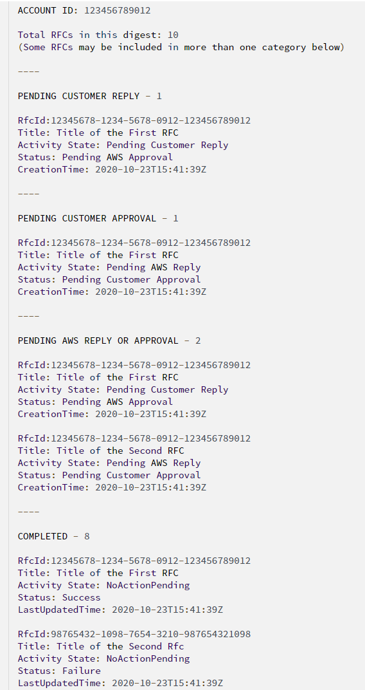

# Sign up for the RFC daily email

You can sign up for a daily email summarizing the RFC
activity in your account over the last 24 hours using the RFC digest feature. The RFC digest feature is a streamlined
process that reduces the number of email notifications you receive
regarding your account's RFCs. The RFC digest might reduce the likelihood that you miss
actions that are pending your response.

To turn on the RFC digest feature, contact your AMS Cloud Service Delivery Manager (CSDM). The CSDM
subscribes you. You can request up to 20 email addresses (or aliases) to include on
your RFC digest email list. The current email schedule is fixed at 09:00 UTC-8.

To turn off the RFC digest feature, contact your CSDM with your request.

If you don't set up RFC digest and want notifications regarding your RFCs,
or if you want more detailed information on your RFCs than what the RFC digest provides, then
use the Change Management System to set up CloudWatch Events notifications or email
notifications for every individual RFC that you want information on. For information on
setting up RFC notifications, see
[RFC State Change Notifications](../userguide/rfc-state-change-notices.md "../userguide/rfc-state-change-notices.md").

The topics contained in the RFC digest include the following:

- Pending Customer Approval: Lists RFCs that are in
  **PendingApproval** status, awaiting your approval
- Pending Customer Reply: Lists RFCs that are awaiting your reply on RFC correspondence
- Pending AWS Approval or Reply: Lists RFCs that are waiting on AMS for reply or approval
- Completed: Lists RFCs in **Success**,
  **Failure**, **Cancelled** and
  **Rejected** status
  The following is an example RFC digest:

