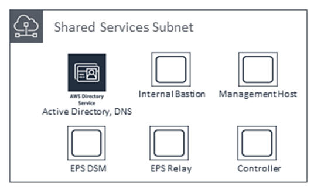

# AMS Single-account landing zone shared services

Shared services subnets contain AMS Directory Services, the Management Host that automates provisioning
and common tasks, antivirus (TrendMicro) management server, and internal bastion hosts:

- AMS Directory Services = AD Domain Controller

Creates an Active Directory in AMS accounts, creates the AMS domain, joins managed stacks to the domain on launch.

- Management hosts = AMS Management Host (automate provisioning and common tasks)

Act as an API endpoint to modify AWS Directory Service, interact with AWS Directory Service domain controllers.

- Security services: Antivirus (TrendMicro) management server = EPS DSM + EPS Relay

Leverages Trend Micro™ Deep Security software (DSM), operates in a client-server model and has a back-end database,
includes Deep Security managers, agents, and relays.

- Internal bastion hosts = Customer bastions

Special purpose servers designed to be the primary access point from the Internet and act as a proxy to your other Amazon EC2 instances.

