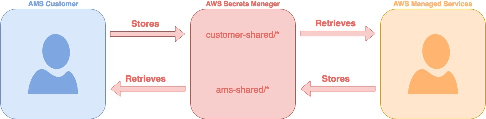

# Use AMS SSP to provision AWS Secrets Manager in your AMS account

Use AMS Self-Service Provisioning (SSP) mode to access AWS Secrets Manager capabilities directly in your AMS managed account. AWS Secrets Manager helps you protect secrets needed to access your applications, services, and IT resources.
The service enables you to easily rotate, manage, and retrieve database credentials, API keys, and other
secrets throughout their lifecycle. Users and applications retrieve secrets with a call to the Secrets Manager
APIs, eliminating the need to hardcode sensitive information in plain text. Secrets Manager offers secret
rotation with built-in integration for Amazon RDS, Amazon Redshift, and Amazon DocumentDB. Also, the service is extensible to other
types of secrets, including API keys and OAuth tokens.
To learn more, see [AWS Secrets Manager](https://aws.amazon.com/secrets-manager/ "https://aws.amazon.com/secrets-manager/").

###### Note

By default, AMS operators can access secrets in AWS Secrets Manager that are encrypted using the
account's default AWS KMS key (CMK). If you want your secrets to be inaccessible to AMS
Operations, use a custom CMK, with an AWS Key Management Service (AWS KMS) key policy that defines permissions appropriate
to the data stored in the secret.

## Secrets Manager in AWS Managed Services FAQ

**Q: How do I request access to AWS Secrets Manager in my AMS account?**

Request access to Secrets Manager by submitting an RFC with the Management |
AWS service | Self-provisioned service | Add (ct-3qe6io8t6jtny) change type.
This RFC provisions the following IAM roles to your account:
`customer_secrets_manager_console_role` and `customer-rotate-secrets-lambda-role`.
The `customer_secrets_manager_console_role` is used as an Admin role to provision and manage
the secrets, and `customer-rotate-secrets-lambda-role` is used as the Lambda execution role
for the Lambda functions that rotate the secrets.
After it's provisioned in your account, you must onboard the
`customer_secrets_manager_console_role` role in your federation solution.

**Q: What are the restrictions to using AWS Secrets Manager in my AMS account?**

Full functionality of AWS Secrets Manager is available in your AMS account, along with automatic
rotation functionality of secrets. However, note that setting up your rotation using
'Create a new Lambda function to perform rotation' is not supported because it requires
elevated permissions to create the AWS CloudFormation stack (IAM Role and Lambda function creation),
which bypasses the Change Management process. AMS Advanced only supports 'Use an
existing Lambda function to perform rotation' where you manage your Lambda functions
to rotate secrets using the AWS Lambda SSPS Admin role. AMS Advanced doesn't create
or manage Lambda to rotate the secrets.

**Q: What are the prerequisites or dependencies to using AWS Secrets Manager in my AMS
account?**

The following namespaces are reserved for use by AMS and are unavailable
as part of direct access to AWS Secrets Manager:

- arn:aws:secretsmanager:\*:\*:secret:ams-shared/\*
- arn:aws:secretsmanager:\*:\*:secret:customer-shared/\*
- arn:aws:secretsmanager:\*:\*:secret:ams/\*

## Sharing keys using Secrets Manager (AMS SSPS)

Sharing secrets with AMS in the plain text of an RFC, service request, or incident report, results in an information disclosure incident and
AMS redacts that information from the case and requests that you regenerate the keys.

You can use
[AWS Secrets Manager](https://aws.amazon.com/secrets-manager/ "https://aws.amazon.com/secrets-manager/") (Secrets Manager) under this namespace, `customer-shared`.



### Sharing Keys using Secrets Manager FAQ

**Q: What type of secrets must be shared using Secrets Manager?**

A few examples are pre-shared keys for VPN creation, confidential keys such as Authentication keys (IAM, SSH), License keys and Passwords.

**Q: How can I share the keys with AMS using Secrets Manager?**

1. Login to the AWS Management console using your federated access and the appropriate role:

for SALZ, the `Customer_ReadOnly_Role`

for MALZ, `AWSManagedServicesChangeManagementRole`. 2. Navigate to the [AWS Secrets Manager console](https://console.aws.amazon.com/secretsmanager/home "https://console.aws.amazon.com/secretsmanager/home") and click
**Store a new secret**. 3. Select **Other type of secrets**. 4. Enter the secret value as a plain-text and use the default KMS encryption. Click **Next**. 5. Enter the secret name and description, the name always starts with **customer-shared/**.
For example **customer-shared/mykey2022**. Click **Next**. 6. Leave automatic rotation disabled, Click **Next**. 7. Review and click **Store** to save the secret. 8. Reply to us with the secret name through the Service request, RFC, or incident report, so we can identify and retrieve the secret.

**Q: What permissions are required for sharing the keys using Secrets Manager?**

**SALZ**: Look for the `customer_secrets_manager_shared_policy` managed IAM policy and verify that
the policy document is the same as the one attached in the creation steps below. Confirm that the policy is attached to the
following IAM Roles: `Customer_ReadOnly_Role`.

**MALZ**: Validate that the `AMSSecretsManagerSharedPolicy`, is attached to the
`AWSManagedServicesChangeManagementRole` role that allows you the `GetSecretValue` action in the `ams-shared`namespace.

Example:

```
{
 "Action": "secretsmanager:*",
 "Resource": [
 "arn:aws:secretsmanager:*:*:secret:ams-shared/*",
 "arn:aws:secretsmanager:*:*:secret:customer-shared/*"
 ],
 "Effect": "Allow",
 "Sid": "AllowAccessToSharedNameSpaces"
 }
```

###### Note

The requisite permissions are granted when you add AWS Secrets Manager as a self-service provisioned service.
