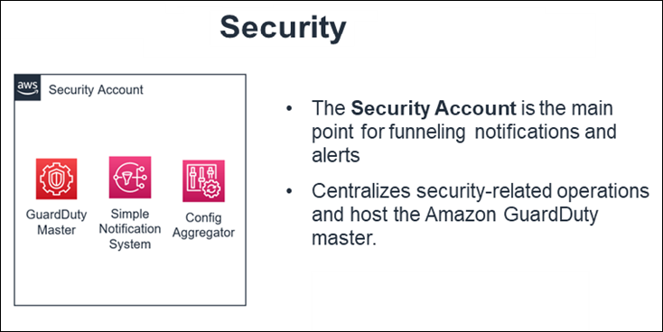

# Security account

The Security account is the central hub for housing security related operations and the
main point for funneling notifications and alerts to the AMS control plane services. In addition, the
Security account houses the Amazon Guard Duty management account and the AWS Config aggregator.

