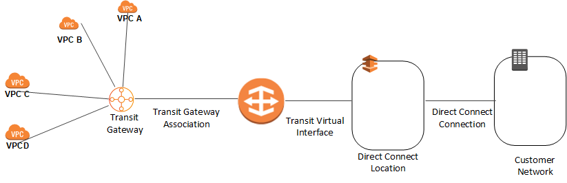

# Connecting Direct Connect to Transit Gateway

You can use your existing Direct Connect connection or create a new Direct Connect connection in one of your existing AWS accounts.
The Direct Connect connection should be a dedicated or hosted connection running at 1 Gbps or more.

###### Note

For information about using Direct Connect with AWS services, see
[Getting Started at an AWS Direct Connect Location](../../../directconnect/latest/UserGuide/getstarted.md "../../../directconnect/latest/UserGuide/getstarted.md").

To use an existing Direct Connect dedicated connection, the connection must not have more than 3 transit virtual interfaces created on it. This is because Direct Connect dedicated connections have a limit of 4 transit virtual interfaces per connection.

For additional information on Direct Connect Limits, see [AWS Direct Connect Limits](../../../directconnect/latest/UserGuide/limits.md "../../../directconnect/latest/UserGuide/limits.md").

After the Direct Connect connection is available, the following occurs:

1. AMS creates a Direct Connect Gateway in the networking account. You must provide an Autonomous System Number (ASN)
   number for the Direct Connect Gateway and the prefixes that have to be advertised from the Direct Connect Gateway.
   This ASN is used as the Amazon ASN.
2. You create a new Transit VIF and set the virtual interface owner as the networking account.
3. AMS logs in to the networking account and accepts the connection proposal.
4. AMS associates the transit gateway with the Direct Connect gateway.
5. AMS associates the attachment with the on-prem Transit Gateway routing table.

###### Note

The ASN provided for the Direct Connect gateway and the Transit Gateway must be different.

To increase the resiliency of your connectivity, it's a best practice to attach at least 2 transit virtual interfaces, from different
AWS Direct Connect locations, to the Direct Connect gateway. For more information, see
[Direct Connect resiliency recommendation](https://aws.amazon.com/directconnect/resiliency-recommendation/ "https://aws.amazon.com/directconnect/resiliency-recommendation/").
