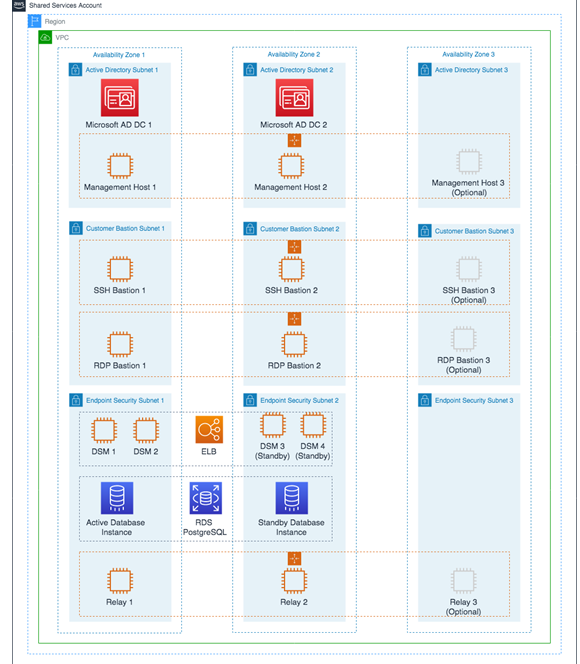

# Shared Services account

The Shared Services account serves as the central hub for most AMS data plane
services. The account contains infrastructure and resources required for access
management (AD), end-point security management (Trend Micro), and it contains the
customer bastions (SSH/RDP). A high-level overview of the resources contained within
Shared Services Account is shown in the following graphic. 

The Shared Services VPC is composed of the AD subnet, the EPS subnet, and the customer bastions subnet
in the three availability zones (AZs). The resources created in the Shared Services VPC are listed below and require your input.

- *Shared Services VPC CIDR range:* When you create a VPC, you must specify a range of IPv4 addresses
  for the VPC in the form of a Classless Inter-Domain Routing (CIDR) block; for example, 10.0.1.0/24. This is the primary CIDR block
  for your VPC.

###### Note

The AMS team recommends the range of /23.

- _Active Directory Details_: Microsoft Active Directory (AD) is utilized
  for user/resource management, authentication/authorization, and DNS, across all of your AMS multi-account landing zone accounts.
  AMS AD is also configured with a one-way trust to your Active Directory for trust-based authentication. The following input is
  required to create the AD:
  - Domain Fully Qualified Domain Name (FQDN): The fully qualified domain name for the
    AWS Managed Microsoft AD directory.
    The domain should not be an existing domain or child domain of an existing domain in your network.
  - Domain NetBIOS Name: If you don't specify a NetBIOS name, AMS defaults the name to the
    first part of your directory DNS.
    For example, corp for the directory DNS corp.example.com.

- _Trend Micro – endpoint protection security (EPS)_: Trend Micro endpoint protection (EPS) is the primary
  component within AMS for operating system security. The system is comprised of Deep Security Manager (DSM), EC2 instances, relay
  EC2 instances, and an agent present within all data plane and customer EC2 instances.

You must assume the `EPSMarketplaceSubscriptionRole` in the Shared Services account, and subscribe to either the
Trend Micro Deep Security (BYOL) AMI, or the Trend Micro Deep Security (Marketplace).

The following default inputs are required to create EPS (if you want to change from the defaults):

    + Relay Instance Type: Default Value - m5.large
    + DSM Instance Type: Default Value - m5.xlarge
    + DB Instance Size: Default Value - 200 GB
    + RDS Instance Type: Default Value - db.m5.large

- _Customer bastions_: You are provided with SSH or RDP
  bastions (or both) in the Shared Services Account, to access other hosts in your AMS
  environment. In order to access the AMS network as a user (SSH/RDP), you must
  use "customer" Bastions as the entry point. The network path originates from the on-premise
  network, goes through DX/VPN to the transit gateway (TGW), and then is routed to the Shared Services VPC.
  Once you are able to access the bastion, you can jump to other hosts in the
  AMS environment, provided that the access request has been granted.
  - The following inputs are required for SSH bastions.
    - SSH Bastion Desired Instance Capacity: Default Value - 2.
    - SSH Bastion Maximum Instances: Default Value - 4.
    - SSH Bastion Minimum Instances: Default Value -2.
    - SSH Bastion Instance Type: Default Value - m5.large (can be changed to save
      costs; for example a t3.medium).
    - SSH Bastion Ingress CIDRs: IP address ranges from which users in your network
      access SSH Bastions.

  - The following inputs are required for Windows RDP bastions.
    - RDP Bastion Instance Type: Default Value - t3.medium.
    - RDP Bastion Desired Minimum Sessions: Default Value - 2.
    - RDP Maximum Sessions: Default Value -10.
    - RDP Bastion Configuration Type: You can choose one of the below configuration
      - SecureStandard = A user receives one bastion and only one user can connect to
        the bastion.
      - SecureHA = A user receives two bastions in two different AZ's to connect to and only one user can connect to the
        bastion.
      - SharedStandard = A user receives one bastion to connect to and two users can connect to the same bastion at once.
      - SharedHA = A user receives two bastions in two different AZ's to connect to and two users can connect to the same bastion at once.

    - Customer RDP Ingress CIDRs: IP address ranges from which users in your network will access RDP Bastions.
