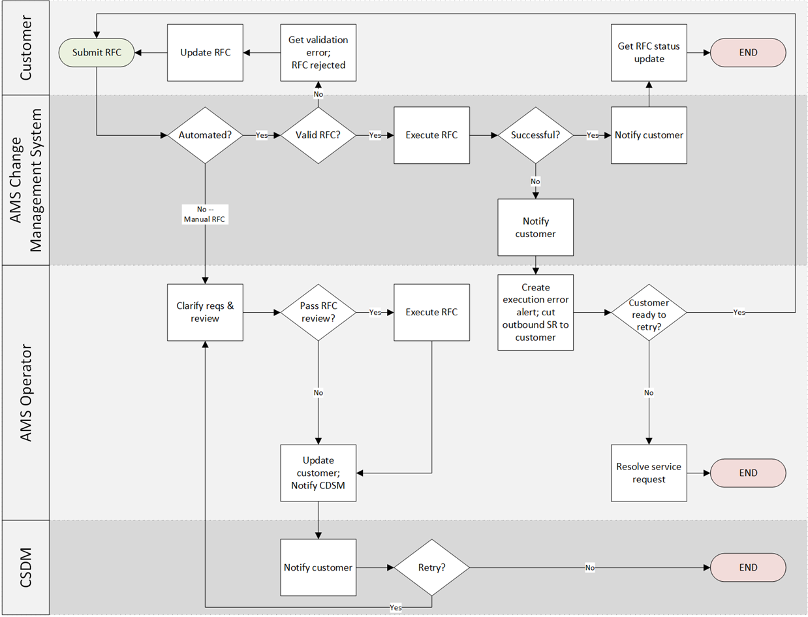

# What are RFCs?

A request for change, or RFC, is how you make a change in your AMS-managed environment, or ask AMS to make a change on your behalf. To create an RFC,
you choose from AMS change types, choose RFC parameters (such as schedule), and then submit the request using either the AMS console or the API commands [CreateRfc](../ApiReference-cm/API_CreateRfc.md "../ApiReference-cm/API_CreateRfc.md") and
[SubmitRfc](../ApiReference-cm/API_SubmitRfc.md "../ApiReference-cm/API_SubmitRfc.md").

An RFC contain two specifications, one for the RFC itself, and one for the change
type (CT) parameters. At the command line, you can use an Inline RFC command, or a
standard CreateRfc template in JSON format, that you fill out and submit along with the CT
JSON schema file that you create (based on the CT parameters). The CT name is an informal
description of the CT. A CSIO (category, subcategory, item, operation) is a more formal
description of a CT. Only the CT ID must be specified when creating an RFC.

RFCs go through two key stages: Validation and Execution.

1. In the Validation Stage, AMS reviews the RFC Request for completeness and
   correctness. AMS also evaluates the request for security in accordance with our
   [security technical standards](rfc-security.md#rfc-security.title "rfc-security.md#rfc-security.title"). AMS validates that the requested change is valid and
   executable.
2. In the Execution Stage, AMS attempts the requested changes on your account.
   AMS handles both stages through an automated process, manual process, or a combination of both. The manual process is handled by the AMS Operations team. For more information, see [Automated and manual CTs](ug-automated-or-manual.md "ug-automated-or-manual.md").

AMS provides three execution modes for handling requests:

- **(AMS Recommended) Execution mode: Automated**.
  These CTs use automation for RFC validations and executions, which is the quickest
  way to achieve your business outcomes.
- **(AMS Suggested) Execution mode: Manual and Designation:
  Managed Automation**. These CTs utilize a combination of automated and
  manual processes for RFC validations and executions. If automation cannot execute
  your requested change, then the RFC is transferred (by either automated routing or
  by the creation of a replacement RFC) to the AMS Operations team for manual
  handling. Submission of these CTs allow for a more structured intake of your
  request, supplemented by AMS automation to improve the handling and execution
  outcome time frame.
- **Execution mode: Manual and Designation: Review
  Required**. Changes requested through [ct-1e1xtak34nx76 Management | Other | Other | Update (review required)](../ctref/management-other-other-update-review-required.md "../ctref/management-other-other-update-review-required.md")
  or [ct-0xdawir96cy7k Management | Other | Other | Create (review required)](../ctref/management-other-other-create-review-required.md "../ctref/management-other-other-create-review-required.md").
  These CTs rely on manual handling for validations and executions. These CTs are
  dependent on manual interpretation of the change request.
  AMS notifies you when the change has completed successfully (Success) or unsuccessfully (Failure).

###### Note

For information about troubleshooting RFC failures, see
[Troubleshooting RFC errors in AMS](rfc-troubleshoot.md "rfc-troubleshoot.md").

The following graphic depicts the workflow of an RFC submitted by you.

