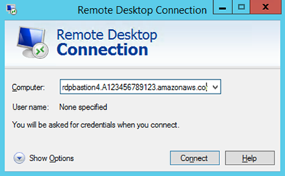
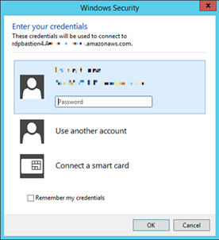
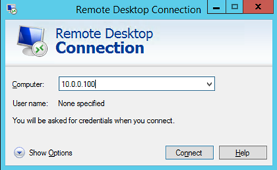

End of support notice: On June 30, 2027, AWS
will end support for AMS Advanced. After June 30, 2027, you will
no longer be able to access the AMS Advanced console or AMS Advanced resources.
For more information, see [AMS Advanced end of support](../userguide/SunsetPlan.md "../userguide/SunsetPlan.md").

# Windows computer to Windows instance

Use Windows Remote Desktop Connection client to connect to a Windows instance from your Windows computer.

MALZ
For more information about the friendly bastion names, see [DNS friendly bastion names](og-validate-service.md#dns-bastions "og-validate-service.md#dns-bastions").

1. Open the Remote Desktop Connection program, a standard Windows
   program, and enter the friendly DNS name of the Windows bastion in the hostname
   field.

 2. Choose **Connect**. The Remote Desktop Connection attempts an RDP
connection to the bastion.

If successful, a credentials dialog box opens. To gain access, use your corporate
Active Directory credentials, as you would with the Windows instance.

 3. Open the Remote Desktop Connection program on the bastion and enter the IP address of
the Windows instance you would like to connect to (for example, 10.0.0.100), and then
choose **Connect**. Your corporate Active Directory credentials are
again required before you connect to the Windows instance.

SALZ
For more information about the friendly bastion names, see [DNS friendly bastion names](og-validate-service.md#dns-bastions "og-validate-service.md#dns-bastions").

1. Open the Remote Desktop Connection program, a standard Windows program,
   and enter the friendly DNS name of the Windows bastion in the hostname field; for
   example,
   `rdpbastion`(1-4)`.A`AMSAccountNumber`.amazonaws.com`,
   which would look like this if your account number is 123456789123 and you choose bastion
   4, `rdpbastion4.A123456789123.amazonaws.com`.

 2. Choose **Connect**. The Remote Desktop Connection attempts an RDP
connection to the bastion.

If successful, a credentials dialog box opens. To gain access, use your corporate
Active Directory credentials, as you would with the Windows instance.

 3. Open the Remote Desktop Connection program on the bastion and enter the IP address of
the Windows instance you would like to connect to (for example, 10.0.0.100), and then
choose **Connect**. Your corporate Active Directory credentials are
again required before you connect to the Windows instance.

