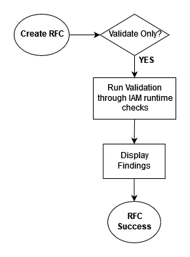
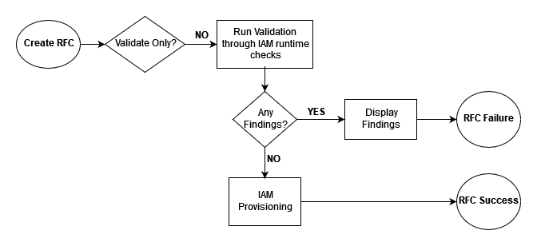

# How Automated IAM Provisioning in AMS works

Automated IAM Provisioning relies on automated run-time checks for IAM to validate changes to IAM resources. These automated checks, performed when the Create, Update, or Delete change types are run,
prevent IAM resources that are overly-permissive or have insecure patterns from being deployed into your account.
This allows you to match the level of rigor in IAM reviews to the expertise of your team. We recommend that teams that are new to cloud services
and need manual checks for all IAM resources changes use the existing review-required change type: Deployment | Advanced stack components |

Identity and Access Management (IAM) | [Create entity or policy (managed automation)](../ctref/deployment-advanced-identity-and-access-management-iam-create-entity-or-policy-review-required.md "../ctref/deployment-advanced-identity-and-access-management-iam-create-entity-or-policy-review-required.md"), (ct-3dpd8mdd9jn1r).
Teams with AWS expertise and control of their environments can use Automated IAM Provisioning to speed up their deployments. You can use this feature to perform validation through automated run-time checks or to perform validation and provisioning of IAM resources after successful validation.

###### Important

AWS Managed Services has proactively implemented a list of validation [runtime checks](aip-runtime-checks.md "aip-runtime-checks.md") that prevent the creation of IAM resources or policies with certain permissions and conditions. For a description of these privileges and conditions, see [Deploying IAM resources in AMS Advanced](deploy-iam-resources.md "deploy-iam-resources.md"). The automated change types [ct-1n9gfnog5x7fl](../ctref/deployment-advanced-identity-and-access-management-iam-create-entity-or-policy-read-write-permissions.md "../ctref/deployment-advanced-identity-and-access-management-iam-create-entity-or-policy-read-write-permissions.md"), [ct-1e0xmuy1diafq](../ctref/management-advanced-identity-and-access-management-iam-update-entity-or-policy-read-write-permissions.md "../ctref/management-advanced-identity-and-access-management-iam-update-entity-or-policy-read-write-permissions.md"), and [ct-17cj84y7632o6](../ctref/management-advanced-identity-and-access-management-iam-delete-entity-or-policy-read-write-permissions.md "../ctref/management-advanced-identity-and-access-management-iam-delete-entity-or-policy-read-write-permissions.md"), allow users who are proficient in managing IAM resouces to provision IAM roles and policies that allow actions beyond Read Only privileges.

In addition, you can use the roles created through the automated change types [ct-1n9gfnog5x7fl](../ctref/deployment-advanced-identity-and-access-management-iam-create-entity-or-policy-read-write-permissions.md "../ctref/deployment-advanced-identity-and-access-management-iam-create-entity-or-policy-read-write-permissions.md"), [ct-1e0xmuy1diafq](../ctref/management-advanced-identity-and-access-management-iam-update-entity-or-policy-read-write-permissions.md "../ctref/management-advanced-identity-and-access-management-iam-update-entity-or-policy-read-write-permissions.md"), and [ct-17cj84y7632o6](../ctref/management-advanced-identity-and-access-management-iam-delete-entity-or-policy-read-write-permissions.md "../ctref/management-advanced-identity-and-access-management-iam-delete-entity-or-policy-read-write-permissions.md") to create the new resources. However, the resources can't follow the AMS naming standard and aren't part of the standard AMS stack. AMS provides the operational and security support of those specific resources on a best effort basis.

While both manual and automated processes aim to uphold our security standards, it's important to note that there are differences in the checks between the two. The automated provisioning allows for greater flexibility in creating and updating roles and policies; therefore, they are not the same. It's recommended that your organization carefully review the validation [runtime checks](aip-runtime-checks.md "aip-runtime-checks.md") listed in the AMS User Guide to ensure that they align with your organization's expectations and requirements.

**Validation flow**

**Validation and provisioning flow**

###### Note

This feature is suitable for teams that are experienced with AWS and IAM resources, and we do not recommend it for teams that are new to AWS.
The automated validation process is designed to catch most errors and is helpful for teams to get quick reviews for changes to IAM, when they understand
the permissions that they need. To use the new change types safely and effectively, we recommend you to have a good understanding of AWS IAM, and the
[run-time checks](aip-runtime-checks.md "aip-runtime-checks.md") offered by the change types to determine whether they are suitable for your team.
