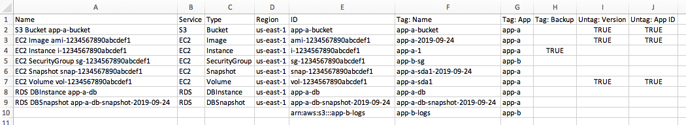

# Tag bulk update notes

These notes are for use with the
[Tag | Bulk Update](../ctref/management-advanced-tag-bulk-update.md "../ctref/management-advanced-tag-bulk-update.md") and
[Tag | Bulk Update (Managed automation)](../ctref/management-advanced-tag-bulk-update-review-required.md "../ctref/management-advanced-tag-bulk-update-review-required.md")
change type example walkthroughs.

Notes on bulk update tags:

- Supported services:
  - For [Tag | Bulk Update (Managed automation)](../ctref/management-advanced-tag-bulk-update-review-required.md "../ctref/management-advanced-tag-bulk-update-review-required.md"): All.
  - For [Tag | Bulk Update](../ctref/management-advanced-tag-bulk-update.md "../ctref/management-advanced-tag-bulk-update.md"):
    - Amazon EC2 Auto Scaling
    - Amazon EC2
    - ELB
    - Amazon RDS
    - Amazon S3 buckets

- To generate the comma-separated values (CSV) file, log in to **Resource Groups** > **Tag Editor** in the AWS console,
  find the resources you want to tag, and then export them to a CSV file. For more information, see
  [Export Results to CSV](../../../ARG/latest/userguide/find-resources-to-tag.md#tagging-resources-csv "../../../ARG/latest/userguide/find-resources-to-tag.md#tagging-resources-csv").

NOTE: We recommend using an S3 pre-signed URL for providing the CSV object location.

- There must be columns with the headers **Service**, **Type**, and **Identifier**.
  These columns are mandatory.
- Rename the column **Identifier** to **ID**.
- The values for columns **Service**, **Type**, and **Identifier** (changed to
  **ID**) are as provided by the **Tag Editor** under **Resource Groups**.
- If a resource to be tagged is not available under the **Tag Editor**, use the Amazon Resource Name (ARN) of the resource for the
  column **Identifier** (changed to **ID**) and keep **Service** and **Type** blank.
- The column headers of the tags to be added or modified must have the format **Tag: `TagKey`**.
- The column headers of the tags to be deleted must have the format **Untag: `TagKey`**.
- Each row is for a resource to be tagged or untagged.
- If a tag is to be added to a resource, specify the value of the tag under the appropriate **Tag: `TagKey`** column.
- If a tag is to be deleted from a resource, specify **True** under the appropriate **Untag: `TagKey`** column.
- If a **Tag: `TagKey`** or **Untag: `TagKey`** is not
  applicable for a resource, add a dash (-) to the respective column or keep it blank.

NOTE: The Untag overrides the Tag - this is because, unlike Tag, Untag needs to be manually added to the CSV file, so we assume the intention was to
remove, not modify, the tag.

- Any additional columns that don't fit the criteria are ignored.

###### Important

The Tag Editor export populates a matrix of all tags against all resources, missing tags are populated with a value of 'not tagged'.
Re-using this export CSV as input to the RFC results in all the previously missing tags being created, with literal values of 'not tagged'.

###### Note

For information about exporting tags to a CSV file, see
[Find Resources to Tag -> Export Results to CSV](../../../ARG/latest/userguide/find-resources-to-tag.md#tagging-resources-csv "../../../ARG/latest/userguide/find-resources-to-tag.md#tagging-resources-csv").
