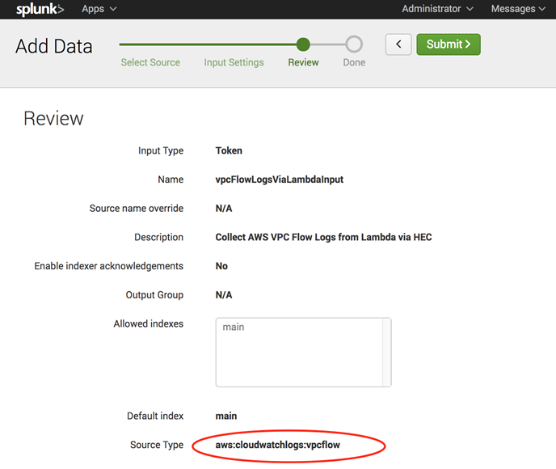

# Integrating with Splunk

AMS supports AWS Lambda-based push to customer log analytics services, such as Splunk.

AMS leverages the Splunk Add-on for Amazon Web services, which allows AWS data to be streamed to Splunk. See
[Hardware and software requirements](http://docs.splunk.com/Documentation/AddOns/released/AWS/Hardwareandsoftwarerequirements "http://docs.splunk.com/Documentation/AddOns/released/AWS/Hardwareandsoftwarerequirements").

Refer to this Splunk blog post [How to stream AWS CloudWatch Logs to Splunk (Hint: it’s easier than you think)](https://www.splunk.com/blog/2017/02/03/how-to-easily-stream-aws-cloudwatch-logs-to-splunk.html "https://www.splunk.com/blog/2017/02/03/how-to-easily-stream-aws-cloudwatch-logs-to-splunk.html"). Because CloudWatch log streaming is enabled by
default for AMS customers, and AMS configures the AWS Lambda function for you, though you need to configure the Splunk HTTP Event
Collector (HEC) input and submit a request to AMS for the added functionality.

Here’s how the data input settings might look:

