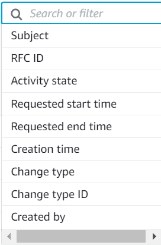

# Find RFCs

To find an RFC by using the AMS console, follow these steps.

###### Note

This procedure applies only to scheduled RFCs, that is, RFCs that did not use the
**ASAP** option.

1. From the left navigation, click **RFCs**.

The RFCs dashboard opens. 2. Scroll through the list or use the **Filter** option to refine the list.

The RFC list changes per filter criteria. 3. Choose the Subject link for the RFC you want.

The RFC details page opens for that RFC with information including RFC ID. 4. If there are many RFCs in the dashboard, you can use the **Filter** option to
search by RFC:

    * **Subject**: The subject line, or title (in the API/CLI) given
     to the RFC when it was created.
    * **RFC ID**: The identifier for the RFC.
    * **Activity state**: If you know the RFC state, you can choose between
     **AwsOperatorAssigned** meaning an operator is currently looking at the RFC,
     **AwsActionPending** meaning that an AMS operator must perform something
     before the RFC execution can proceed or
     **CustomerActionPending** meaning that you need to take some action before
     the RFC execution can proceed.
    * **Status**: If you know the RFC status, you can choose between:


    	+ **Scheduled**: RFCs that were scheduled.
    	+ **Canceled**: RFCs that were canceled.
    	+ **In progress**: RFCs in progress.
    	+ **Success**: RFCs that executed successfully.
    	+ **Rejected**: RFCs that were rejected.
    	+ **Editing**: RFCs that are being edited.
    	+ **Failure**: RFCs that failed.
    	+ **Pending approval**: RFCs that cannot proceed until
    	 either AMS or you approve. Typically, this indicates that you need to approve the
    	 RFC. You will have gotten a service notification of this in your Service Requests list.
    * **Change type**: Pick the **Category**,
     **Subcategory**, **Item**,
     and **Operation**, and the change type ID is retrieved for you.
    * **Requested start time** or **Requested end time**: This
     filter option lets you choose **Before** or
     **After**, and then enter a
     **Date** and, optionally, a
     **Time** (hh:mm and time zone). This filter
     operates successfully only on scheduled RFCs (not ASAP RFCs).
    * **Status**: Either **Scheduled**, **Canceled**, **In progress**, **Success**,
     **Rejected**, **Editing**, or **Failure**.
    * **Subject**: The subject (or title, if the RFC was created with the API/CLI) that you gave the RFC.
    * **Change type ID**: Use the identifier for the change type submitted with the RFC.

The search allows you to add the filters, as shown in the following screenshot.

 5. Click on the Subject link for the RFC you want.

The RFC details page opens for that RFC with information including RFC ID.
You can use multiple filters to find an RFC.

To check the change type version, use this command:

```
aws amscm list-change-type-version-summaries --filter Attribute=ChangeTypeId,Value=`CT_ID`
```

###### Note

You can use any `CreateRfc` parameters with any RFC whether or not they are part of the schema for the
change type. For example, to get notifications when the RFC status changes, add this line, `--notification "{\"Email\": {\"EmailRecipients\" : [\"email@example.com\"]}}"` to the
RFC parameters part of the request (not the execution parameters). For a list of all CreateRfc parameters, see the
[AMS Change Management API Reference](../ApiReference-cm/API_CreateRfc.md "../ApiReference-cm/API_CreateRfc.md").

If you don’t write down the RFC ID, and need to find it later, you can use the AMS change management (CM) system to search for it and narrow the results with a
filter or query.

1. The CM API [ListRfcSummaries](../ApiReference-cm/API_ListRfcSummaries.md "../ApiReference-cm/API_ListRfcSummaries.md") operation has filters. You can [Filter](../ApiReference-cm/API_Filter.md "../ApiReference-cm/API_Filter.md")
   results based on an `Attribute` and `Value` combined in a logical AND
   operation, or based on an `Attribute`, a `Condition`, and `Values`.

| RFC filtering      | Attribute                                                                             | Valid values           | Valid conditions | Default condition                                                                                                                                                                                                                    | Notes                                                                                                                                                                                                                                                                                                                                                                                                                                                                                                                                                                                                                                                                                                                                                                                                                                                                                                                                                                                                                                                                                                                                                                                                                                                                                                                                                                                                                                                                                                                                                                                                                                                                                                                                                                                                                                                                                                                                                                                                                                                                                                                                                                                                                                                                                                                                                                                             |
| ------------------ | ------------------------------------------------------------------------------------- | ---------------------- | ---------------- | ------------------------------------------------------------------------------------------------------------------------------------------------------------------------------------------------------------------------------------ | ------------------------------------------------------------------------------------------------------------------------------------------------------------------------------------------------------------------------------------------------------------------------------------------------------------------------------------------------------------------------------------------------------------------------------------------------------------------------------------------------------------------------------------------------------------------------------------------------------------------------------------------------------------------------------------------------------------------------------------------------------------------------------------------------------------------------------------------------------------------------------------------------------------------------------------------------------------------------------------------------------------------------------------------------------------------------------------------------------------------------------------------------------------------------------------------------------------------------------------------------------------------------------------------------------------------------------------------------------------------------------------------------------------------------------------------------------------------------------------------------------------------------------------------------------------------------------------------------------------------------------------------------------------------------------------------------------------------------------------------------------------------------------------------------------------------------------------------------------------------------------------------------------------------------------------------------------------------------------------------------------------------------------------------------------------------------------------------------------------------------------------------------------------------------------------------------------------------------------------------------------------------------------------------------------------------------------------------------------------------------------------------------- |
| ActualEndTime      | Any string representing an ISO8601 datetime (for example, “20170101T000000Z”)         | Before, After, Between | None             | The Before or After condition only accepts one value in the Values field. The Between condition must have exactly two values in the Values field, where the first value should represent a date that happens before the second value |
| ActualStartTime    | Any string representing an ISO8601 datetime (for example, “20170101T000000Z”)         | Before, After, Between | None             | The Before or After condition only accepts one value in the Values field. The Between condition must have exactly two values in the Values field, where the first value should represent a date that happens before the second value |
| AutomationStatusId | Manual, Automated                                                                     | Equals                 | Equals           | There are only two automation statuses                                                                                                                                                                                               |
| ChangeTypeId       | Any valid change type ID; for example, ct-123h45t6uz7jl                               | Equals                 | Equals           | [Finding a Change Type or CSIO](ug-find-ct-ex-section.md "ug-find-ct-ex-section.md")                                                                                                                                                 |
| ChangeTypeVersion  | Any valid change type ID; for example, 1.0                                            | Equals                 | Equals           | [Finding a Change Type or CSIO](ug-find-ct-ex-section.md "ug-find-ct-ex-section.md")                                                                                                                                                 |
| CreatedBy          | Any string (maximum allowed length is 2048 characters)                                | Contains               | Contains         | The CreatedBy field of the RFC contains the ARN of the user who created it                                                                                                                                                           |
| CreatedTime        | Any string representing an ISO8601 datetime (for example, “20170101T000000Z”)         | Before, After, Between | None             | The Before or After condition only accepts one value in the Values field. The Between condition must have exactly two values in the Values field, where the first value should represent a date that happens before the second value |
| LastModifiedTime   | Any string representing an ISO8601 datetime (for example, “20170101T000000Z”)         | Before, After, Between | None             | The Before or After condition only accepts one value in the Values field. The Between condition must have exactly two values in the Values field, where the first value should represent a date that happens before the second value |
| LastSubmittedTime  | Any string representing an ISO8601 datetime (for example, “20170101T000000Z”)         | Before, After, Between | None             | The Before or After condition only accepts one value in the Values field. The Between condition must have exactly two values in the Values field, where the first value should represent a date that happens before the second value |
| RequestedEndTime   | Any string representing an ISO8601 datetime (for example, “20170101T000000Z”)         | Before, After, Between | None             | The Before or After condition only accepts one value in the Values field. The Between condition must have exactly two values in the Values field, where the first value should represent a date that happens before the second value |
| RequestedStartTime | Any string representing an ISO8601 datetime (for example, “20170101T000000Z”)         | Before, After, Between | None             | The Before or After condition only accepts one value in the Values field. The Between condition must have exactly two values in the Values field, where the first value should represent a date that happens before the second value |
| RfcStatusId        | Canceled, Editing, Failure, InProgress, PendingApproval, Rejected, Scheduled, Success | Equals                 | Equals           | Refresh the RFC list in the AMS console or run [GetRfc](../ApiReference-cm/API_GetRfc.md "../ApiReference-cm/API_GetRfc.md")                                                                                                         |
| Title              | Any valid RFC title                                                                   | Contains               | Contains         | Regular expressions in each individual field are not supported. Case insensitive search                                                                                                                                              | Examples: To find the IDs of all the RFCs related to SQS (where SQS is contained in the Item portion of the CT), you can use this command: ``list-rfc-summaries --query 'RfcSummaries[?contains(Item.Name,`SQS`)].[Category.Id,Subcategory.Id,Type.Id,Item.Id,RfcId]' --output table`` Which returns something like this: ``` ----------------------------------------------------------------------------                                                                                                                                                                                                                                                                                                                                                                                                                                                                                                                                                                                                                                                                                                                                                                                                                                                                                                                                                                                                                                                                                                                                                                                                                                                                                                                                                                                                                                                                                                                                                                                                                                                                                                                                                                                                                                                                                                                                                                                        |
| ListRfcSummaries   | +----------+--------------------------------+-------+-------+----------------+        |
| Deployment         | Advanced Stack Components                                                             | SQS                    | Create           | ct-123h45t6uz7jl                                                                                                                                                                                                                     |
| Management         | Monitoring & Notification                                                             | SQS                    | Update           | ct-123h45t6uz7jl                                                                                                                                                                                                                     | +----------+--------------------------------+-------+-------+----------------+ ``Another filter available for `list-rfc-summaries` is `AutomationStatusId`, to look for RFCs that are automated or manual:`` aws amscm list-rfc-summaries --filter Attribute=AutomationStatusId,Value=Automated ``Another filter available for `list-rfc-summaries` is `Title` (**Subject** in the console):`` Attribute=Title,Value=`RFC-TITLE` `Example of the new request structure in JSON that returns RFCs where: <br>• (Title CONTAINS the phrase "Windows 2012" OR "Amazon Linux") AND <br>• (RfcStatusId EQUALS "Success" OR "InProgress") AND <br>• (20170101T000000Z <= RequestedStartTime <= 20170103T000000Z) AND (ActualEndTime <= 20170103T000000Z)` { "Filters": [ { "Attribute": "Title", "Values": ["Windows 2012", "Amazon Linux"], "Condition": "Contains" }, { "Attribute": "RfcStatusId", "Values": ["Success", "InProgress"], "Condition": "Equals" }, { "Attribute": "RequestedStartTime", "Values": ["20170101T000000Z", "20170103T000000Z"], "Condition": "Between" }, { "Attribute": "ActualEndTime", "Values": ["20170103T000000Z"], "Condition": "Before" } ] } ```###### Note With more advanced`Filters`, AMS intends to deprecate the following fields in an upcoming release: <br>• Value: The Value field is part of the Filters field. Use the Values field that supports more advanced functionality. <br>• RequestedEndTimeRange: Use the RequestedEndTime inside the Filters field that supports more advanced functionality <br>• RequestedStartTimeRange: Use the RequestedStartTime inside the Filters field that supports more advanced functionality. For information about using CLI queries, see [How to Filter the Output with the --query Option](../../../cli/latest/userguide/controlling-output.md#controlling-output-filter "../../../cli/latest/userguide/controlling-output.md#controlling-output-filter") and the query language reference, [JMESPath Specification](http://jmespath.org/specification.html "http://jmespath.org/specification.html"). 2. If you're using the AMS console: Go to the **RFCs** list page. If needed, you can filter on the RFC **Subject**, which is what you entered as the RFC `Title` when you created it. ###### Note This procedure applies only to scheduled RFCs, that is, RFCs that did not use the **ASAP** option. |
