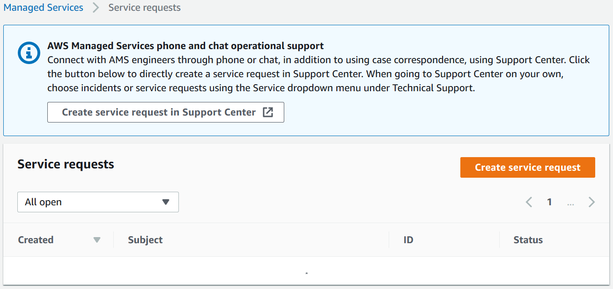
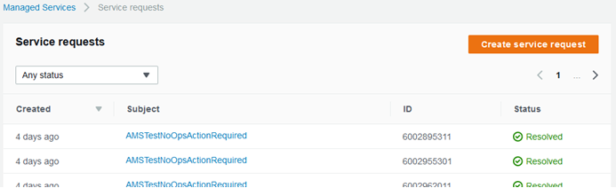
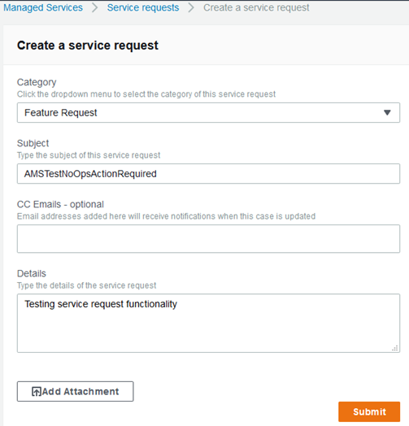

# Creating a service request in AMS

To create a service request using the AWS Managed Services (AMS) console:

1. From the left navigation, choose **Service requests**.

The **Service requests** list opens.

If your service request list is empty, the **Clear filter** option resets the filter to **Any status**.

If you know you want to use phone or chat, click **Create service request in Support Center** to
open the service request **Create** page in the Support Center Console, auto-populated with the AMS service type.

###### Note

Phone calls initiated with Support center are recorded, to better improve response. If the call drops, you must
call back through the Support Center case, AWS has no mechanism for calling you back.

###### Important

Phone and chat support is designed to help with support cases, incidents and service requests.
For RFC issues, use the correspondence option on the relevant RFC details page, to reach an AMS engineer. 2. If you want to find an existing service request, select a service request status filter in the drop-down list.

|                                                                                     |                                                                                                                                                                                                                                                                                                                                                                                                                                                                                     |
| ----------------------------------------------------------------------------------- | ----------------------------------------------------------------------------------------------------------------------------------------------------------------------------------------------------------------------------------------------------------------------------------------------------------------------------------------------------------------------------------------------------------------------------------------------------------------------------------- |
| Dropdown menu showing ticket status options including Open, Reopened, and Resolved. | • All service requests that are not yet resolved. • A new service request that is not yet assigned. • A service request that has been assigned. • A service request that you reopened. • An assigned, complicated, service request. • Service requests that require your feedback before the next step. • Service requests to which you have recently submitted information. • A service request that has concluded. • All service requests in the account. |

3. Choose **Create**.

The **Create a service request** page opens.

 4. Select a **Category**.

###### Note

If you are going to test service request functionality, add the no-action flag, `AMSTestNoOpsActionRequired`. to your service request title. 5. Enter information for:

    * **Subject**: This creates a link to the service request details on the list page.
    * **CC emails**: These emails receive correspondence in addition to your default email contacts.
    * **Details**: Provide as much information here as possible.

To add an attachment, choose **Add Attachment**, browse to the attachment you want, and
click **Open**. To delete the attachment, click the Delete icon:

. 6. Choose **Submit**.

A details page opens with information on the service request--such as **Type**, **Subject**,
**Created**, **ID**, and **Status**--and a **Correspondence** area
that includes the description of the request you created.

Additionally, your service request displays on the **Service Request** list page. Use this when you have an alert but have not yet heard from AMS.

Click **Reply** to open a correspondence area and provide additional details or status updates.

Click **Resolve Case** when the service request has been resolved.

Click **Load More** to view additional correspondences that do not fit on the inital page.

Don't forget to rate the communication!

For billing-related queries, create a service request case from Support Center Console.

**YouTube Video**:
[How and when to raise service requests from AWS Console and what are it’s Service Level Objectives?](https://www.youtube.com/watch?v=wQ1bZtHjr3I&list=PLhr1KZpdzukc_VXASRqOUSM5AJgtHat6-&index=7&t=5s "https://www.youtube.com/watch?v=wQ1bZtHjr3I&list=PLhr1KZpdzukc_VXASRqOUSM5AJgtHat6-&index=7&t=5s")
