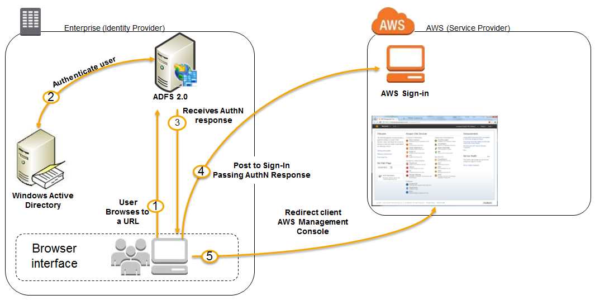

# How integration between AD FS and AMS works

A one-way trust between your on-premises network and the AMS domain is the default means for access to stacks and VPCs. When a VPC and
stack are created, access is granted via pre-configured Active Directory security groups. In addition, access to the AWS Management Console can be configured using Active
Directory Federation Service (AD FS), or any federation software that supports SAML, for a single sign-on (SSO) to the AWS Management Console.

###### Note

AMS can federate to many federation services, Ping, Okta, and so on. You aren't limited to AD FS; we provide here an example of one
federation technology available to you.

Information here is duplicated from this blog post:
[Enabling Federation to AWS Using Windows Active Directory, AD FS, and SAML 2.0](https://aws.amazon.com/blogs/security/enabling-federation-to-aws-using-windows-active-directory-adfs-and-saml-2-0/ "https://aws.amazon.com/blogs/security/enabling-federation-to-aws-using-windows-active-directory-adfs-and-saml-2-0/").

1. The flow is initiated when a user (let’s call him Bob) browses to the AD FS sample site (https://Fully.Qualified.Domain.Name.Here/adfs/ls/IdpInitiatedSignOn.aspx)
   inside his domain. When you install AD FS, you get a new virtual directory named **adfs** for your default website, which includes this page.
2. The sign-on page authenticates Bob against AD. Depending on the browser
   Bob is using, he might be prompted for his AD username and password.
3. Bob’s browser receives a SAML assertion in the form of an authentication response from AD FS.
4. Bob’s browser posts the SAML assertion to the AWS sign-in endpoint for SAML (https://signin.aws.amazon.com/saml). Behind the scenes, sign-in uses
   the [AssumeRoleWithSAML](../../../STS/latest/APIReference/API_AssumeRoleWithSAML.md "../../../STS/latest/APIReference/API_AssumeRoleWithSAML.md") API to request
   temporary security credentials and then constructs a sign-in URL for the AWS Management Console.
5. Bob’s browser receives the sign-in URL and is redirected to the console.
   From Bob’s perspective, the process happens transparently. He starts at an internal website and ends up at the AWS Management Console, without ever having to supply any
   AWS credentials.

###### Note

More information on configuring federation to the AMS console is provided in:

- **Multi-Account Landing Zone**:
  [Configuring Federation to the AMS Console](../onboardingguide/setup-net-federate-console.md "../onboardingguide/setup-net-federate-console.md")
- **Single-Account Landing Zone**:
  [Configuring Federation to the AMS Console](../onboardingguide/fed-with-console.md "../onboardingguide/fed-with-console.md")
  Additionally, see
  [Appendix: AD FS claim rule and SAML settings](apx-adfs-claim-rule-saml.md "apx-adfs-claim-rule-saml.md").
  For information about using AWS Microsoft AD to support your Active Directory–aware applications, in the AWS Cloud,
  that are subject to compliance requirements, see
  [Manage Microsoft AD Compliance](../../../directoryservice/latest/admin-guide/ms_ad_compliance.md "../../../directoryservice/latest/admin-guide/ms_ad_compliance.md").
