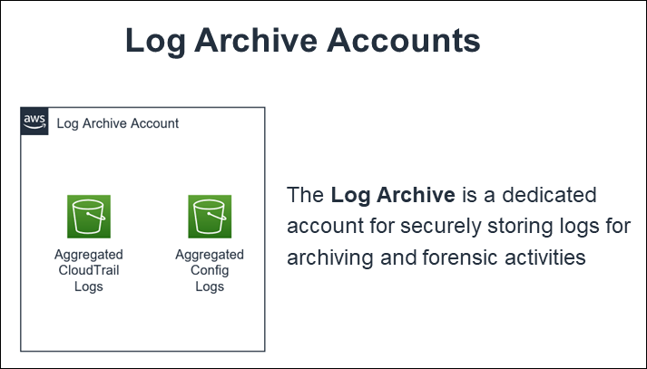

End of support notice: On June 30, 2027, AWS
will end support for AMS Advanced. After June 30, 2027, you will
no longer be able to access the AMS Advanced console or AMS Advanced resources.
For more information, see [AMS Advanced end of support](SunsetPlan.md "SunsetPlan.md").

# Log Archive account

The Log Archive account serves as the central hub for archiving logs across your AMS multi-account landing zone
environment. There is an S3 bucket in the account that contains copies of AWS CloudTrail and
AWS Config log files from each of the AMS multi-account landing zone environment accounts.
You could use this account for your Centralised Logging solution with AWS Firehose, or Splunk, and so forth.
AMS access to this account is limited to a few users; restricted to auditors and security teams for compliance and
forensic investigations related to account activity.

