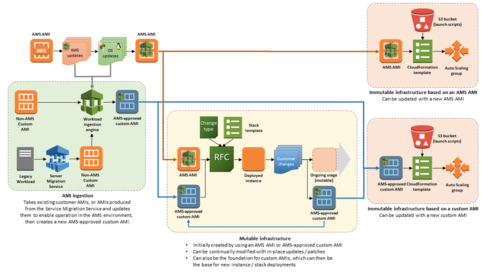

# AMI updates patching (using patched AMIs

for Auto Scaling groups)

AMI-replacement patching is done on immutable infrastructures by updating the AMI
ID that is configured to deploy new Amazon EC2 instances in an Auto Scaling group.

Amazon Machine Images (AMIs) are released on a regular basis for the supported
operating systems. Operating system vendors release new patches on a periodic basis.
AMS takes the Amazon-provided AMI, updates it with the latest patches, and then
adds the appropriate components to enable it to operate in the AMS environment.
Then, it makes the new AMS AMI available to all AMS customers by sharing the AMI
to the accounts. Your Auto Scaling group stacks can be refreshed on a monthly basis
with these newly released AMS AMIs. The following graphic illustrates how AMIs are
used in AMS your environments.

Auto Scaling groups create their instances based on the configured AMI for the
Auto Scaling group. When AMS shares updated AMIs, you have the following options
depending on how you are managing AMI updates:

- If you are using an application deployment tool (for example, UserData,
  CodeDeploy, and so forth) that customizes your instances automatically after
  they are created, you can do the following:
  - Reply to the patching service notification, or submit a service
    request, for the latest AMS AMI to replace your current Auto
    Scaling group's configuration AMI. After the AMI ID in your Auto
    Scaling groups' configuration is replaced, AMS kicks off rolling
    updates of your instances and your Auto Scaling group instance
    configurations (for example, installing applications, boot scripts,
    etc.) are applied to the new instances created with the new AMS AMI automatically.

- If you are using a custom/golden AMI in your Auto Scaling groups'
  configuration, you can:
  - Create an instance with the new AMS AMI, customize the instance
    and create a new golden AMI. Share the new golden AMI with AMS
    using the Amazon EC2 console, and submit a service request to AMS to
    update your Auto Scaling groups' configuration to use your new custom AMI.
  - Share your existing golden AMI with AMS by using the Amazon EC2
    console, and submit a service request for AMS to update your
    golden AMI. To do this, AMS creates an instance from your golden
    AMI, applies the patches to that instance, creates a new golden AMI
    for you, and then updates your Auto Scaling groups' configuration to
    use the new AMI. The drawback here is that AMS cannot test that
    your new custom AMI works the way you want it to. Instead, you
    should test the instance created with the new AMI and verify that
    everything works correctly before creating a new golden AMI, sharing
    it, and requesting that AMS update your Auto Scaling groups. AMS does not recommend this option.

## Standard patching: AMI updates

Every month AMS releases new Amazon
Machine Images (AMIs) with service improvements and new patches
that apply to the AMIs.

###### Note

New AMS AMIs are generated after Patch Tuesday from updated AWS AMIs.
Then, AMS tests them before making them available. After the new AMIs pass
testing, AMS shares updated AMIs to managed accounts.

## Critical patching: AMI updates

When needed, AMS provides AMIs updated with critical security patches
released since the last monthly AMI release.

The process for critical security updates to immutable infrastructures is
identical to the monthly AMI process for immutable infrastructures, except that
a new AMS AMI is created outside the normal schedule (Patch Tuesday), based on
the release of new critical updates. AMS makes available a new AMI with the
critical security patches according to the service level agreements (SLAs)
defined for your account. AMS updates of Auto Scaling groups by request only.
Use a service request to submit AMI replacement requests.
