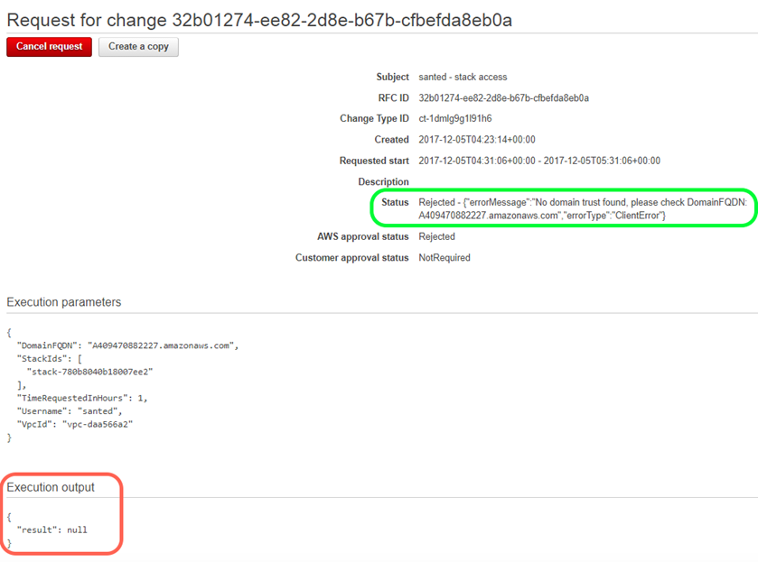
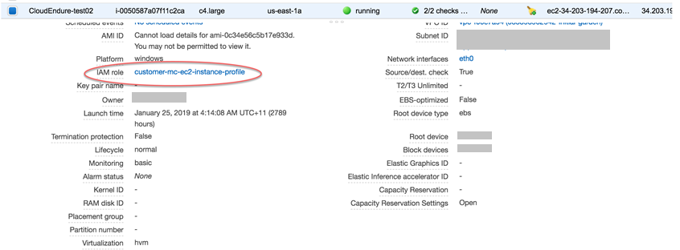

# Troubleshooting RFC errors in AMS

Many AMS provisioning RFC failures can be investigated through the CloudFormation documentation.
See [Troubleshooting AWS CloudFormation: Troubleshooting Errors](../../../AWSCloudFormation/latest/UserGuide/troubleshooting.md#troubleshooting-errors "../../../AWSCloudFormation/latest/UserGuide/troubleshooting.md#troubleshooting-errors")

Additional troubleshooting suggestions are provided in the following sections.

## "Management" RFC errors in AMS

AMS "Management" Category change types (CTs) allow you to request access to resources as well as manage existing resources. This section
describes some common issues.

### RFC access errors

- Make sure the Username and FQDN you specified in the RFC are correct and exist in the domain. For help finding your FQDN, see
  [Finding your FQDN](find-FQDN.md "find-FQDN.md").
- Make sure the stack ID you specified for access is an EC2-related stack. Stacks such as
  ELB and Amazon Simple Storage Service (S3) are not candidates for access RFCs, instead, use your read only access role to get access these stacks resources.
  For help finding a stack ID, see
  [Finding stack IDs](find-stack.md "find-stack.md")
- Make sure the stack ID you provided is correct and belongs to the relevant account.

For help with other access RFC failures, see
[Access management](access-mgmt.md "access-mgmt.md").

**YouTube Video**:
[How do I raise a Request for Change (RFC) properly to avoid rejections and failures?](https://www.youtube.com/watch?v=IFOn4Q-5Cas&list=PLhr1KZpdzukc_VXASRqOUSM5AJgtHat6-&index=5&t=242s "https://www.youtube.com/watch?v=IFOn4Q-5Cas&list=PLhr1KZpdzukc_VXASRqOUSM5AJgtHat6-&index=5&t=242s")

### RFC (manual) CT scheduling errors

Most change types are ExecutionMode=Automated, but some are ExecutionMode=Manual and that affects how you should schedule them to avoid RFC failure.

Scheduled RFCs with ExecutionMode=Manual, must be set to execute at least 24 hours in the future if you are using the AMS Console to
create the RFC. This caveat does not apply to the AMS API/CLI, but it is still important to schedule Manual RFCs at least 8 hours ahead.

AMS aims to respond to a manual CT within four hours, and will correspond as soon as possible, but it could take much longer for the RFC to actually
be executed.

### Using RFCs with manual update CTs

AMS Operations reject Management | Other | Other RFCs for updates to stacks, when there is
an Update change type for the type of stack that you want to update.

### RFC delete stack errors

RFC delete stack failures: If you use the Management | Standard stacks | Stack | Delete CT, you will see
the detailed events in the AWS CloudFormation Console for the stack with the AMS stack name. You can identify your
stack by checking it against the name it has in the AMS Console.
The AWS CloudFormation Console provides more details about failure causes.

Before deleting a stack, you should consider how the stack was created. If you created the stack using
an AMS CT and did not add or edit the stack resources, then you can expect to delete it without issue.
However, it is a good idea for you remove any manually-added resources from a stack before submitting
a delete stack RFC against it. For example, if you create a stack using the full stack CT (HA Two Tier),
it includes a security group - SG1. If you then use AMS to create another security group - SG2,
and reference the new SG2 in the SG1 created as part of the full stack, and then use the delete stack CT
to delete the stack, the SG1 will not delete as it is referenced by SG2.

###### Important

Deleting stacks can have unwanted and unanticipated consequences. AMS prefers to \*not\*
delete stacks or stack resources on behalf of customers for this reason. Note, that AMS
will only delete resources on your behalf (through a submitted Mangement | Other | Other | Update change type)
that are not possible to delete using the appropriate, automated, change type to delete.
Additional considerations:

- If the resources are enabled for 'delete protection', AMS can help to unblock this if you
  submit a Management | Other | Other | Update change type and, after the deletion protection is removed,
  you can use the automated CT to delete that resource.
- If there are multiple resources in a stack, and you want to delete only a subset of the
  stack resources, use the CloudFormation Update change type (see
  [CloudFormation Ingest Stack: Updating](../appguide/ex-cfn-ingest-update-col.md "../appguide/ex-cfn-ingest-update-col.md")).
  You can also submit a Management | Other | Other | Update change type and AMS engineers can help you
  craft the changeset, if needed.
- If there are issues using the CloudFormation Update CT due to drifts,
  AMS can help if you submit a Management | Other | Other | Update to resolve the drift
  (as far as supported by the AWS CloudFormation Service) and provide a ChangeSet that
  you can then validate and execute using the automated CT,
  Management/Custom Stack/Stack From CloudFormation Template/Approve Changeset and Update.
  AMS maintains the above restrictions to help ensure there are no unexpected or unanticipated
  resource deletions.

For more information, see
[Troubleshooting AWS CloudFormation: delete stack fails](../../../AWSCloudFormation/latest/UserGuide/troubleshooting.md#troubleshooting-errors-delete-stack-fails "../../../AWSCloudFormation/latest/UserGuide/troubleshooting.md#troubleshooting-errors-delete-stack-fails").

### RFC update DNS errors

Multiple RFCs to update a DNS hosted zone can fail, some without reason. Creating multiple RFCs at the same time to update DNS hosted zones
(private or public) can cause some RFCs to fail because they are trying to update the same stack at the same time.
AMS change management rejects or fails RFCs that are not able to update a stack because the stack is already being updated by another RFC. AMS
recommends that you create one RFC at a time and wait for the RFC to succeed before raising a new one for the same stack.

### RFC IAM entities errors

AMS provisions a number of default IAM roles and profiles into AMS accounts that
are designed to meet your needs. However, you may need to request additional IAM resources occasionally.

The process for submitting RFCs requesting custom IAM resources follows the standard workflow for manual RFCs,
but the approval process also includes a security review to ensure appropriate security controls are in place.
Therefore, the process typically takes longer than other manual RFCs. To reduce the cycle time on these RFCs,
please follow the following guidelines.

For information on what we mean by an IAM review and how it maps to our Technical Standards and Risk Acceptance
process, see [Understand RFC security reviews](rfc-security.md "rfc-security.md").

Common IAM resources requests:

- If you are asking for a policy pertaining to a major cloud-compatible application,
  such as CloudEndure, see the AMS pre-approved IAM CloudEndure policy: Unpack the
  [WIGs Cloud Endure Landing Zone Example](samples/wigs-ce-lz-examples.md "samples/wigs-ce-lz-examples.md")
  file and open the `customer_cloud_endure_policy.json`

###### Note

If you want a more permissive policy, discuss your needs with your CloudArchitect/CSDM
and obtain, if needed, an AMS Security Review and Signoff before submitting an RFC
implementing the policy.

- If you want to modify a resource deployed by AMS in your account by default, we
  recommend that you ask for a modified copy of that resource instead of changes to the existing one.
- If you are requesting permissions for a human user (instead of attaching the permissions
  to the user) attach the permissions to a role, and then grant the user permission to assume that role. For details
  on doing this, see
  [Temporary AMS Advanced console access](access-console-temp.md "access-console-temp.md").
- If you require exceptional permissions for a temporary migration or workflow,
  provide an end date for those permissions in your request.
- If you’ve already discussed the subject of your request with your security team,
  provide evidence of their approval to your CSDM with as much detail as possible.

If AMS rejects an IAM RFC we provide a clear reason for the rejection. For example, we might reject an
IAM policy create request and explain what about the policy is inappropriate. In that case, you can make
the identified changes and resubmit the request. If additional
clarity on the status of a request is required, submit a service request, or contact your CSDM.

The following list describes the typical risks that AMS tries to mitigate as we review your IAM RFCs.
If your IAM RFC has any of these risks, it may result in the rejection of the RFC.
In cases where you require an exception, AMS asks for approvals from your security team.
To seek such an exception, coordinate with your CSDM.

###### Note

AMS may, for any reason, decline any change to IAM resources inside of an account.
For concerns regarding any RFC rejection, reach out to AMS Operations via a service request, or contact your CSDM.

- Privilege escalation, such as permissions that allow you to modify your own permissions,
  or to modify the permissions of other resources inside the account. Examples:
  - The use of `iam:PassRole` with another, more privileged role.
  - Permission to attach/detach IAM policies from a role or user.
  - The modification of IAM policies in the account.
  - The ability to make API calls in the context of management infrastructure.

- Permissions to modify resources or applications that are required to provide AMS services to you. Examples:
  - Modification of AMS infrastructure like the bastions, management host, or
    EPS infrastructure.
  - Deletion of log management AWS Lambda functions, or log streams.
  - The deletion or modification of the default CloudTrail monitoring application.
  - The modification of the Directory Services Active Directory (AD).
  - Disabling CloudWatch (CW) alarms.
  - The modification of the principals, policies, and namespaces deployed in the account
    as a part of the landing zone.

- Deployment of infrastructure outside of best practices, such as permissions that allow
  the creation of infrastructure in a state that endangers your information security. Examples:
  - The creation of public, or unencrypted, S3 buckets or public sharing of EBS volumes.
  - The provisioning of public IP addresses.
  - The modification of security groups to allow broad access.

- Overly broad permissions capable of causing application impact, such as permissions that
  can result in data loss, integrity loss, inappropriate configuration, or interruptions of service
  for your infrastructure and the applications inside the account. Examples:
  - Disabling, or redirecting, network traffic through APIs like
    `ModifyNetworkInterfaceAttribute` or `UpdateRouteTable`.
  - The disabling of managed infrastructure by detaching volumes from managed hosts.

- Permissions for services not a part of the AMS service description and not supported by AMS.

Services not listed in the AMS Service description cannot be used in AMS accounts.
To request support for a feature or service, please reach out to your CSDM.

- Permissions that do not meet your stated goal as they are either too generous, or too
  conservative, or are applied to the wrong resources. Examples:
  - A request for `s3:PutObject` permissions to an S3 bucket that has
    mandatory KMS encryption, without `KMS:Encrypt` permissions to the relevant key.
  - Permissions that pertain to resources that don’t exist in the account.
  - IAM RFCs where the description of the RFC does not seem to match the request.

## "Deployment" RFC errors

AMS "Deployment" Category change types (CTs) allow you to request various AMS-supported resources be added to your account.

Most AMS CTs that create a resource are based on AWS CloudFormation templates. As a customer you have read-only access to all AWS services including AWS CloudFormation, you can quickly identify
the AWS CloudFormation stack that represents your stack based on the stack description using the AWS CloudFormation Console. The failed stack will likely be in
a state of DELETE_COMPLETE. Once you have identified the AWS CloudFormation stack, the events will show you the specific resource that failed to
create, and why.

### Using CloudFormation documentation to troubleshoot

Most AMS provisioning RFCs use a CloudFormation template and that documentation can be helpful for troubleshooting. See documentation for that AWS CloudFormation template:

- Create application load balancer failure:
  [AWS::ElasticLoadBalancingV2::LoadBalancer (Application Load Balancer)](../../../AWSCloudFormation/latest/UserGuide/aws-resource-elasticloadbalancingv2-loadbalancer.md "../../../AWSCloudFormation/latest/UserGuide/aws-resource-elasticloadbalancingv2-loadbalancer.md")
- Create Auto scaling group:
  [AWS::AutoScaling::AutoScalingGroup (Auto Scaling Group)](../../../AWSCloudFormation/latest/UserGuide/aws-properties-as-group.md "../../../AWSCloudFormation/latest/UserGuide/aws-properties-as-group.md")
- Create memcached cache:
  [AWS::ElastiCache::CacheCluster (Cache Cluster)](../../../AWSCloudFormation/latest/UserGuide/aws-properties-elasticache-cache-cluster.md "../../../AWSCloudFormation/latest/UserGuide/aws-properties-elasticache-cache-cluster.md")
- Create Redis cache:
  [AWS::ElastiCache::CacheCluster (Cache Cluster)](../../../AWSCloudFormation/latest/UserGuide/aws-properties-elasticache-cache-cluster.md "../../../AWSCloudFormation/latest/UserGuide/aws-properties-elasticache-cache-cluster.md")
- Create DNS Hosted Zone (used with Create DNS private/public):
  [AWS::Route53::HostedZone (R53 Hosted Zone)](../../../AWSCloudFormation/latest/UserGuide/aws-resource-route53-hostedzone.md "../../../AWSCloudFormation/latest/UserGuide/aws-resource-route53-hostedzone.md")
- Create DNS Record Set (used with Create DNS private/public):
  [AWS::Route53::RecordSet (Resource Record Sets)](../../../AWSCloudFormation/latest/UserGuide/aws-properties-route53-recordset.md "../../../AWSCloudFormation/latest/UserGuide/aws-properties-route53-recordset.md")
- Create EC2 stack:
  [AWS::EC2::Instance (Elastic Compute Cloud)](../../../AWSCloudFormation/latest/UserGuide/aws-properties-ec2-instance.md "../../../AWSCloudFormation/latest/UserGuide/aws-properties-ec2-instance.md")
- Create Elastic File System (EFS):
  [AWS::EFS::FileSystem (Elastic File System)](../../../AWSCloudFormation/latest/UserGuide/aws-resource-efs-filesystem.md "../../../AWSCloudFormation/latest/UserGuide/aws-resource-efs-filesystem.md")
- Create Load balancer:
  [AWS::ElasticLoadBalancing::LoadBalancer (Elastic Load Balancer)](../../../AWSCloudFormation/latest/UserGuide/aws-properties-ec2-elb.md "../../../AWSCloudFormation/latest/UserGuide/aws-properties-ec2-elb.md")
- Create RDS DB:
  [AWS::RDS::DBInstance (Relational Database)](../../../AWSCloudFormation/latest/UserGuide/aws-properties-rds-database-instance.md "../../../AWSCloudFormation/latest/UserGuide/aws-properties-rds-database-instance.md")
- Create Amazon S3:
  [AWS::S3::Bucket (Simple Storage Service)](../../../AWSCloudFormation/latest/UserGuide/aws-properties-s3-bucket.md "../../../AWSCloudFormation/latest/UserGuide/aws-properties-s3-bucket.md")
- Create Queue:
  [AWS::SQS::Queue (Simple Queue Service)](../../../AWSCloudFormation/latest/UserGuide/aws-properties-sqs-queues.md "../../../AWSCloudFormation/latest/UserGuide/aws-properties-sqs-queues.md")

### RFC creating AMIs errors

An Amazon Machine Image (AMI) is a template that contains a software configuration (for example, an operating system, an application server,
and applications). From an AMI, you launch an instance, which is a copy of the AMI running as a virtual server in the cloud. AMIs are
very useful, and required to create EC2 instances or Auto Scaling groups; however, you must observe some requirements:

- The instance you specify for `Ec2InstanceId` must be in a stopped state for the RFC to succeed.
  Do not use Auto Scaling group (ASG) instances for this parameter because the ASG will terminate a stopped instance.
- To create an AMS Amazon Machine Image (AMI), you must start with an AMS instance. Before you can use the instance to create the AMI,
  you must prepare it by ensuring that it is stopped and dis-joined from its domain. For details, see
  [Create a Standard Amazon Machine Image Using Sysprep](../../../AWSEC2/latest/WindowsGuide/Creating_EBSbacked_WinAMI.md#23ami-create-standard "../../../AWSEC2/latest/WindowsGuide/Creating_EBSbacked_WinAMI.md#23ami-create-standard")
- The name you specify for the new AMI must be unique within the account or the RFC fails. How to do this is described in
  [AMI | Create](../ctref/deployment-advanced-ami-create.md "../ctref/deployment-advanced-ami-create.md"), and for more details, see
  and [AWS AMI Design](https://aws.amazon.com/answers/configuration-management/aws-ami-design/ "https://aws.amazon.com/answers/configuration-management/aws-ami-design/").

###### Note

For additional information for prepping for AMI creation, see
[AMI | Create](../ctref/deployment-advanced-ami-create.md "../ctref/deployment-advanced-ami-create.md").

### RFCs creating EC2s or ASGs errors

For EC2 or ASG failures with timeouts, AMS recommends that you confirm if the AMI used is customized. If it is, please refer to the AMI creation steps
included in this guide (see
[AMI | Create](../ctref/deployment-advanced-ami-create.md "../ctref/deployment-advanced-ami-create.md"))
to ensure that the AMI was created correctly. A common mistake when creating a custom AMI is not following the steps in the guide to rename or invoke Sysprep.

### RFCs creating RDS errors

Amazon Relational Database Service (RDS) failures can occur for many different reasons because you can use many different engines when you create the
RDS, and each engine has its own requirements and limitations. Before attempting to create an AMS RDS stack, carefully review AWS RDS
parameter values, see
[CreateDBInstance](../../../AmazonRDS/latest/APIReference/API_CreateDBInstance.md "../../../AmazonRDS/latest/APIReference/API_CreateDBInstance.md").

To learn more about Amazon RDS in general, including size recommendations, see
[Amazon Relational Database Service Documentation](https://aws.amazon.com/documentation/rds/ "https://aws.amazon.com/documentation/rds/").

### RFCs creating Amazon S3s errors

One common error when creating an S3 storage bucket is not using a unique name for the bucket. If you submitted an S3 bucket
Create CT with the same name as one previously submitted, it would fail because an
S3 bucket would already exist with that BucketName. This would be detailed in the AWS CloudFormation Console, where you will see that the stack event
shows that the bucket name is already in use.

## RFC validation versus execution errors

RFC failures and related messages differ in the output messages on the AMS console RFC details page for a selected RFC:

- Validation Failures reasons are available in Status Field only
- Execution Failures reasons are available in Execution Output as well as Status Fields.

## RFC error messages

When you come across the following error for the listed change types (CTs), you can use these solutions to help you find the source of the problems and fix them.

`{"errorMessage":"An error has occurred during RFC execution. We are investigating the issue.","errorType":"InternalError"}`

If you require further assistance after referring to the following troubleshooting
options, then engage AMS via RFC correspondence or create a service request. See
[RFC Correspondence
and Attachment (Console)](ex-rfc-correspondence.md "ex-rfc-correspondence.md") and [Creating a
Service Request in AMS](gui-ex-create-service-request.md "gui-ex-create-service-request.md") for more details.

### Workload ingestion (WIGS) errors

###### Note

Validation tools for both Windows and Linux can be downloaded and run
directly on your on-premises servers, as well as EC2 instances in AWS. These can be found through the
_AMS Advanced Application Developer's Guide_
[Migrating workloads: Linux pre-ingestion validation](../appguide/ex-migrate-instance-linux-validation.md "../appguide/ex-migrate-instance-linux-validation.md") and
[Migrating workloads: Windows pre-ingestion validation](../appguide/ex-migrate-instance-win-validation.md "../appguide/ex-migrate-instance-win-validation.md").

- Make sure EC2 instance exists in target AMS account. For example, if you have shared your AMI from a non-AMS account to an AMS account,
  you'll have to create an EC2 instance in your AMS account with the shared AMI before you can submit a Workload Ingest RFC.
- Check to see if the security groups attached to the instance have egress traffic allowed. The SSM Agent needs to be able to connect to its public endpoint.
- Check to see if the instance has the right permissions to connect with the SSM agent. These permissions come with the `customer-mc-ec2-instance-profile`,
  you can check for this in the EC2 console:

### EC2 instance stack stop errors

- Check to see if the instance is already in a stopped or terminated state.
- If the EC2 instance is online and you see the `InternalError` error, then submit a service request for AMS to investigate.
- Note that you can't use the change type Management | Advanced stack components | EC2 instance stack | Stop ct-3mvvt2zkyveqj to stop an Auto Scaling group (ASG) instance. If you need to stop an ASG instance, then
  submit a service request.

### EC2 instance stack create errors

The `InternalError` message is from CloudFormation; a CREATION_FAILED status reason. You can find details on the stack failure in
CloudWatch stack events by following these steps:

- In the AWS Management console, you can view a list of stack events while your stack is being created, updated, or deleted.
  From this list, find the failure event and then view the status reason for that event.

The status reason might contain an error message from AWS CloudFormation or from a particular service that can help you understand the problem.

- For more information about viewing stack events, see
  [Viewing AWS CloudFormation Stack Data and Resources on the AWS Management Console](../../../AWSCloudFormation/latest/UserGuide/cfn-console-view-stack-data-resources.md "../../../AWSCloudFormation/latest/UserGuide/cfn-console-view-stack-data-resources.md").

### EC2 instance volume restore errors

AMS creates an internal troubleshooting RFC when EC2 instance volume restore fails. This is done because EC2 instance
volume restore is an important part of disaster recovery (DR) and AMS creates this internal troubleshooting RFC for you
automatically.

When the internal troubleshooting RFC is created, a banner is displayed providing you with links to the RFC.
This internal troubleshooting RFC provides your with more visibility into RFC failures and, rather than submitting retry RFCs
leading to the same errors, or making you manually reach out to AMS for this failure, you can keep track of your changes
and know that the failure is being worked on by AMS. This also reduces the time-to-recovery (TTR) metric for their change
as AMS Operators proactively work on the RFC failure instead of waiting for your request.

## How to get help with an RFC

You can reach out to AMS to identify the root cause of your failure. AMS business hours are 24 hours a day, 7 days a week, 365 days a year.

AMS provides several avenues for you to ask for help or make service requests.

- To ask for information or advice, or for access to an AMS-managed IT service, or to request an additional service from AMS, use the AMS console and submit a
  service request. For details, see [Creating a Service Request](gui-ex-create-service-request.md "gui-ex-create-service-request.md").
  For general information about AMS service requests, see [Service Request Management](mk-service-requests.md "mk-service-requests.md").
- To report an AWS or AMS service performance issue that impacts your managed environment, use the AMS console and submit an incident report.
  For details, see [Reporting an Incident](gui-ex-report-incident.md "gui-ex-report-incident.md"). For general information about AMS
  incident management, see [Incident response](sec-incident-response.md "sec-incident-response.md").
- For specific questions about how you or your resources or applications are working with AMS, or to escalate an incident, email one or more of the following:
  1.  First, if you are unsatisfied with the service request or incident report response, email your CSDM: ams-csdm@amazon.com
  2.  Next, if escalation is required, you can email the AMS Operations Manager (but your CSDM will probably do this): ams-opsmanager@amazon.com
  3.  Further escalation would be to the AMS Director: ams-director@amazon.com
  4.  Finally, you are always able to reach the AMS VP: ams-vp@amazon.com
