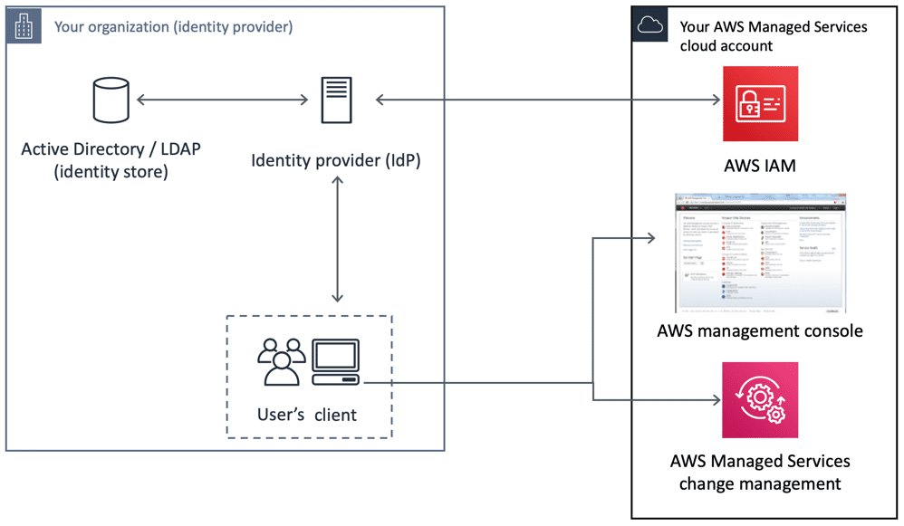
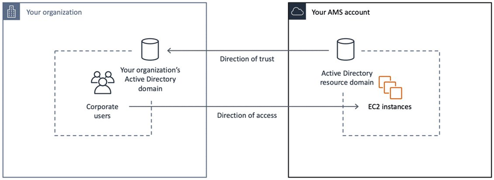

# Identity and access management

AWS Identity and Access Management (IAM) is a web service that helps you securely control access to AWS resources. You use IAM to control who is authenticated (signed in) and authorized (has
permissions) to use resources. During AMS onboarding, you are responsible for creating cross-account IAM Admin roles within each of your managed accounts.

## Multi-Account Landing Zone (MALZ) IAM safeguards

AMS multi-account landing zone (MALZ) requires an Active Directory (AD) trust as a primary design goal of AMS access
management to allow each organization (both AMS, and customer) management of their own
identities' life cycles. This avoids the need to have credentials in one another's
directory. The one-way trust is configured, so that the Managed Active Directory within
the AWS account trusts the customer owned or managed AD to authenticate users. Because
the trust is only one way, it doesn't mean that the Managed AD is trusted by the Customer Active Directory.

In this configuration, the customer directory that manages user identities is known as the User Forest, and
the Managed AD to which Amazon EC2 instances are attached is known as the Resource Forest. This is a
commonly-leveraged Microsoft design pattern for Windows authentication; for more information, see
[Forest Design Models](https://docs.microsoft.com/en-us/windows-server/identity/ad-ds/plan/forest-design-models "https://docs.microsoft.com/en-us/windows-server/identity/ad-ds/plan/forest-design-models").

This model allows both organizations to automate their respective lifecycles and
allows both AMS and you to rapidly revoke access if an employee leaves the
organization. Without this model, if both organizations used a common directory (or
created users/groups in one another's directories), then both organizations would have
to put in additional workflows, and user syncs, to account for employees starting and
leaving. This introduces risk as that process has latency and can be error-prone.

### MALZ access pre-requisites

MALZ Identity Provider Integration for access to the AWS/AMS console, CLI, SDK.

One-way trust for Amazon EC2 instances in your AMS account.

## Amazon Inspector security

The Amazon Inspector service monitors the security of your AMS-managed stacks.
Amazon Inspector is an automated security assessment service that helps identify gaps in the security and compliance of
infrastructure deployed on AWS. Amazon Inspector security assessments enable you to automatically assess stacks for exposure, vulnerabilities, and
deviations from best practices by checking for unintended network accessibility and vulnerabilities in your Amazon EC2 instances.
After performing an assessment, Amazon Inspector produces a detailed list of security findings prioritized by level of severity. Amazon Inspector assessments are
offered as pre-defined rules packages mapped to common security best practices and definitions. These rules are regularly updated by AWS security
researchers. For more information about Amazon Inspector go to
[Amazon Inspector](https://aws.amazon.com/inspector "https://aws.amazon.com/inspector").

**AMS Amazon Inspector FAQs**

- Is Amazon Inspector installed to my AMS accounts by default?

No. Amazon Inspector is not part of the default AMI build or workload ingestion.

- How do I access and install Amazon Inspector?

Submit an RFC (Management | Other | Other | Create) to request account access and installation to Inspector and the AMS operations team will modify
the Customer_ReadOnly_Role to provide Amazon Inspector console access (without SSM access).

- Does the Amazon Inspector Agent have to be installed on all of the Amazon EC2 instances I want to assess?

No, Amazon Inspector assessments with the network reachability rules package can be run without an agent for any Amazon EC2 instances. The agent is
required for host assessment rules packages. For more information about agent installation, see
[Installing Amazon Inspector Agents](../../../inspector/latest/userguide/inspector_installing-uninstalling-agents.md "../../../inspector/latest/userguide/inspector_installing-uninstalling-agents.md").

- Is there an additional cost for this service?

Yes. Amazon Inspector pricing can be found on the [Amazon Inspector pricing](https://aws.amazon.com/inspector/pricing/ "https://aws.amazon.com/inspector/pricing/") site.

- What are Amazon Inspector findings?

Findings are potential security issues discovered during the Amazon Inspector assessment of the selected assessment target. Findings are displayed
in the Amazon Inspector console or the API, and contain both a detailed description of the security issues and recommendations for resolving them.

- Are reports of the Amazon Inspector assessment available?

Yes. An assessment report is a document that details what is tested in the assessment run, and the results of the assessment.
The results of your assessment are formatted into standard reports, which can be generated to share results within your team for
remediation actions, to enrich compliance audit data, or to store for future reference. An Amazon Inspector assessment report
can be generated for an assessment run once it has been successfully completed.

- Can I use tags to identify the stacks I want to run Amazon Inspector reports against?

Yes.

- Will AMS Operations teams have access to the Amazon Inspector assessment results?

Yes. Anyone with access to the Amazon Inspector console in AWS is able to view findings and assessment reports.

- Will AMS Operations teams recommend or take action based on the findings of the Amazon Inspector reports?

No. If you want changes made based on the findings of the Amazon Inspector report, you must request changes through an RFC (Management | Other | Other | Update).

- Will AMS be notified when I run an Amazon Inspector report?

When you request Amazon Inspector access, the AMS Operator running the RFC notifies your CSDM of the request.

For more information, see [Amazon Inspector FAQs](https://aws.amazon.com/inspector/faqs/ "https://aws.amazon.com/inspector/faqs/").

## AMS multi-account landing zone EPS non-default settings

This section has been redacted because it contains sensitive AMS security-related information.
This information is available through the AMS console **Documentation**. To access AWS Artifact, you can contact your CSDM for instructions or go to [Getting Started with AWS Artifact](https://aws.amazon.com/artifact/getting-started "https://aws.amazon.com/artifact/getting-started").

## AMS Guardrails

A guardrail is a high-level rule that provides ongoing governance for your overall AMS environment.

This section has been redacted because it contains sensitive AMS security-related information.
This information is available through the AMS console **Documentation**. To access AWS Artifact, you can contact your CSDM for instructions or go to [Getting Started with AWS Artifact](https://aws.amazon.com/artifact/getting-started "https://aws.amazon.com/artifact/getting-started").

## MALZ Service control policies

This section has been redacted because it contains sensitive AMS security-related information.
This information is available through the AMS console **Documentation**. To access AWS Artifact, you can contact your CSDM for instructions or go to [Getting Started with AWS Artifact](https://aws.amazon.com/artifact/getting-started "https://aws.amazon.com/artifact/getting-started").
