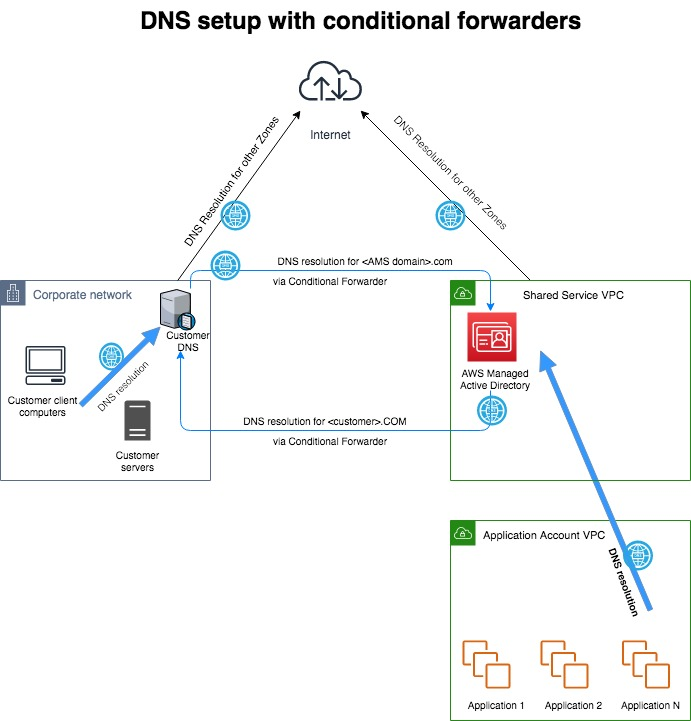
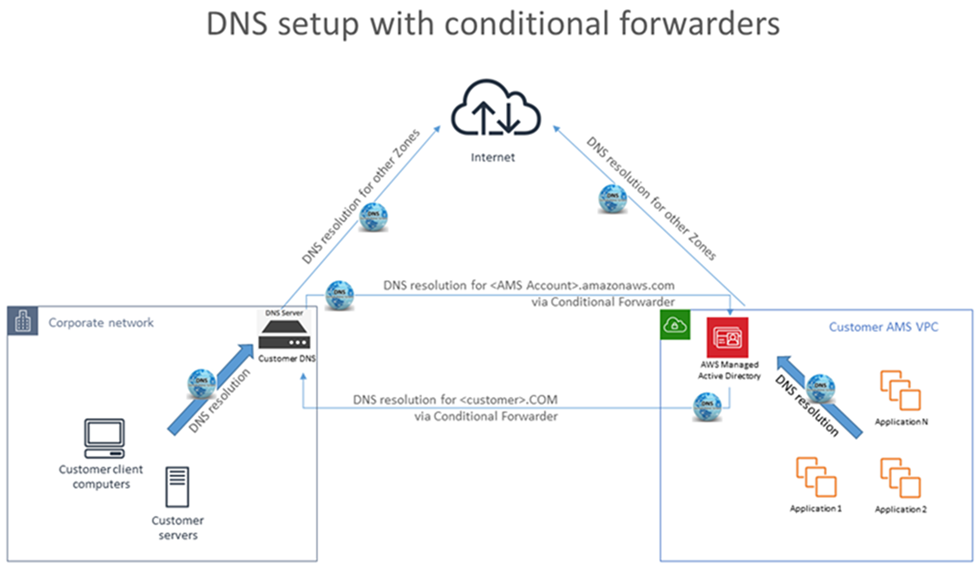
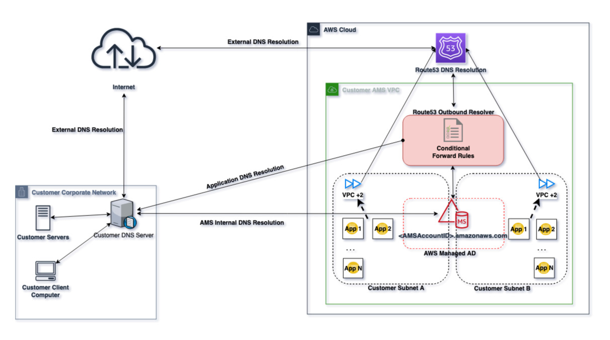

# Setting up private and public DNS

During onboarding, AMS sets up a private DNS service for communications between your managed resources and AMS.

You can use AMS Route 53 to manage the internal DNS names for your application resources
(web servers, application servers, databases, and so forth)
without exposing this information to the public Internet. This adds an additional layer of security, and
also allows you to fail over from a primary resource
to a secondary one (often called a "flip") by mapping the DNS name to a different IP address.

After you create private DNS resources using the Deployment | Advanced
stack components | DNS (private) | Create (ct-0c38gftq56zj6) or Deployment | Advanced
stack components | DNS (public) | Create (ct-0vzsr2nyraedl), you can use the Management
| Advanced stack components | DNS (private) | Update (ct-1d55pi44ff21u) and Management | Advanced stack components | DNS (public) | Update (ct-1hzofpphabs3i), CTs to configure additional, or update existing, record sets. For multi-account landing zone (MALZ) accounts, DNS resources created in the application account VPCs can be shared with the shared services account VPC to maintain centralized DNS using AMS AD. MALZ The following graphic illustrates a possible DNS configuration for Multi-Account Landing Zone AMS. It illustrates a hybrid DNS setup between AMS and a typical customer network. A Canonical Name Record (CNAME) in the customer network DNS server forwards to the AMS AD DNS in the shared services account with a conditional forward that has the CNAME of the AMS FQDN forwarded to the A record.  SALZ The following graphic illustrates a possible DNS configuration for single-account landing zone (SALZ). It shows a hybrid DNS setup between AMS and a typical customer network. A CNAME in the customer network DNS server forwards to the AMS AD DNS with a conditional forward which has the CNAME of the AMS FQDN forwarded to the A record.  SALZ Route53 DNS The following graphic illustrates a possible DNS configuration for single-account landing zone (SALZ). It shows a hybrid DNS setup between AMS and a typical customer network. A CNAME in the customer network DNS server forwards to the AMS AD DNS with a conditional forward which has the CNAME of the AMS FQDN forwarded to the A record. This also leverages Route53 for outbound network traffic so that any application in the account can have DNS Resolution in the account with the highest availability. Route53 enabled Resolution paths:  • Instance attempting to resolve AMS MAD name --> VPC +2 (Route53/AmazonProvidedDNS) --> Conditional Forwarders evaluated --> Route53 MAD Conditional Forwarder rule matched --> Route53 Outbound resolver --> Managed AD DNS  • Instance attempting to resolve customer on-prem name --> VPC +2 (Route53/AmazonProvidedDNS) --> Conditional Forwarders evaluated --> Route53 On-prem Conditional Forwarder rule matched --> Route53 Outbound resolver --> Customer on-prem DNS  • Instance attempting to resolve Internet name --> VPC +2 (Route53/AmazonProvidedDNS) --> Conditional Forwarders evaluated --> No matching forwarder --> Internet DNS Service  For more information, see [Using DNS with Your VPC](../../../AmazonVPC/latest/UserGuide/vpc-dns.md "../../../AmazonVPC/latest/UserGuide/vpc-dns.md") and [Working with Private Hosted Zones](../../../Route53/latest/DeveloperGuide/hosted-zones-private.md "../../../Route53/latest/DeveloperGuide/hosted-zones-private.md").
